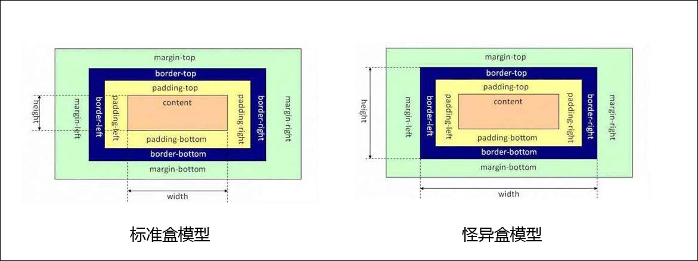

# CSS 盒子模型

## 盒子模型概念

CSS3中的盒模型有以下两种：标准盒子模型、怪异盒子模型（IE盒子模型）。

  

盒模型都是由四个部分组成的，分别是 margin、border、padding 和 content。

标准盒模型和怪异盒模型的区别在于设置 width 和 height 时，所对应的范围不同：

- 标准盒模型的 width 和 height 属性的范围只包含了content，
- 怪异盒模型的 width 和 height 属性的范围包含了border、padding和content。

可以通过修改元素的 box-sizing 属性来改变元素的盒模型：

```css
box-sizing: border-box;  /*标准盒子模块*/
box-sizing: content-box; /*怪异*/
```

## 设置盒子类型

```css
box-sizeing: margin-box;
box-sizing: border-box;  /*标准盒子模块*/
box-sizeing: padding-box;
box-sizing: content-box; /*怪异*/
```

## 高与宽

`width`  语法格式：

```css
/* <length> values */
width: 300px;
width: 25em;

/* <percentage> value */
width: 75%;

/* Keyword values */
width: max-content;
width: min-content;
width: fit-content(20em);
width: auto;

/* Global values */
width: inherit;
width: initial;
width: revert;
width: revert-layer;
width: unset;
```

`min-width` 属性用于设置盒子的最小宽度：`if width<min-width, width=min-width`

`max-width` 属性用于设置盒子的最大宽度：`if width>max-width, width=max-width`

`height` 有类似的属性。

## 内外边距

内边距：`padding`，外边距：`margin`:

```css
/* Apply to all four sides */
margin: 1em;
margin: -3px;

/* vertical | horizontal */
margin: 5% auto;

/* top | horizontal | bottom */
margin: 1em auto 2em;

/* top | right | bottom | left */
margin: 2px 1em 0 auto;
```

也可以单独设置某个方向：

```css
margin-left: 1rem;
```

**负`margin`**：会往嵌入到那个方向，例如：

1. 当元素的`margin-top`或者`margin-left`为负数时，“当前元素”会被拉向指定方向。
2. 当元素的`margin-bottom`或者`margin-right`为负数时，“后续元素”会被拉向指定方向。

`padding` 与 `margin` 一样，但是`padding` 没有负值。

## 边框属性

边框 `border` 分为上下左右四个边框。每个边框可以设置线条样式，粗细，颜色。

```css
/* style */
border: solid;

/* width | style */
border: 2px dotted;

/* style | color */
border: outset #f33;

/* width | style | color */
border: medium dashed green;
```

以上案例会设置四个方向，如果要设置某一个方向可以分别使用：`border-left, border-right, border-top, border-bottom ` 设置：

```css
border-left: 2px solid grey;
```

## 圆角属性

黑子还能设置圆角属性 `border-radius`：

```css
/* The syntax of the first radius allows one to four values */
/* Radius is set for all 4 sides */
border-radius: 10px;

/* top-left-and-bottom-right | top-right-and-bottom-left */
border-radius: 10px 5%;

/* top-left | top-right-and-bottom-left | bottom-right */
border-radius: 2px 4px 2px;

/* top-left | top-right | bottom-right | bottom-left */
border-radius: 1px 0 3px 4px;

/* The syntax of the second radius allows one to four values */
/* (first radius values) / radius */
border-radius: 10px / 20px;

/* (first radius values) / top-left-and-bottom-right | top-right-and-bottom-left */
border-radius: 10px 5% / 20px 30px;

/* (first radius values) / top-left | top-right-and-bottom-left | bottom-right */
border-radius: 10px 5px 2em / 20px 25px 30%;

/* (first radius values) / top-left | top-right | bottom-right | bottom-left */
border-radius: 10px 5% / 20px 25em 30px 35em;

/* Global values */
border-radius: inherit;
border-radius: initial;
border-radius: revert;
border-radius: revert-layer;
border-radius: unset;
```

## 盒子的阴影

盒子阴影设置案例：

```css
/* Keyword values */
box-shadow: none;

/* offset-x | offset-y | color */
box-shadow: 60px -16px teal;

/* offset-x | offset-y | blur-radius | color */
box-shadow: 10px 5px 5px black;

/* offset-x | offset-y | blur-radius | spread-radius | color */
box-shadow: 2px 2px 2px 1px rgba(0, 0, 0, 0.2);

/* inset | offset-x | offset-y | color */
box-shadow: inset 5em 1em gold;

/* Any number of shadows, separated by commas */
box-shadow: 3px 3px red, -1em 0 0.4em olive;
```

## 轮廓

轮廓 `outline`  的设置方式与 `border` 类似：

```css
/* style */
outline: solid;

/* color | style */
outline: #f66 dashed;

/* style | width */
outline: inset thick;

/* color | style | width */
outline: green solid 3px;

/* 设置距离 */
outline-offset: 0.5rem;
```

`outline` 没有上下左右之分，不占用空间，但可设置与边框的距离。

## 盒子的位置

盒子在网页中的位置模式由 `position` 属性设置：

```css
position: static;
position: relative;
position: absolute;
position: fixed;
position: sticky;
position: -webkit-sticky; /*Safari*/

/* Global values */
position: inherit;
position: initial;
position: revert;
position: revert-layer;
position: unset;
```

然后再用 `top, bottom, left, right` 四个属性设置偏移值，像这样：

```css
position: relative;
top: 20px;
left: 20px;
```

`static` 表示盒子按照正常的方式排布，也就是一个元素接着一个元素排布时它该在的位置，所有盒子默认按此方式排布。`top, bottom,left，right,z-index` 没有作用。

`relative`：相对与正常位置排布有一个偏移。上述例子就是相对它正常的位置的顶部向下偏移 20px，相对于正常位置左边向右偏移 20px；

`absolute`：脱离正常渲染流，它不占用位置，就好像飘浮起来了一样。在这种情况下，`top, left, right, bottom` 的偏移值是相对于第一个`relative` 的祖先结点，如果没有，就是相对于窗口。**父相子绝**。

`fixed`：脱离正常文档流，并且偏移量`top, left, right, bottom` 是相对于窗口的。

`sticky`: 主要用在对 scroll 事件的监听上。对于下面的例子，在向滑动过程中，`sticky` 元素距离窗口顶部50px时，它就会固定在此位置，然后父元素底部会把它推走。

```css
<!DOCTYPE html>
<html lang="en">
<head>
  <title>Sticky</title>
  <style>
    * {
      margin: 0;
      padding: 0;
    }
    .sticky {
      position: sticky;
      top: 50px;
    }
  </style>
</head>
<body>
  <header style="background-color: red; height:50px;">头部</header>
  <div style="height: 50px;">挡住你</div>
  <div style="background-color: grey;width: 500px; height: 800px; margin: 0 auto;">
    <div class="sticky" style="background-color: green; width: 500px; height: 20px;">醒目的标题</div>
    长长的文章
  </div>
  <div style="background-color: blue;width:500px;height: 1000px;margin:0 auto;"></div>
</body>
</html>
```
# 参考文章
- CUGGZ. [高频前端面试题汇总之CSS篇](https://juejin.cn/post/6905539198107942919). 稀土掘金.
- [Box model in CSS](https://cssreference.io/box-model/)


