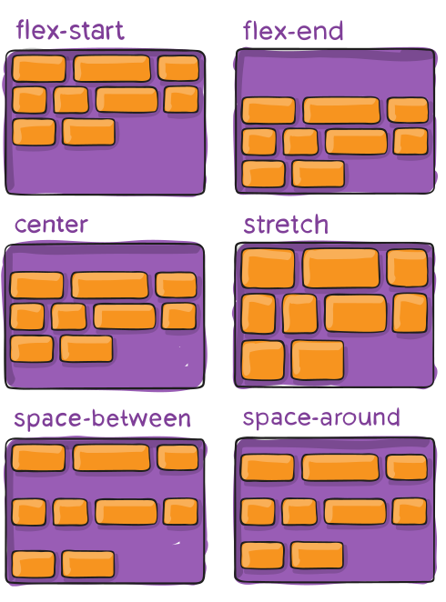

# CSS 布局

## Display

`display` 属性的值，[参考MDN](https://developer.mozilla.org/en-US/docs/Web/CSS/display)：

```css
/* precomposed values */
display: block;
display: inline;
display: inline-block;
display: flex;
display: inline-flex;
display: grid;
display: inline-grid;
display: flow-root;

/* box generation */
display: none;
display: contents;

/* two-value syntax */
display: block flow;
display: inline flow;
display: inline flow-root;
display: block flex;
display: inline flex;
display: block grid;
display: inline grid;
display: block flow-root;

/* other values */
display: table;
display: table-row; /* all table elements have an equivalent CSS display value */
display: list-item;

/* Global values */
display: inherit;
display: initial;
display: revert;
display: revert-layer;
display: unset;
```

### `none`

设置为 none 的元素既不会占据空间，也无法显示，相当于该元素不存在。 

### 三剑客比较

| 属性              | `inline`           | `block`                                                      | `inline-block` |
| ----------------- | ------------------ | ------------------------------------------------------------ | -------------- |
| width与height     | 无效               | 有效                                                         | 有效           |
| margin 与 padding | 左右有效，上下无效 | 有效                                                         | 有效           |
| 换行              | 共用一行           | 独占一行，默认会继承父元素的宽度，高度一般以子元素撑开的高度为准 | 共用一行       |

接下来我们重点讲 Flex 布局与 Grid 布局。

## Flex

请阅读：Chris Coyier. [A Complete Guide to Flexbox](https://css-tricks.com/snippets/css/a-guide-to-flexbox/). 

### 基础知识


- **容器与条目**。
- **主轴与交叉轴**。主轴：浮动的方向是主轴方向，交叉轴是与主轴垂直的方向。
- **起点与终点**。
- **盒子的尺寸**。

浮动布局不是单一的属性就能完成的，是一些列属性共同完成的，包括容器与条目。

### 配置容器属性

- 设置浮动显示。

```css
.container {
  display: flex; /* or inline-flex */
}
```

- 设置浮动方向与换行，[例子](https://codepen.io/team/css-tricks/pen/bEajLE/1ea1ef35d942d0041b0467b4d39888d3)。

```css
.container {
  display: flex; /* or inline-flex */
  flex-direction: row | row-reverse | column | column-reverse;
  flex-wrap: nowrap | wrap | wrap-reverse;
}
```

两个属性可以合并成：

```css
.container {
  display: flex;
  flex-flow: column wrap;
}
```

- 条目主轴排列方式


```css
.container {
  display: flex;
  flex-flow: row wrap;
  justify-content:flex-start|flex-end|center|space-between|space-around|space-evenly
}
```

- 交叉轴方向排列方式


`align-content`



```css
.container {
  align-items: stretch|flex-start|flex-end|center|baseline;/*单行*/
  align-content:flex-start | flex-end | center | space-between | space-around | space-evenly | stretch;/*只有 wrap 才有效*/
}
```

- 间距


```css
gap: 10px;
gap: 10px 20px; /*行间距，列间距*/
row-gap: 10px;
column-gap: 20px;
```

### 条目优先级

```css
.item {
  order: 5; /* default is 0 */
}
```

`order` 值越小越排在后面。

### 伸展与收缩

使用 `flex-grow` 调整空间占比。设置了`flex-grow` 的元素会获取剩下的空间。

使用 `flex-shrink: 3;` 属性使得该 `item` 相对于其项目的收缩 `1/3`。[示例](https://www.w3school.com.cn/cssref/pr_flex-shrink.asp)

### 调整自己位置

```css
align-self: auto | flex-start | flex-end | center | baseline | stretch;
```

## Grid

请阅读：Chris House. [A Complete Guide to Grid](https://css-tricks.com/snippets/css/complete-guide-grid/).

Grid 布局又称网格布局，他实际上就是把二维平面划分成行与列，形成网格。Gide 布局与 flex 布局一样，需要同时设置容器与项目的属性。

### 术语


- **容器与条目**。容器用于存放条目。就好比书架上的书，停车场场的车。
- **栅格线**。即上图中的黑线。
- **栅格**。就是图中的每个格子。
- **轨道(Track)**。两条相邻网格线之间的空间，你可以把它们想象成网格的列或行。
- **区域（Area）**。任意网格区域，例如上图黄色区域。

### 容器属性

首先把 `display` 设置成 `grid`。

```css
.container {
  display: grid | inline-grid;
}
```

接下来用 `grid-template-columns` 与 `grid-template-rows` 划分网格。

```html
<div class="container">
  <div class="red">1</div>
  <div class="green">2</div>
  <div class="blue">3</div>
</div>
```

```css
.container {
  display: grid;
  grid-template-columns: 1fr 1fr 1fr; /*repeat(3, 1fr)*/
}

.red {
  background-color: red;
}

.green {
  background-color: green;
}

.blue {
  background-color: blue;
}
```

上述例子的含义是 `fr` 表示把容器分为三列，每一列占一份。

**定义列的技巧：**

```css
grid-template-columns: repeat(auto-fill, 100px); /*每一列 100px, 列数就是容器宽度/每列宽度*/
grid-template-columns: 1fr 1fr minmax(100px, 1fr);/*列的最大与最小宽度*/
grid-template-columns: 100px auto 100px; /*自动宽度，一般是实际内容宽度*/
grid-template-columns: [c1] 100px [c2] 100px [c3] auto [c4]; /*网格线重命名*/
```

### 行与列的间距
```css
.container {
  row-gap: 20px;
  column-gap: 20px;
  gap: 20px 20px;
}
```

### 命名区域

```css
.container {
  display: grid;
  grid-template-columns: 50px 50px 50px 50px;
  grid-template-rows: auto;
  grid-template-areas: 
    "header header header header"
    "main main . sidebar"
    "footer footer footer footer";
}
```

### 对齐方式

元素内部：

```css
justify-items: start | end | center | stretch;
align-items: start | end | center | stretch;
place-items: center; /*快速居中*/
```

元素之间：

```css
justify-content: start | end | center | stretch | space-around | space-between | space-evenly;

align-content: start | end | center | stretch | space-around | space-between | space-evenly;
```

### 项目占位

通过指定项目左右或上下网格线的形式划分区域。

```css
.item-1 {
  grid-column-start: 2;
  grid-column-end: 4;
}

/* 命名网格线*/
.item-1 {
  grid-column-start: header-start;
  grid-column-end: header-end;
}

/*跨越网格线数，end = start+2*/
.item-1 {
  grid-column-start: span 2;
}

/* grid-column属性是grid-column-start和grid-column-end的合并简写形式
 * grid-row属性是grid-row-start属性和grid-row-end的合并简写形式。
 */
.item {
  grid-column: <start-line> / <end-line>;
  grid-row: <start-line> / <end-line>;
}

/*指定区域名*/
.item-1 {
  grid-area: e;
}
```

## BFC

官方定义：**BFC（Block Formatting Context）块格式化上下文**， 是Web页面的可视CSS渲染的一部分，是块盒子的布局过程发生的区域，也是浮动元素与其他元素交互的区域。

说人话：**BFC就是页面上的一个隔离的独立容器，容器里面的子元素不会影响到外面的元素。** 我们经常使用到BFC，只不过不知道它是BFC而已。

### BFC的性质

1. 内部的块级元素会在垂直方向一个接着一个地放置。
2. Box垂直方向上的距离由 margin 决定。属于同一个 BFC 的两个相邻的Box的margin会发生重叠。
3. 每个盒子的左外边框紧挨着包含块的左边框，即使浮动元素也是如此。
4. BFC的区域不会与float box重叠。
5. BFC就是页面上的一个隔离的独立容器，容器里面的子元素不会影响到外面的元素，反之亦然。
6. 计算BFC的高度时，浮动子元素也参与计算。

### 如何创建一个BFC

我们介绍接种常用的方法，[完整示例链接](https://developer.mozilla.org/en-US/docs/Web/Guide/CSS/Block_formatting_context)。

| 属性       | 值                                                  |
| ---------- | --------------------------------------------------- |
| `float`    | 除了 `none`，可以是：`left, rigth`                  |
| `position` | `absolute, fixed`                                   |
| `overflow` | 除了`visible, clip` ，可以是：`auto, sroll, hidden` |
| `display`  | 很多，例如：`inline-block, table-cell, flow-root`   |
| `contain`  | `layout, content, paint`                            |

 `display:flex;`或` display:inline-flex` 的直接孩子也是BFC，除了他们自己也是 `flex, grid, table`。

 `display:grid;`或` display:inline-grid` 的直接孩子也是BFC，除了他们自己也是 `flex, grid, table`。

## float

float 属性可以指定一个元素应沿其容器的左侧或右侧放置，允许文本和内联元素环绕它。float 属性最初只用于在一段文本内浮动图像，实现文字环绕的效果，但是早期的 CSS 标准中并没有提供好的左右布局方案, 因此在一段时间里面它成为**网页多列布局**的最常用工具。float 属性的常用取值：
- none：不浮动，默认值
- left：向左浮动
- right：向右浮动

浮动元素的规则：
- **向左或向右**方向移动，直到**自己的边界紧贴着包含块**（一般是父元素）或者**其他浮动元素的边界**为止，如果元素是向左（右）浮动，浮动元素的左（右）边界不能超出包含块的左（右）边界，定位元素会**层叠**在浮动元素上面。
- 浮动元素不能层叠。如果一个元素浮动，另一个浮动元素已经在那个位置了，后浮动的元素将紧贴着前一个浮动元素（左浮找左浮，右浮找右浮）。如果水平方向剩余的空间不够显示浮动元素，浮动元素将向下移动，直到有充足的空间为止。

这个例子演示了浮动，盒子的高度会塌陷，即使块级元素也不会独占一行。

```html

<div class="box2">
  　　君不见，黄河之水天上来，奔流到海不复回。
  　　君不见，高堂明镜悲白发，朝如青丝暮成雪！
  　　人生得意须尽欢，莫使金樽空对月。
  　　天生我材必有用，千金散尽还复来。
  　　烹羊宰牛且为乐，会须一饮三百杯。
  　　岑夫子，丹丘生，将进酒，杯莫停。
  　　与君歌一曲，请君为我倾耳听。
  　　钟鼓馔玉不足贵，但愿长醉不复醒。
  　　古来圣贤皆寂寞，惟有饮者留其名。
  　　陈王昔时宴平乐，斗酒十千恣欢谑。
  　　主人何为言少钱，径须沽取对君酌。
  　　五花马、千金裘，呼儿将出换美酒，与尔同销万古愁！
</div>
```

```css
.box1 {
  float: left;
  background-color: pink;
}

.box2 {
  background-color: rgba(0, 255, 0, 0.4);
}
```

**浮动的问题**

由于浮动元素脱离了标准流，变成了脱标元素，所以不再向父元素汇报高度。父元素计算总高度时，就不会计算浮动子元素的高度，这就导致了**高度坍塌**的问题，后续的盒子都会跟着塌陷。

**清除浮动**

为了解决后续盒子的高度塌陷问题，需要清除浮动，主要有两种方法:

1）使用 clear 属性清除浮动：

```html
<div>
  <div class="div1"></div>
  <p>这里是一个浮动的段落</p>
</div>

<div class="div2">哎呀，我也浮了</div>
```

```css
.div1 {
  height: 100px;
  width: 100px;
  background: blue;
  float: left;
}

.div2 {
  height: 20px;
  width: 300px;
  background: red;
  clear: both; /*left, right, both, none*/
}
```

或者给父元素添加一个伪元素：

```html
<div class="clear-float">
  <div class="div1"></div>
  <p>这里是一个浮动的段落</p>
</div>

<div class="div2">哎呀，我怎么也浮了</div>
```

```css
.div1 {
  height: 100px;
  width: 100px;
  background: blue;
  float: left;
}

.div2 {
  height: 20px;
  width: 300px;
  background: red;
}

.clear-float::after {
  content: "";
  clear: both;
  display: block;
  /* 浏览器兼容 */
  visibility: hidden;
  height: 0;
}
```

2）新建 BFC

还是上面的例子，只需要把父元素容器设置成一个 BFC，当父元素设置成 BFC 后，浮动元素的高度也计算在内，不会发生塌缩。

```css
.clear-float {
  overflow: hidden;
}
```

**浮动元素重叠**

1、行内元素与浮动元素发生重叠，边框、背景、内容都会显示在浮动元素之上

2、块级元素与浮动元素发生重叠，边框、背景会显示在浮动元素之下，内容会显示在浮动元素之上

## z-index

z-index 就是堆叠上下文，用于设置盒子的遮盖关系。当元素postion:static;时，z-index是不生效的，只有当元素的 position 为：relative, absolute, fixed 等脱离了文档流的定位时，z-index 才会生效。z-index 的值可以为负数，默认值为 auto。z-index 为负值时不仅会处于 z-index 为 0 和正值元素的后面，还会处于非堆叠元素的后面。

z-index的值是越大越靠前吗?

答案是否定的，如果是兄弟元素，那么是值越大越靠前。但如果不在同一个容器内，需要先比较父元素的 z-index 值，如果父元素的 z-index 很小，那子元素的 z-index 值再大也没有用。

**注意**：默认值 auto的元素不会处于堆叠上下文中，不会对子元素构成约束，子元素可以用自己的 z-index 与其他元素比较。

# 参考文章

- WebChang. [CSS中的BFC是什么？怎么用？](https://juejin.cn/post/7031065166317879310). 稀土掘金.
- Chris Coyier. [A Complete Guide to Flexbox](https://css-tricks.com/snippets/css/a-guide-to-flexbox/). 
- Chris House. [A Complete Guide to Grid](https://css-tricks.com/snippets/css/complete-guide-grid/).
- CUGGZ. [彻底理解CSS Flexbox布局，看这一篇就够了！](https://juejin.cn/post/7004622232378966046). 稀土掘金.
- CUGGZ. [高频前端面试题汇总之CSS篇](https://juejin.cn/post/6905539198107942919). 稀土掘金.
- [Box model in CSS](https://cssreference.io/box-model/)

- Rsquo. [CSS-浮动详解](https://juejin.cn/post/7084895918855553032). 稀土掘金.
- 李悦之. [z-index详解](https://www.jianshu.com/p/c2145034f7da). 简书.