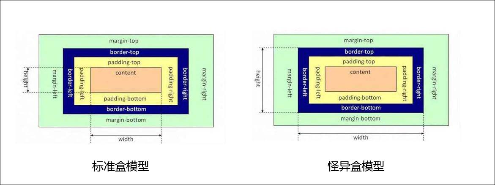

# CSS 基础知识

本章主要讲解 CSS 的一些基础知识，理解这些基础知识能让我们写出更好的CSS。

## 样式的引入

CSS 有三种引入方法：

- 行内样式表（内联式样式），每个 HTML 标签都有 `style`

### CSS选择器及其优先级

| **选择器**       | **格式**                | **优先级权重** |
| ---------------- | ----------------------- | -------------- |
| id选择器         | `#id`                   | 100            |
| 类选择器         | `.classname`            | 10             |
| 属性选择器       | `div[attr=value]`       | 10             |
| 伪类选择器       | `li:last-child`         | 10             |
| 标签选择器       | `element`               | 1              |
| 伪元素选择器     | `li::after`             | 1              |
| 相邻兄弟选择器   | `h1+p`                  | 0              |
| 相邻兄弟们选择器 | `h1~p`                  | 0              |
| 子选择器         | `ul>li`                 | 0              |
| 后代选择器       | `li a`                  | 0              |
| 通配符选择器     | `*`                     | 0              |
| 自带的样式       | 浏览器自带              | 1              |
| 行内样式         | `style="color: red;"`   | 1000           |
| `!important`     | `color: red;!important` | 1000           |
| 继承             | 继承                    | 0              |


对于选择器的**优先级**：

- 内联样式：1000

**注意事项：**

- `!important` 声明的样式的优先级最高；
- 如果优先级相同，则最后出现的样式生效；
- 继承得到的样式的优先级最低；
- 通用选择器（*）、子选择器（>）和相邻同胞选择器（+）并不在这四个等级中，所以它们的权值都为 0 ；
- 样式表的来源不同时，优先级顺序为：内联样式 > 内部样式 > 外部样式 > 浏览器用户自定义样式 > 浏览器默认样式。

### CSS 样式继承性

**一、无继承性的属性**

1) **display**：规定元素应该生成的框的类型
2) **文本属性**：

- vertical-align：垂直文本对齐
- text-decoration：规定添加到文本的装饰
- text-shadow：文本阴影效果
- white-space：空白符的处理
- unicode-bidi：设置文本的方向

3) **盒子模型的属性**：width、height、margin、border、padding
4) **背景属性**：background、background-color、background-image、background-repeat、background-position、background-attachment
5) **定位属性**：float、clear、position、top、right、bottom、left、min-width、min-height、max-width、max-height、overflow、clip、z-index
6) **生成内容属性**：content、counter-reset、counter-increment
7) **轮廓样式属性**：outline-style、outline-width、outline-color、outline
8) **页面样式属性**：size、page-break-before、page-break-after
9) **声音样式属性**：pause-before、pause-after、pause、cue-before、cue-after、cue、play-during

**二、有继承性的属性**

1. **字体系列属性**

- font-family：字体系列
- font-weight：字体的粗细
- font-size：字体的大小
- font-style：字体的风格

2. **文本系列属性**

- text-indent：文本缩进
- text-align：文本水平对齐
- line-height：行高
- word-spacing：单词之间的间距
- letter-spacing：中文或者字母之间的间距
- text-transform：控制文本大小写（就是uppercase、lowercase、capitalize这三个）
- color：文本颜色

3. **元素可见性**

- visibility：控制元素显示隐藏

4. **列表布局属性**

- list-style：列表风格，包括list-style-type、list-style-image等

5. **光标属性**

- cursor：光标显示为何种形态

###  display 的属性值及其作用

| **属性值**   | **作用**                                                   |
| ------------ | ---------------------------------------------------------- |
| none         | 元素不显示，并且会从文档流中移除。                         |
| block        | 块类型。默认宽度为父元素宽度，可设置宽高，换行显示。       |
| inline       | 行内元素类型。默认宽度为内容宽度，不可设置宽高，同行显示。 |
| inline-block | 默认宽度为内容宽度，可以设置宽高，同行显示。               |
| list-item    | 像块类型元素一样显示，并添加样式列表标记。                 |
| table        | 此元素会作为块级表格来显示。                               |
| inherit      | 规定应该从父元素继承display属性的值。                      |

### display 的 block、inline和inline-block的区别

（1）**block：** 会独占一行，多个元素会另起一行，可以设置width、height、margin和padding属性；

（2）**inline：** 元素不会独占一行，设置width、height属性无效。但可以设置水平方向的margin和padding属性，不能设置垂直方向的padding和margin；

（3）**inline-block：** 将对象设置为inline对象，但对象的内容作为 对象呈现，之后的内联对象会被排列在同一行内。

对于行内元素和块级元素，其特点如下：

**（1）行内元素**

- 设置宽高无效；
- 可以设置水平方向的margin和padding属性，不能设置垂直方向的padding和margin；
- 不会自动换行；

**（2）块级元素**

- 可以设置宽高；
- 设置margin和padding都有效；
- 自动换行；
- 多个块状，默认排列从上到下。

（3）inline-block

- 可以设置宽高；
- 设置margin和padding都有效；
- 不会自动换行，后面可以有其他元素。

[案例](https://www.w3school.com.cn/css/css_inline-block.asp)

### 隐藏元素的方法有哪些

- **display: none**：渲染树不会包含该渲染对象，因此该元素不会在页面中占据位置，也不会响应绑定的监听事件。
- **visibility: hidden**：元素在页面中仍占据空间，但是不会响应绑定的监听事件。
- **opacity: 0**：将元素的透明度设置为 0，以此来实现元素的隐藏。元素在页面中仍然占据空间，并且能够响应元素绑定的监听事件。
- **position: absolute**：通过使用绝对定位将元素移除可视区域内，以此来实现元素的隐藏。
- **z-index: 负值**：来使其他元素遮盖住该元素，以此来实现隐藏。
- **clip/clip-path** ：使用元素裁剪的方法来实现元素的隐藏，这种方法下，元素仍在页面中占据位置，但是不会响应绑定的监听事件。
- **transform: scale(0,0)**：将元素缩放为 0，来实现元素的隐藏。这种方法下，元素仍在页面中占据位置，但是不会响应绑定的监听事件。

### transition和animation的区别

- **transition是过度属性**，强调过度，它的实现需要触发一个事件（比如鼠标移动上去，焦点，点击等）才执行动画。它类似于flash的补间动画，设置一个开始关键帧，一个结束关键帧。
- **animation是动画属性**，它的实现不需要触发事件，设定好时间之后可以自己执行，且可以循环一个动画。它也类似于flash的补间动画，但是它可以设置多个关键帧（用@keyframe定义）完成动画。

### 对盒模型的理解

CSS3中的盒模型有以下两种：标准盒子模型、怪异盒子模型（IE盒子模型）。

   

盒模型都是由四个部分组成的，分别是 margin、border、padding 和 content。

标准盒模型和怪异盒模型的区别在于设置 width 和 height 时，所对应的范围不同：

- 标准盒模型的 width 和 height 属性的范围只包含了content，
- 怪异盒模型的 width 和 height 属性的范围包含了border、padding和content。

可以通过修改元素的 box-sizing 属性来改变元素的盒模型：

```css
box-sizing: border-box;  /*标准盒子模块*/
box-sizing: content-box; /*怪异*/
```

作者：CUGGZ
链接：https://juejin.cn/post/6905539198107942919
来源：稀土掘金
著作权归作者所有。商业转载请联系作者获得授权，非商业转载请注明出处。

