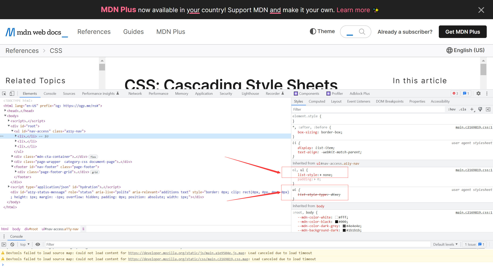
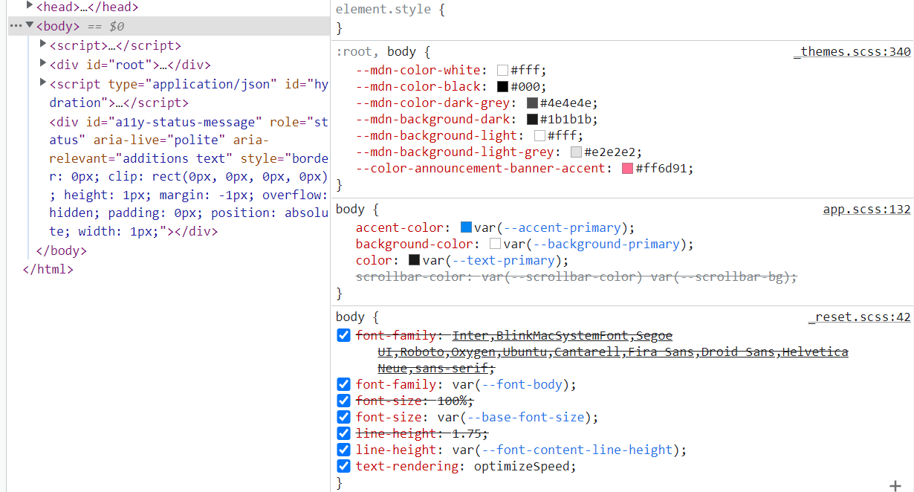

# CSS 基础：那些可能被你忽视的细节

本章主要梳理了 CSS 的一些基础知识。开始之前先做个小测验：

- CSS 有哪些引入方式？
- `:root #myApp input:required` 权重是多少？
- a 元素能继承父元素颜色吗，宽度呢？
- 你知道 CSS 变量吗？

先在评论区写下你的答案，看看你能答出几个。

## 样式的引入

CSS 有三种引入方法：分别是行内样式，内部样式表，外部样式表。

### 行内样式

行内样式也叫内联式样式，行内样式通过标签的 `style` 属性设置样式，如下所示：

```css
<h1 style="color:red;">style 属性的应用</h1>
<p style="font-size:14px;color:green;">直接在 HTML 标签中设置的样式</p>
<p style="display:none;">影藏的内容</p>
```

行内样式的优先级较高，可以用来设置某些特殊样式或者微调元素的样式。不建议把所有的样式放在行内样式表中，因为过多的样式会让元素变得“臃肿不堪”，使文档的文档结构不明晰，不利于维护。

### 内部样式表

内部样式表是把样式写在一个 `style` 标签内部：

```css
<!DOCTYPE html>
<html lang="en">

<head>
  <meta charset="UTF-8" />
  <meta http-equiv="X-UA-Compatible" content="IE=edge" />
  <meta name="viewport" content="width=device-width, initial-scale=1.0" />
  <title>内部样式表</title>
  <style>
    h1 {
      color: red;
    }

    p {
      font-size: 14px;
      color: green;
    }
  </style>
</head>

<body>
  <h1>style 属性的应用</h1>
  <p>直接在 HTML 标签中设置的样式</p>
</body>

</html>
```

内部样式表的方式实现了结构与样式的分离，这样做的好处是使得 HTML 专注于搭建网页结构，而CSS更加专注于元素样式的调整。这种方式在学习或演示CSS属性的时候非常有用，或者调试一个小功能的时候也非常方便。目前有一些前端框架就是采用的这种方式，例如 Vue，Svelte。这种写法在应对大型网站的时候不够友好，因为大型网站有很多页面，有许多CSS样式可以共用，如果每个页面都要重写一遍或者手动赋值，那种感觉也是挺痛苦的。因此就有了独立的CSS文件。

### 外部样式表

 外部样式表指的是把样式写在一个单独的样式文件中，然后通过文件路径引用：

```html
<link rel="stylesheet" href="reset.css">
<link rel="stylesheet" href="utils.css">
<link rel="stylesheet" href="main.css">
```

把样式单独的写在样式文件中，可以在需要的地方通过 `link` 标签引入，修改的时候，只需要修改一次，所有依赖该文件的网页都能生效。除此之外，还可以把自己的样式表以库的形式发布到网上，其他有需要的网站也可以引用，真的不要太方便。

## CSS 选择器

把样式写在样式表中（`style` 标签或者单独的样式文件中）需要解决一个问题：这个样式是写给谁的，或者谁需要这个样式，如果把样式必做各式各样的衣服，那么给元素应用样式的过程就像穿衣服的一样。穿衣服的过程就是应用样式的过程，CSS 通过 CSS 选择器给元素应用样式。

### 标签选择器

标签选择器通过元素标签名字选择标签，例如：

```css
h1 {
  color: red;
}
```

会把所有的 h1 标签的字体颜色设置为红色。

### id 选择器

id 选择器会选择具有某个 id 值得标签：

```html
<style>
  #tom {
    color: grey;
  }

  #garfield {
    color: orange;
  }
</style>

<h1 id="tom">我是汤姆猫</h1>
<h1 id="garfield">我是加菲猫</h1>
```

id 选择器的语法格式是 `#id-name`，一般来说 id 在一个网页中是唯一的，如果有两个元素有一样的 id 值会发生什么呢？那就是所有具有该 id 值的元素都会穿上相应样式。

### 类选择器

类选择器通过 `class` 属性应用相应的样式，它的声明方法是：

```css
<style>
  .grey {
    color: grey;
  }

  .orange {
    color: orange;
  }
</style>

<h1 class="grey">我是汤姆猫</h1>
<h1 class="orange">我是加菲猫</h1>
```

类选择通过 `.class-name` 声明类样式，类样式可以组合：

```css
<style>
  .grey {
    color: grey;
  }

  .orange {
    color: orange;
  }

  .underline {
    text-decoration: underline;
  }
  
  .small{
    font-size: 14px;
  }
</style>

<h1 class="grey underline">我是汤姆猫</h1>
<h1 class="orange small">我是加菲猫</h1>
```

每种样式有自己独特的效果，通过组合不同的样式来实现一个复杂的效果，就好像女生穿搭一样：涂个口红显得成熟，配个项链显得富贵，配个蝴蝶结显得可爱，配个丝袜显得性感，想要什么样的效果就搭配什么样式，所以女孩子特别喜欢学前端，对吧。

### 属性选择器

属性选择器可以选择具有某种属性的元素，语法如下所示：

```css
<style>
  [hello] {
    color: green;
  }
</style>

<h1 hello>我是汤姆猫</h1>
<h1>我是加菲猫</h1>
```

当然还可以设置属性值：

```css
<style>
  [hello=world] {
    color: green;
  }
</style>

<h1 hello="world">我是汤姆猫</h1>
<h1 hello>我是加菲猫</h1>
```

更强大的选择器[^3]：

```css
/* href 中含有 "example" */
a[href*="example"] {
  font-size: 2em;
}

/* href 以 ".org" 结尾 */
a[href$=".org"] {
  font-style: italic;
}

/* 样式表包含 "logo" */
a[class~="logo"] {
  padding: 2px;
}

/* href 包含 "insensitive" 忽略大小写，与正则开关类似 */
a[href*="insensitive" i] {
  color: cyan;
}
```

### 后代选择器

除了单独的选择某个元素，还可以通过元素的之间的嵌套关系选择，最常用的是后代选择器：

```css
<style>
  .summer .plant {
    color: green;
  }

  .autumn .plant {
    color: gold;
  }
</style>

<div class="summer">
  <div class="plant">玉米</div>
</div>

<div class="autumn">
  <div class="plant">玉米</div>
</div>
```

两个独立的选择器之间加一个空格表示：什么里面的什么，或者说，谁谁谁的后代的后代。反正空格表示后代关系，隔着也是可以的，只要在里面就能生效。上面里的例子表示夏天里的植物和秋天里的植物各是一个样式。

### 直接孩子选择器

直接孩子选择器的语法是 `parent>child`:

```html
<style>
  .summer>.plant {
    color: green;
  }

  .autumn>.plant {
    color: gold;
  }
</style>

<div class="summer">
  <div class="north">
    <div class="plant">玉米</div>
  </div>
</div>

<div class="autumn">
  <div class="plant">玉米</div>
</div>
```

隔代了就不管用了，必须是直接的孩子结点。

### 兄弟关系

相邻兄弟选择器 `one+two+three`：

```html
<style>
  .one+.two {
    color: red;
  }

  .two+.three {
    color: green;
  }

  .one+.three {
    color: blue;
  }
</style>

<div class="box">
  <div class="one">大娃</div>
  <div class="two">二娃</div>
  <div class="three">三娃</div>
</div>
```

特别注意大娃和三娃隔了个二娃，三娃的蓝色就不生效了。

### 小结

以上小节总结了一些常用的选择器，CSS 选择器实在是太多了，更多的选择器可以阅读参考文章[^1]。

【练习】如何选择除了第一个的所有子节点？

```css
ul li:not(:first-child){...}
```

## CSS选择器优先级

CSS（Cascading Style Sheets）叠层样式表，某一个元素可能同时被多个样式规则选中，例如通配符 *, 标签名，类，浏览器该用哪个样式呢？这时候就需要根据优先级来设置样式了。打开浏览器调试工具，在 Styles 一栏会显示元素的样式，并且优先级高的样式会显示在上面，优先级较低的样式会显示在下面，并且后面有很多相同的样式样式属性被划掉了，这是因为高优先级的样式覆盖了低优先级样式的缘故：



【知识点】样式权重分为三个等级：ID，Class，Type[^2]，因此施加在某个元素上的样式权重分别为：1-1-1。

【例】`ul#nav li.active a` 的权重是：`1-1-3`，其中有一个 ID 选择器 `#nav`，一个 Class 选择器 `.active` ，三个 Tyep 选择器：`ul, li, a`。

【知识点】样式权重计算规则，从高到低比较优先级。

【例】`1-3-2` 大于 `1-3-1`，先比较 ID：`1==1`，再比较 Class：`3==3`，再比较 Type: `2>1`。

每个等级的选择器都有哪些呢？

- **ID 级**。只有一个：`#id`，权重：`1-0-0`
- **Class 级**。1）类`.class`，2）属性：`[attr], [attr=value], [lang|="zh"]`，3）伪类：`:hover, :nth-of-type(3n), :required `，权重：`0-1-0`
- **Type 级**。1）标签名：`div, p , a`，2）伪元素：`::before, ::placeholder`，权重：`0-0-1`

【例外情况】

- 通配符 `*` 和伪类`:where()` 及其参数不贡献任何权重，即`0-0-0`
- 组合子  [`+`](https://developer.mozilla.org/en-US/docs/Web/CSS/Adjacent_sibling_combinator), [`>`](https://developer.mozilla.org/en-US/docs/Web/CSS/Child_combinator), [`~`](https://developer.mozilla.org/en-US/docs/Web/CSS/General_sibling_combinator), ["  "](https://developer.mozilla.org/en-US/docs/Web/CSS/Descendant_combinator), 和 [`||`](https://developer.mozilla.org/en-US/docs/Web/CSS/Column_combinator) 本身不贡献权重。
- 伪类 [`:not()`, `:is()` 和 `:has()`](https://developer.mozilla.org/en-US/docs/Web/CSS/Specificity#the-is-not-and-has-exceptions)本身不贡献权重，但它们的参数计算权重。
- 继承的样式权重为零。

【练习】计算如下规则的权重：

```css
[type="password"]             /* 0-1-0 */
input:focus                   /* ? */
:root #myApp input:required   /* ? */
h2:has(~ h2)                  /* ? */
```

【行内样式】

行内样式没有选择器，可以把它的权重看做：`1-0-0-0` ，或者说它比任何样式表的优先级都要高。唯一能覆盖行内样式表的方式是使用 `!important`。

## CSS 样式继承性

子元素的某些属性值可以从父元素继承而来，利用此特性可以减少大量重复代码。

### 有继承性的属性

1. **字体系列属性**

- font-family：字体系列
- font-weight：字体的粗细
- font-size：字体的大小
- font-style：字体的风格

2. **文本系列属性**

- text-indent：文本缩进
- text-align：文本水平对齐
- line-height：行高
- word-spacing：单词之间的间距
- letter-spacing：中文或者字母之间的间距
- text-transform：控制文本大小写（就是uppercase、lowercase、capitalize这三个）
- color：文本颜色

3. **元素可见性**

- visibility：控制元素显示隐藏

4. **列表布局属性**

- list-style：列表风格，包括list-style-type、list-style-image等

5. **光标属性**

- cursor：光标显示为何种形态

【例外】`a` 标签的字体大小与颜色没有继承性，这是因为浏览器样式(user agent style sheet)表的存在，可以在初始化样式表中加入：

```css
a{
    font-size: inherit;
    color: inherit;
}
```

就能和默认的样式说拜拜了。

【例外】正常文档流中的**块级元素**的宽度具有继承性。有的同学喜欢给元素加 `width: 100%;`，其实很多情况下没必要这么做，有的同学给浮动或定位盒子居中，发现居中不了，这是因为脱流流的盒子不继承父元素宽度，它的宽度由内容撑开。

【练习】问 123 的颜色是？

```html
<style>
    .main{
        color:blue
    }
    span{
        color:green
    }
</style>
<div style="color:red !important" class="main">
    <span>123</span>
</div>
```

### 无继承性的属性

虽然记住具有继承性的属性就行了，没有继承性的属性供参考也需要参考一下，以免抱有侥幸心理。注意：盒子模型的宽度是个特例。

1) **display**：规定元素应该生成的框的类型
2) **特殊文本属性**：

- vertical-align：垂直文本对齐
- text-decoration：规定添加到文本的装饰
- text-shadow：文本阴影效果
- white-space：空白符的处理
- unicode-bidi：设置文本的方向

3) **盒子模型属性**：width、height、margin、border、padding、outline、min-width、min-height、max-width、max-height、overflow、clip、
4) **背景属性**：background、background-color、background-image、background-repeat、background-position、background-attachment
5) **浮动与定位属性**：float、clear、position、top、right、bottom、left、z-index
6) **生成内容属性**：content、counter-reset、counter-increment
7) **页面样式属性**：size、page-break-before、page-break-after
9) **声音样式属性**：pause-before、pause-after、pause、cue-before、cue-after、cue、play-during

## CSS 变量

不知道屏幕前的你有没有听说过CSS变量，在检查某些网站的源码时偶然间就发现了CSS变量这个好东西：



利用CSS变量可以方便的调整网页样式，尤其结合 JavaScript 可以更加优雅的调节样式，利用CSS变量可以轻松实现网页换肤功能。

### 认识CSS变量[^4]

**声明**：`--var-name: var-value;`

**读取**：`var(--var-name, [fallback-value])`

**类型**：

- 普通：只能用作属性值不能用作属性名
- 数值：使用 `calc()`与数值单位连用 `var(--width) * 10px`

**作用域**：在当前元素块作用域及其子元素块作用域下有效。

### JavaScript API

JavaScript 中主要有3个操作**CSS变量**的 API，看上去简单易记，分别如下：

- 读取变量：`elem.style.getPropertyValue()`
- 设置变量：`elem.style.setProperty()`
- 删除变量：`elem.style.removeProperty()`

## 参考文章

[^1]: MDN. [CSS selectors](https://developer.mozilla.org/en-US/docs/Web/CSS/CSS_Selectors). 

[^2]: MDN. [Specificity](https://developer.mozilla.org/en-US/docs/Web/CSS/Specificity).

[^3]: MDN. [Attribute selectors](https://developer.mozilla.org/en-US/docs/Web/CSS/Attribute_selectors).

[^4]:JowayYoung. [妙用CSS变量，让你的CSS变得更心动](https://juejin.cn/post/6844904084936327182). 稀土掘金.


> ♥ 我是前端工程师：你的甜心森。非常感谢大家的点赞与关注，欢迎大家参与讨论或协作，QQ交流群：233589794。
>
> ★ 本文[开源](https://github.com/xiayulu/FrontEndCultivation)，采用 [CC BY-SA 4.0 协议](http://creativecommons.org/licenses/by-sa/4.0/)，转载请注明出处：[前端工程师的自我修养](https://github.com/xiayulu/FrontEndCultivation). GitHub.com@xiayulu.
>
> ★ 创作合作或招聘信息请发私信或邮件：zuiaiqiansen@163.com，注明主题：创作合作或**招聘前端工程师**。
