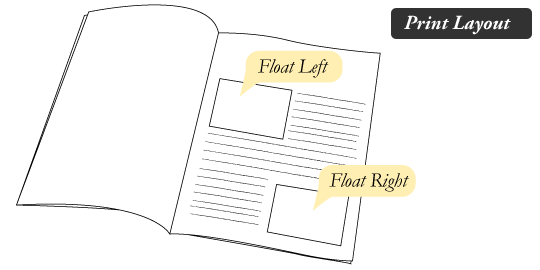
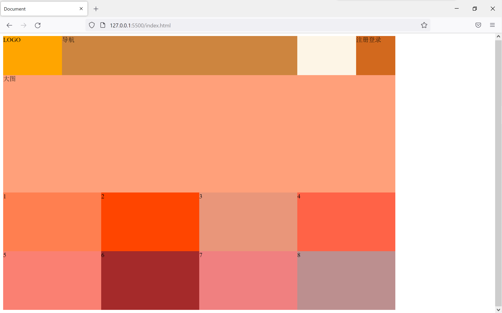
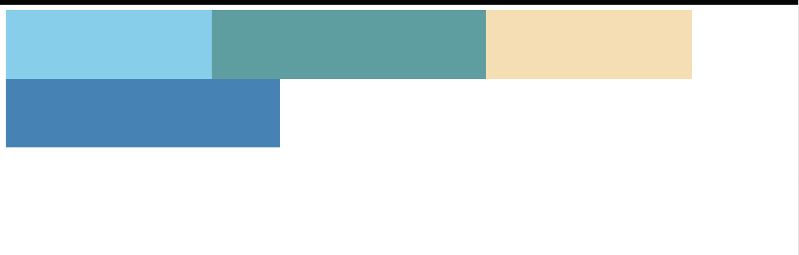
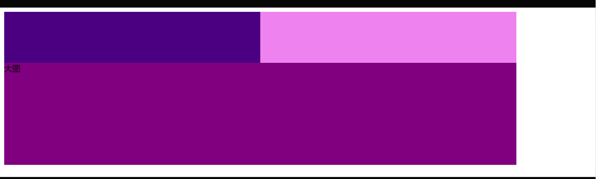
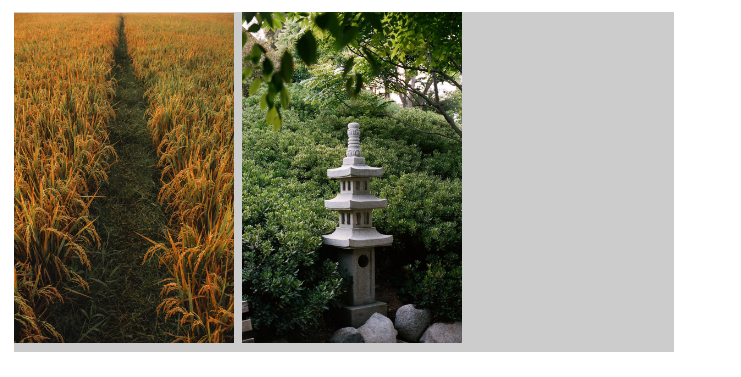
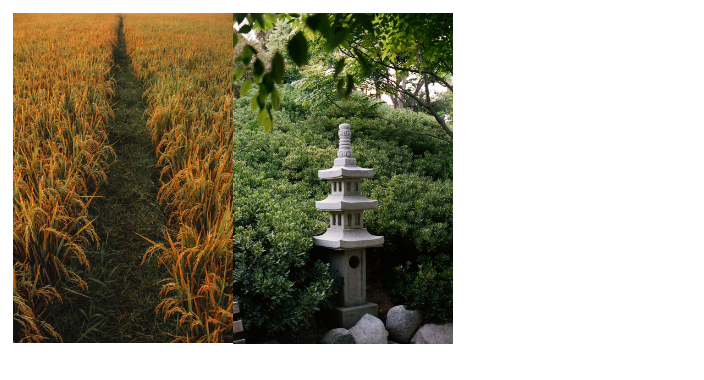
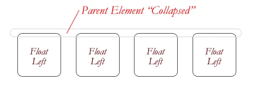
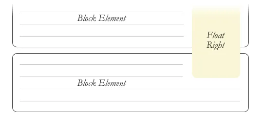
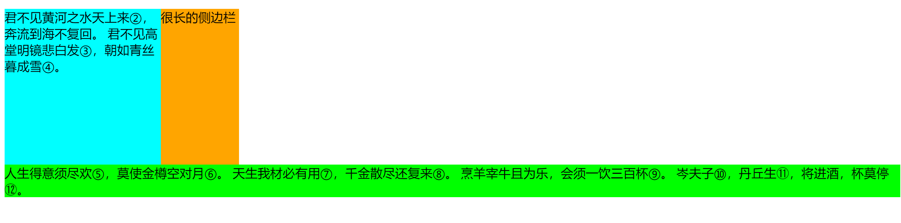

# CSS 浮动详解：场景、案例、易错点和清除浮动

## 浮动与布局

浮动的本意是解决一个排版问题：实现文字环绕图片的效果，但是Web初期没有好的布局工具，所以浮动被广泛用做布局工具：（图片来自[^1]）



[在线案例](https://codepen.io/team/css-tricks/pen/RPYWGj/9fbe5755324cb9d3ca4a4060fdcd3058)。

浮动是每个前端人的必修课程，自己的前端第一课就是利用浮动画色块，当整个网页被花花绿绿绿的色块填满的时候，成就感满满的：



```html
<style>
  .a {
    width: 1000px;
    height: 100px;
    background-color: oldlace;
  }

  .a1 {
    width: 150px;
    height: 100px;
    background-color: orange;
    float: left;
  }

  .a2 {
    width: 600px;
    height: 100px;
    background-color: peru;
    float: left;
  }

  .a3 {
    width: 100px;
    height: 100px;
    background-color: chocolate;
    float: right;
  }

  .b {
    width: 1000px;
    height: 300px;
    background-color: LightSalmon;
  }

  .c {
    width: 1000px;
    height: 300px;
    background-color: seashell;
  }

  .c1 {
    width: 250px;
    height: 150px;
    background-color: Coral;
    float: left;
  }

  .c2 {
    width: 250px;
    height: 150px;
    background-color: OrangeRed;
    float: left;
  }

  .c3 {
    width: 250px;
    height: 150px;
    background-color: DarkSalmon;
    float: left;
  }

  .c4 {
    width: 250px;
    height: 150px;
    background-color: Tomato;
    float: left;
  }

  .c5 {
    width: 250px;
    height: 150px;
    background-color: Salmon;
    float: left;
  }

  .c6 {
    width: 250px;
    height: 150px;
    background-color: Brown;
    float: left;
  }

  .c7 {
    width: 250px;
    height: 150px;
    background-color: LightCoral;
    float: left;
  }

  .c8 {
    width: 250px;
    height: 150px;
    background-color: RosyBrown;
    float: left;
  }
</style>

<div class="a">
  <div class="a1">LOGO</div>
  <div class="a2">导航</div>
  <div class="a3">注册登录</div>
</div>

<div class="b">大图</div>

<div class="c">
  <div class="c1">1</div>
  <div class="c2">2</div>
  <div class="c3">3</div>
  <div class="c4">4</div>
  <div class="c5">5</div>
  <div class="c6">6</div>
  <div class="c7">7</div>
  <div class="c8">8</div>
</div>
```

[在线演示](https://codepen.io/xiayulu/pen/LYmaMag)，建议复制代码到本地打开，效果更好。

画色块块的时候，先用PS量好宽高，然后用CSS写好高度和宽度和背景颜色以及备注，命名是按abcdefg来，画完之后整个网页就是花花绿绿的，是不是挺漂亮的呀。

这就是浮动布局。

【要点】浮动布局要点：

- 先分析设计稿，把网页内容按大到小分块。
- 用PS量每个块的高度与宽度。
- 用 CSS+浮动画色块。

### 浮动布局常见问题

**问题一、超出宽度。**如果内容超出容器宽度，那么就会后面的小盒子就会掉出来：



```html
<style>
  .a {
    width: 1000px;
    height: 100px;
    background-color: wheat;
  }

  .a1 {
    width: 300px;
    height: 100px;
    background-color: skyblue;
    float: left;
  }

  .a2 {
    width: 400px;
    height: 100px;
    background-color: cadetblue;
    float: left;
  }

  .a3 {
    width: 400px;
    height: 100px;
    background-color: steelblue;
    float: left;
  }
</style>
<div class="a">
  <div class="a1"></div>
  <div class="a2"></div>
  <div class="a3"></div>
</div>
```

[在线案例](https://codepen.io/xiayulu/pen/dyerwxa)。

如果你在画色块的时候发现某个色块掉出来了，那说明量宽度的时候量多了一点。量高度的时候确实容易出错，因为色块多的时候，眼睛都量花了，建议中途多休息，不要硬刚，身体要紧。

**问题二、消失的盒子高度。**有的同学在画色块的时候，发现有一个诡异的现象：



```html
<style>
  .a {
    width: 1000px;
    background-color: lavender;
  }

  .a1 {
    width: 500px;
    height: 100px;
    background-color: Indigo;
    float: left;
  }

  .a2 {
    width: 500px;
    height: 100px;
    background-color: Violet;
    float: left;
  }

  .b {
    width: 1000px;
    height: 300px;
    background-color: Purple;
  }
</style>

<div class="a">
  <div class="a1"></div>
  <div class="a2"></div>
</div>

<div class="b">大图</div>
```

[在线案例](https://codepen.io/xiayulu/pen/YzLgBXb)。

大图的盒子明明设置了300px的高度，为啥只剩200px了呢？b 盒子的高度到哪里去了呢，为什么呢？？？为什么呢？？？

【解读】原因在于 a 盒子没有设置高度，导致了 b 盒子向上平移了 100px。这是十分常见的错误：忘记给盒子设置高度。在实际开发过程中，盒子很多，没有色块的提示，很容易忘掉高度。一般来说，网页出现文字与背景分离的现象，多半是这种错误。解决方法是设置高度，或清除浮动。

【思考】有的同学看到了“大图”两个文字出现在 a 盒子的下面，如果平移了，文字应该在上面啊，这该怎么解释？

## 浮动的性质

### 浮动盒子会脱离文档流

为什么会出现上述第二种情况呢？这是因为浮动会脱离正常文档流，准确的是脱离文档流半层。脱离文档流半层指的是**浮动盒子的背景脱离文档流，但内容依然占据原来的位置**：


代码：

```html
<style>
  .a {
    width: 100px;
    height: 100px;
    background-color: rgb(0, 0, 0, 0.2);
    float: left;
  }

  .b {
    background-color: orange;
  }
</style>

<div class="a"></div>
<div class="b">
  <p>窗前明月光</p>
  <p>疑是地上霜</p>
  <p>举头望明月</p>
  <p>低头思故乡</p>
</div>
```

[在线演示](https://codepen.io/xiayulu/pen/OJZqqwE)

【解读】首先给 a 盒子一个宽高和透明颜色，并设置浮动，然后再给 b 盒子添加内容和设置背景颜色。因为浮动盒子的背景脱离了文档流，所以b 盒子的背景整个向上移动了，但是 a 盒子的内容没有脱离文档流，所以把 b 盒子的内容挤到旁边去了。如果把a盒子的宽度设置成100%，那么 a 盒子的内容就会完全被挤下来，再给 b 设置一个固定高度就会出现内容与背景分离的现象：


```html
<style>
  .a {
    width: 100%;
    height: 100px;
    background-color: rgb(0, 0, 0, 0.2);
    /*注释浮动会正常排布*/
    float: left;
  }

  .b {
    height: 150px;
    background-color: orange;
  }
</style>

<div class="a"></div>
<div class="b">
  <p>窗前明月光</p>
  <p>疑是地上霜</p>
  <p>举头望明月</p>
  <p>低头思故乡</p>
</div>
```

为了防止浮动盒子背景高度塌陷而导致混乱的排版，可以通过给浮动盒子包一个固定高度的容器解决：

```html
<style>
  .wrapper {
    height: 100px;
  }

  .a {
    width: 100px;
    height: 100px;
    background-color: rgb(0, 0, 0, 0.2);
    float: left;
  }

  .b {
    background-color: orange;
  }
</style>

<div class="wrapper">
  <div class="a"></div>
</div>

<div class="b">
  <p>窗前明月光</p>
  <p>疑是地上霜</p>
  <p>举头望明月</p>
  <p>低头思故乡</p>
</div>
```

这样就不会影响到后面元素的排列。


### 浮动元素的位置

浮动的盒子会脱离文档流（半层），然后紧靠父元素或其他浮动盒子的左边界或右边界，并且紧靠父元素的上边界。如果父元素剩下的宽度放不下浮动元素，浮动盒子会另起一行，继续依次规则排列。

【重点】浮动的盒子是紧挨着的，没有一点缝隙，如果不设置外边距。

【案例】清除图片之间的缝隙。

```html
<style>
  .a {
    width: 300px;
    background-color: rgb(0, 0, 0, 0.2);
  }

  .a img {
    width: 100px;
  }
</style>

<div class="a">
  
  
</div>
```



仔细观察上面两张图片，它们中间存在一个缝隙，缝隙是由图片元素之间的空白字符形成的，你可以把两张图片挨在一起写，中间不加空格，不加换行：

```html

```

但是这个解决方案不靠谱，因为代码格式化一下就可能挂了，所以通过给两张图片加上浮动，就能完美解决这个问题（加上浮动之后背景也没了）。[在线演示](https://codepen.io/xiayulu/pen/MWGxRYw)：



### 浮动盒子对父元素的高度贡献为零

 正常布局流中，如果父元素没有设置高度值，那么它的高度等于内容撑开的高度，也叫自然高度。然而，浮动盒子对父元素的高度贡献值为零，如果一个容器只包含浮动盒子（浮动布局），那么它的高度为零，这种现象称为父元素塌陷：



父元素塌陷不仅会影响本容器，后续所有的元素都可能收到影响，尤其是容器内的内容有益处现象时：



[在线案例](https://codepen.io/xiayulu/pen/QWroRza)

之前的案例通过为父元素设置一个高度值解决了这一问题，这种方式存在一个明显的缺点：当内容高度不确定或内容超出容器高度时失效。有没有什么方法技能消除浮动的副作用又能能保持父元素的自然高度呢？

第一种方法：给父元素容器设置：

```css
overflow: hidden;
```

这样里面的元素就不会影响到外面了。这种方法虽然解决了副作用，但没有解决自然高度问题。


## 清除浮动

清除浮动与浮动是一对孪生兄弟，浮动虽然好用，但有时候不太“听话”：可能会影响其他的元素，清除浮动就是用来给浮动盒子“擦屁股的”。

**clear 属性**定义了元素的哪边上不允许出现浮动元素。在 CSS1 和 CSS2 中，这是通过自动为清除元素（即设置了 clear 属性的元素）增加上外边距实现的。在 CSS2.1 中，会在元素上外边距之上增加清除空间，而外边距本身并不改变。不论哪一种改变，最终结果都一样，如果声明为左边或右边清除，会使元素的上外边框边界刚好在该边上浮动元素的下外边距边界之下[^2]。

常用声明方式：

```css
clear: none;
clear: left;
clear: right;
clear: both;
```
接上述问题。

第二种方法: 创建一个空元素，给他设置 `.clear{clear:both;}`，形成一个隔离区（此时需要去掉 box 的高度）：

```html
<div class="box cyan">
  <div class="side orange right">很长的侧边栏</div>
  <p>
    君不见黄河之水天上来②，奔流到海不复回。
    君不见高堂明镜悲白发③，朝如青丝暮成雪④。
  </p>
  <div class="clear"></div>
</div>

<div class="lime">
  人生得意须尽欢⑤，莫使金樽空对月⑥。
  天生我材必有用⑦，千金散尽还复来⑧。
  烹羊宰牛且为乐，会须一饮三百杯⑨。
  岑夫子⑩，丹丘生⑪，将进酒，杯莫停⑫。
</div>
```



Nice!!!完美解决副作用和自然高度问题，但这种方法会出多一个空元素，看着难受，使用 `::after` 伪元素改进：

```css
<style>
  .box {
    width: 300px;
    /*height: 100px;*/ /*高度不需要*/
  }

  .side {
    width: 100px;
    height: 200px;
  }

  .right {
    float: right;
  }

  .clearfix::after {
    /*三条缺一不可*/
    display: block;
    content: '';
    clear: both;
    /*兼容性*/
    visibility: hidden;
    height: 0;
  }

  .orange {
    background-color: orange;
  }

  .lime {
    background-color: lime;
  }

  .cyan {
    background-color: cyan;
  }
</style>

<div class="box cyan clearfix">
  <div class="side orange right">很长的侧边栏</div>
  <p>
    君不见黄河之水天上来②，奔流到海不复回。
    君不见高堂明镜悲白发③，朝如青丝暮成雪④。
  </p>
</div>

<div class="lime">
  人生得意须尽欢⑤，莫使金樽空对月⑥。
  天生我材必有用⑦，千金散尽还复来⑧。
  烹羊宰牛且为乐，会须一饮三百杯⑨。
  岑夫子⑩，丹丘生⑪，将进酒，杯莫停⑫。
</div>
```

只要给父元素套一个样式：clearfix 就可以完美消除浮动的副作用啦。

## 小结

- 浮动元素会脱离文档流半层，浮动元素背景脱离文档流。
- 浮动元素不会给父元素贡献高度。
- 浮动元素具有优良性质：行内元素也可设置高宽，上下边距，并且不存在外边距塌陷。
- 浮动元素可能影响后续元素排版，可使用 clear 清除浮动，使用封装的 clearfix 类更佳。

## 参考文章

[^1]: Sara Cope. [float](https://css-tricks.com/almanac/properties/f/float/). css-tricks.com.

[^2]:Isabella. [css清除浮动的原理和方法](https://segmentfault.com/a/1190000039658450). segmentfault.

> ♥ 我是前端工程师：你的甜心森。非常感谢大家的点赞与关注，欢迎大家参与讨论或协作。
>
> ★ 本文[开源](https://github.com/xiayulu/FrontEndCultivation)，采用 [CC BY-SA 4.0 协议](http://creativecommons.org/licenses/by-sa/4.0/)，转载请注明出处：[前端工程师的自我修养](https://github.com/xiayulu/FrontEndCultivation). GitHub.com@xiayulu.
>
> ★ 创作合作或招聘信息请发私信或邮件：zuiaiqiansen@163.com，注明主题：创作合作或**招聘前端工程师**。

