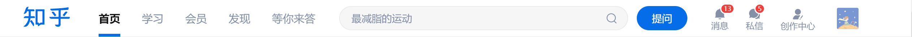

## 常见布局案例

上一章我们学习了可用于布局的CSS属性，本章把之前学到的布局知识用于实战之中。

### 行布局

行布局使得元素排布在同一行，使用行布局的一些场景：

- 头部导航栏
- 工具栏
- 数据统计

知识点：flex, grid。

难点：对齐，间距，响应式，长宽。

【案例1】[知乎](https://www.zhihu.com/)首部导航。



知乎的首部导航栏是典型的行布局，Logo，导航链接，搜索框，提问按钮等元素处在同一行。实现行布局最简单的是弹性盒子(FlexBox)。

```html
<header>
  <a href="https:zhihu.com" class="logo">
    <h1>知乎</h1>
  </a>
  <nav>
    <a href="#!" class="header-link">首页</a>
    <a href="#!" class="header-link">学习</a>
    <a href="#!" class="header-link">会员</a>
    <a href="#!" class="header-link">发现</a>
    <a href="#!" class="header-link">等你来答</a>
  </nav>
  <div class="s-box">
    <form class="s-form">
      <input type="text" class="s-input">
    </form>
    <button class="s-button">提问</button>
  </div>
  <div class="info-box">
    <div class="info-button">
      <span>消息</span>
    </div>
    <div class="info-button">
      <span>私信</span>
    </div>
    <div class="info-button">
      <span>创作中心</span>
    </div>
  </div>
  <div class="avatar">
    
  </div>
</header>
```

这里我们先用HTML把结构搭建出来，然后使用弹性布局：

```css
header{
  display: flex;
  align-items: center;
  justify-content: space-between;
  
  background-color: #fff;
  padding: 5px 55px 5px 15px;
}

.s-box{
  display: flex;
  align-items:center;
}

.info-box{
  display: flex;
  align-items: center;
}

/*其他样式*/
body{
  margin:0;
  background-color:#eee;
}

header a{
  text-decoration:none;
}

.logo{
  font-size: 2rem;
}

.avatar-img{
  height: 2rem;
  width: 2rem;
}
```

结果：


【解读】

- 通过 `  display: flex;  ` 使得元素在排列在一行，通过 `align-items: center;` 使得元素在交叉轴方向居中（垂直居中）。
- 通过 `justify-content: space-between;` 使得元素在水平方向均匀分布，并且间距相同。
- 说明：这里我们没有对元素进行细节方面的修饰，例如设置链接之间的边距，颜色，边框等，仅做布局演示。

【思考】

1. 如何使得输入框的长度占据多余的空间？（提示：使用 `flex-grow`）

### 列布局

列布局使得元素纵向排布。主要使用场景：

- 列表
- 卡片
- 数据
- 导航链接

知识点：flex, grid。

难点：对齐，间距，高度，响应式。

【示例1】使用 block 盒子实现列布局，因为 block 盒子默认是一个接一个排列的。

```html
<div class="h-20 w-100 black"></div>
<div class="h-20 w-100 green"></div>
<div class="h-20 w-100 gold"></div>
```

 ```css
.h-20 {
  height: 20px;
}

.w-100 {
  width: 100px;
}

.black {
  background-color: #000;
}

.green {
  background-color: #f00;
}

.gold {
  background-color: gold;
}
 ```


【案例2】使用 `flex` 列向布局。之前我们使用 `flex` 实现了知乎的导航栏的横向布局，但是没有实现红框框里的图标与文字布局。


```html
<div class="info-box">
  <div class="info-button">
    <span>
      <svg width="18" height="18" viewBox="0 0 24 24" data-new-api="BellFill24" data-old-api="Bell" class="Zi Zi--Bell css-7dgah8" fill="currentColor">
        <path d="M9.723 21.271c0-.42.34-.76.76-.76h3.043a.76.76 0 010 1.521h-3.043a.76.76 0 01-.76-.76z" fill-rule="evenodd" clip-rule="evenodd"></path>
        <path d="M11.153 3.115c0-.618.376-1.115.844-1.115.469 0 .845.499.845 1.115v.183c3.997.369 7.012 4.117 7.024 8.515v5.655h.253a.76.76 0 110 1.521H3.891a.76.76 0 010-1.521h.253v-5.655c.011-4.392 3.02-8.137 7.009-8.514v-.184z">
        </path>
      </svg>
    </span>
    <span>消息</span>
  </div>
  <div class="info-button">
    <span><svg width="18" height="18" viewBox="0 0 24 24" data-new-api="ChatBubbleTwoFill24" data-old-api="Comments" class="Zi Zi--Comments css-7dgah8" fill="currentColor">
        <path d="M2 11c0 1.79.553 3.45 1.498 4.82L2.6 18.667a.6.6 0 00.751.753l3.07-.96A8.5 8.5 0 102 11zm11.46 9.414c-.457.16-.506.794-.034.904A6.96 6.96 0 0015 21.5c1.148 0 2.422-.31 3.444-.912.357-.217.658-.378 1.043-.252l1.414.42c.357.112.679-.168.574-.546l-.47-1.57a.736.736 0 01.05-.632c.602-1.108.945-2.32.945-3.498 0-1.07-.248-2.11-.7-3.046-.21-.435-.815-.25-.872.23-.47 3.954-3.211 7.394-6.968 8.72z" fill-rule="evenodd" clip-rule="evenodd"></path>
      </svg></span>
    <span>私信</span>
  </div>
  <div class="info-button">
    <span><svg width="18" height="18" viewBox="0 0 24 24" data-new-api="UserPencilFill24" data-old-api="UserPencilFill24" class="ZDI ZDI--UserPencilFill24 css-7dgah8" fill="currentColor">
        <path d="M6.5 7.5A5.5 5.5 0 0112 2a5.5 5.5 0 015.5 5.5A5.5 5.5 0 0112 13a5.5 5.5 0 01-5.5-5.5zm8.11 9.498c.404-.408.91-1 1.17-1.51.067-.133.13-.284.165-.442.034-.15.058-.373-.033-.602a.872.872 0 00-.545-.509 1.37 1.37 0 00-.604-.043c-.657.082-1.518.184-2.373.24-.867.055-1.68.058-2.254-.041-1.189-.204-2.045-.19-2.781.087-.722.272-1.25.773-1.804 1.302-1.533 1.462-2.434 3.311-2.65 4.831-.11.78.535 1.339 1.199 1.339h8.1a.96.96 0 00.955-.929c.06-1.767.7-2.96 1.456-3.723zm6.504-1.568a.75.75 0 10-1.228-.86l-2.903 4.146a.75.75 0 001.229.86l2.902-4.146zm-4.227 6.099a.75.75 0 10-1.241-.842l-.267.392a.75.75 0 001.242.842l.266-.392z" fill-rule="evenodd" clip-rule="evenodd"></path>
      </svg></span>
    <span>创作中心</span>
  </div>
</div>
```

```css
.info-box {
  display: flex;
  align-items: center;
}

.info-button {
  display: flex;
  flex-direction: column;
  align-items: center;
  
  /*辅助样式*/
  color: #8590a6;
  margin-right: 24px;
  font-size:12px;
}
```

结果：


### 行列布局

行列布局要求组合行与列的元素，例如知乎用户信息布局：


左边的头像与右边的昵称与简介采用行列混合布局。

```html
<div class="user">
  <span class="avatar">
    
  </span>
  <div class="detail">
    <a href="#!" target="_blank" class="nickname">叉猹少年闰土</a>
    <div class="bio">外星人你知道吗</div>
  </div>
</div>
```

```css
.user {
  display: flex;
  align-items: center;
}

.detail {
  margin-left: 14px;
  height: 40px;
}

.avatar {
  width: 38px;
  height: 38px;
}

.avatar-img {
  width: 38px;
  height: 38px;
  border-radius: 2px;
}

.nickname {
  font-weight: 600;
  font-size: 15px;
  line-height: 1.1;
  color: #444;
  text-decoration: none;
}

.bio {
  font-size: 14px;
  color: #646464;
  line-height: 1.6;
  margin-top: 2px;
}
```

效果：


### 固定布局

固定布局使得某些元素固定在页面的某个地方，例如头部导航栏，底部工具栏，侧边导航栏，文章目录等。

知识点：位置，宽高。

难点：位置设置，宽高比例的调整。

【案例1】固定侧边栏布局

```html
<header class="header">固定头部</header>
<aside class="menu">固定侧边栏</aside>
<main class="content">主要内容</main>
```

```css
body{
  background-color:#eee;
  margin: 0;
}

:root{
  --menu-width: 200px;
}

.header{
  position:fixed;
  top:0;
  width:100%;
  height: 2.5rem;
  background-color: pink;
}

.menu{
  position: fixed;
  left:0;
  top: 2.5rem;
  width: var(--menu-width);
  background-color: skyblue;
}

.content{
  background-color: gold;
  height: 900px;
  width: calc(100% - var(--menu-width));
  margin-left: auto;
  margin-top: 2.5rem;
}
```

结果：


### 瀑布流布局

