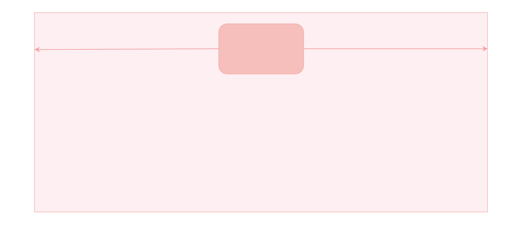
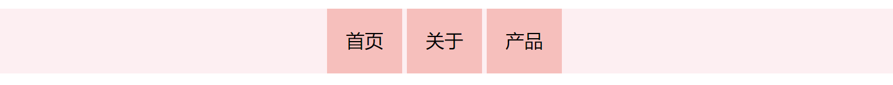
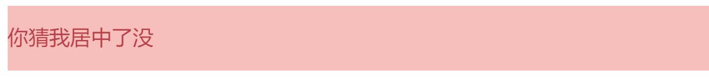
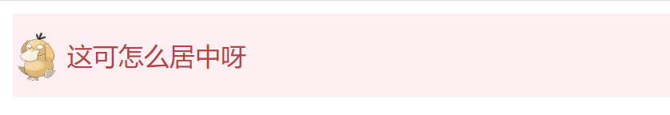
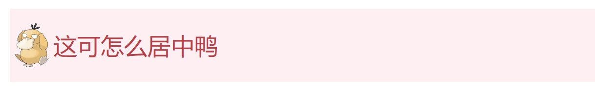
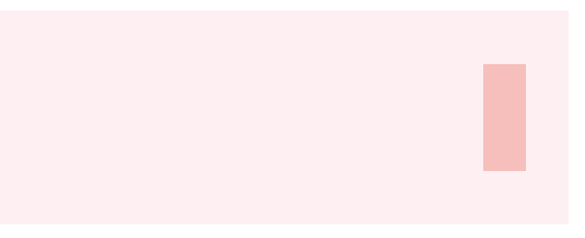
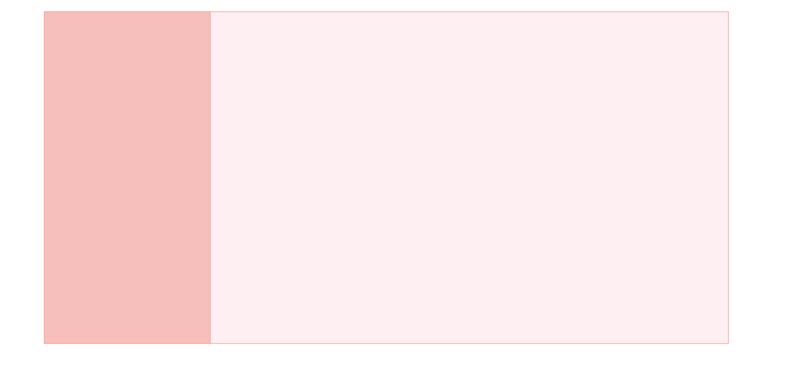
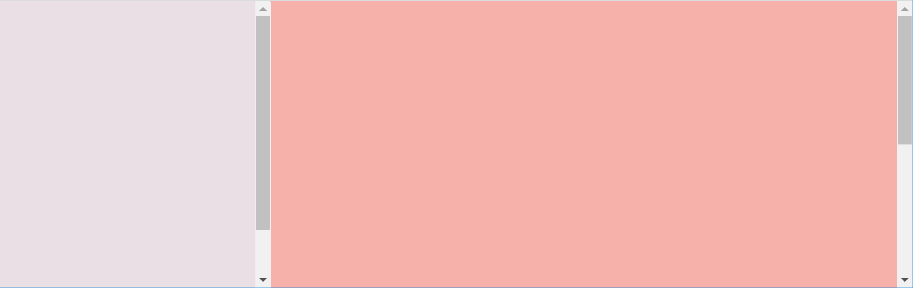
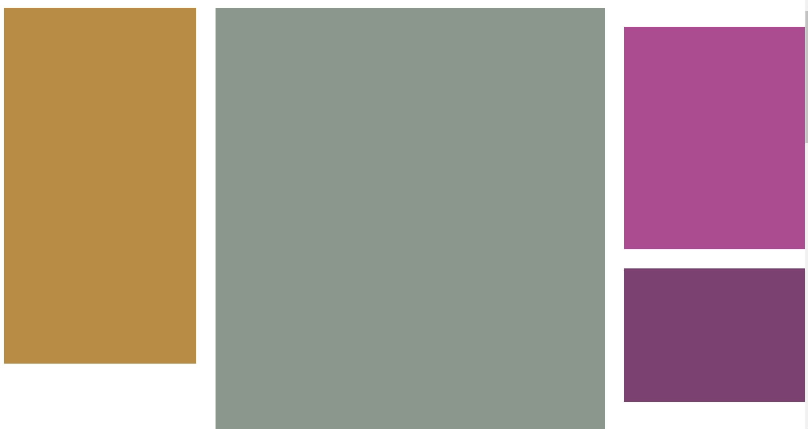
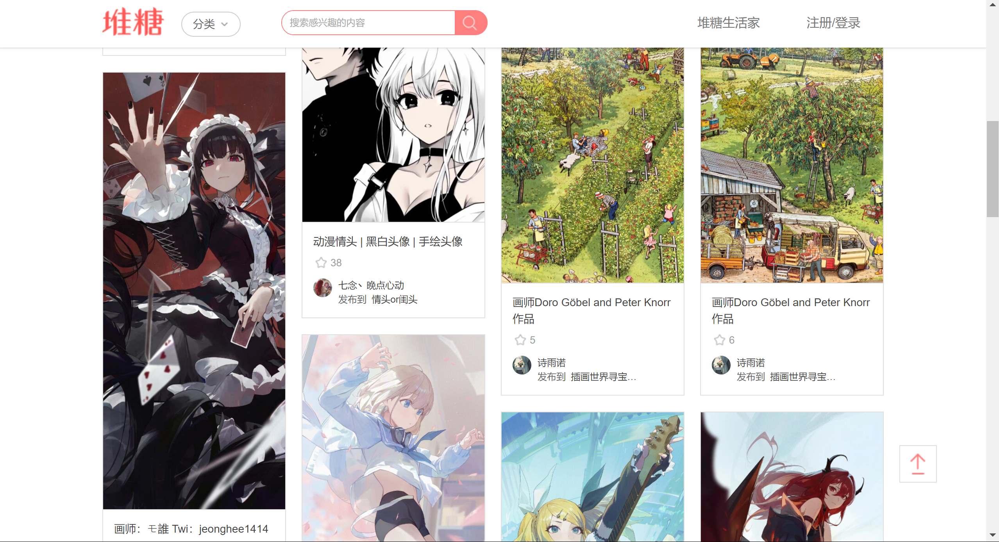

# CSS 布局案例：不会还有人不会布局吧

CSS 布局是前端最重要的一课，学会了 CSS 布局前端就算入门了。本文总结了常见的布局案例，可以作为 CSS 布局的学习资料，也可以作为开发的参考资料，建议大家先收藏，如果对你有帮助可以考虑点个小小的赞。

## 水平居中

水平居中布局要求：假设容器的宽度为 $x$，中间内容的宽度为 $y$，则左边空余宽度=右边空余宽度=$(x-y)/2$，如下图所示：



### 方法一、margin: auto;

```html
    <style>
      .box {
        height: 50vh;
        background-color: #fdeff2;
      }

      .content {
        width: 150px;
        height: 100px;
        background-color: #f6bfbc;

        margin: 0 auto; /*居中*/
      }
    </style>

    <div class="box">
      <div class="content"></div>
    </div>
```

【要点解读】水平居中的含义：当容器宽度比内容大的时候，“居中”才有意义，因此使用此方法的前提是内容的宽度比容器的宽度小。

【易错点】对和容器宽度相等的内容使用 `margin:auto;`，例如容器是浮动盒子时，脱流的定位容器。

【原理】margin 的 auto 值等于剩余空间的宽度，写 `margin-left: auto；`内容会被顶到右边，如果同时设置左右 `margin: 0 auto;` 则左右平分剩余空间。

【技巧】`margin: 0 auto;` 可以简写成：`margin: auto;` 因为当 margin-top 或 margin-bottom 为 auto 时值为 0 ，除非脱离文档流。

### 方法二、弹性盒子

```html
    <style>
      .box {
        height: 150px;
        background-color: #fdeff2;
        display: flex;
        justify-content: center; /*居中*/
      }

      .content {
        width: 150px;
        height: 100px;
        background-color: #f6bfbc;
      }
    </style>

    <div class="box">
      <div class="content"></div>
    </div>
```

【解读】弹性盒子有专门的居中方案：即在主轴与交叉轴方向设置 center。

### 方法三、text-align: center

当内容是非块级元素时，使用 `text-align:center;`  可以实现居中效果：

```html
    <style>
      ul {
        text-align: center;

        /* 其他样式 */
        line-height: 40px;
        list-style: none;
        margin: 0;
        padding: 0;
        background-color: #fdeff2;
      }

      ul li {
        display: inline-block;

        /* 其他样式 */
        background-color: #f6bfbc;
        padding: 8px 16px;
      }
    </style>
    <ul>
      <li>首页</li>
      <li>关于</li>
      <li>产品</li>
    </ul>
```



【要点解读】text-align 的方法经常在文本居中时使用，并且该属性具有继承性，使用起来非常方便。用于布局时，常用语导航条内的链接居中，把 `li` 设置成 `inline-block` 然后居中即可。

【易错点】没有分清容器与内容，把 inline-block 设置到容器元素上了。

【易错点】对宽度与内容相等的容器使用，例如浮动的容器。

### 方法四、定位实现

```html
    <style>
      .box {
        height: 200px;
        background-color: #fdeff2;

        position: relative;
      }

      .content {
        width: 150px;
        height: 100px;
        background-color: #f6bfbc;

        /* 定位实现水平居中
        1. left=right
        2. 剩余空间的宽度大于零
        3. 内容宽度已知
        */
        position: absolute;
        left: 0;
        right: 0;
        margin: auto;
      }
    </style>

    <div class="box">
      <div class="content"></div>
    </div>
```

【要点解读】设置左右距离相等，然后设置 `margin: auto;`

【易错点】需要知道内容的宽度，如果不设置内容的宽度，则铺满容器。

### 小结

这么多水平居中的方法，你学会了了吗？

【练习】请说出几种水平居中的方法，各有何优缺点？

## 垂直居中

### 方法一、line-height 实现文字垂直居中

思路：把 line-height 设置成容器的高度，即可实现文字居中。

```html
<style>
  .box {
    height: 50px;
    background-color: #fdeff2;
  }

  .content {
    line-height: 50px;
    background-color: #f6bfbc;
    color: #b94047;
  }
</style>

<div class="box">
  <div class="content">你猜我居中了没</div>
</div>
```



### 方法二、vertical-align 实现图片文字居中

```html
    <style>
      .box {
        line-height: 50px;
        background-color: #fdeff2;
        color: #b94047;
      }

      .box img {
        height: 30px;
        vertical-align: middle;
      }

      .box span {
        vertical-align: middle;
      }
    </style>

    <div class="box">
      
      <span>这可怎么居中呀</span>
    </div>
```



【要点】该方法只能用于具有行内性质的元素，并且内容的高度小于 `line-height` 的时候有效。

### 方法三、弹性盒子

弹性盒子轻轻松松就能实现垂直居中：

```html
    <style>
      .box {
        height: 50px;
        display: flex;
        align-items: center;

        background-color: #fdeff2;
        color: #b94047;
      }

      .box img {
        height: 30px;
      }
    </style>

    <div class="box">
      
      <span>这可怎么居中鸭</span>
    </div>
```



【要点解读】使用 `align-items:center;` 可实现垂直居中，使用 `justify-content:center;` 可以实现水平居中。更为准确的说法是：`align-items:center;`  实现交叉轴方向的居中，`justify-content:center;` 实现主轴方向的居中，主轴方向由 `flex-direction`声明，默认为从左到右。

【易错点】只有容器的高度比内容大时，才能实现垂直居中。

### 方法四、定位实现垂直居中

```html
    <style>
      .box {
        height: 100px;
        background-color: #fdeff2;

        position: relative;
      }

      .content {
        width: 20px;
        height: 50px;
        background-color: #f6bfbc;

        /* 定位实现垂直居中
        1. top=bottom, 设置 margin: auto;
        2. 剩余空间的高度大于零
        3. 内容高度已知
        */
        position: absolute;
        right: 20px;
        top: 0;
        bottom: 0;
        margin: auto;
      }
    </style>

    <div class="box">
      <div class="content"></div>
    </div>
```



【要点解读】设置上下距离相等，然后设置 `margin: auto;` 即可实现，这种方法多用于右侧工具栏布局。

定位还有另外一种方法，平移法：

```html
    <style>
      .box {
        height: 100px;
        background-color: #fdeff2;

        position: relative;
      }

      .content {
        width: 20px;
        height: 50px;
        background-color: #f6bfbc;

        /* 定位实现垂直居中
        1. 先让上边界居中，然后用平移调整
        2. 剩余空间的高度大于零
        3. 内容高度已知
        */
        position: absolute;
        right: 20px;
        top: 50%;
        transform: translateY(-50%);
      }
    </style>

    <div class="box">
      <div class="content"></div>
    </div>
```

### 小结

垂直居中是网页布局常用的方法，垂直居中比水平居中会麻烦一点点。不过有了弹性盒子之后，一切都变得简单了，毕竟弹性盒子专门为布局而生。

【练习】请说出几种垂直居中的方法，并说说各有何优缺点？

## 两栏布局

如下图所示，两栏布局要求：

1）左侧宽度固定

2）右侧占据剩余宽度

3）左侧不随着右侧内容滚动



两栏布局常用于后台管理系统，左侧是多级导航菜单，右侧是系统详情。也常用于文档系统，左侧是多级目录，右侧是文档内容。

### 方法一、使用定位实现两栏布局

```html
    <style>
      body {
        margin: 0;
      }

      .home-side {
        /* 实现固定侧边栏 
         * 必须同时设置 top 和 bottom
        */
        position: fixed;
        top: 0;
        bottom: 0;

        /* 设置侧边栏宽度 */
        width: 200px;

        /* 设置内容溢出滚动效果 */
        overflow-y: auto;
      }

      .side-content {
        width: 100%;
        height: 120vh;
        background-color: #e9dfe5;
      }

      .home-main {
        /* 使用左外边距留出侧边栏宽度 */
        margin-left: 200px;

        background-color: #f5b1aa;
        height: 200vh;
      }
    </style>
    <div class="home">
      <aside class="home-side">
        <div class="side-content"></div>
      </aside>
      <main class="home-main"></main>
    </div>
```

【要点】

1）使用固定定位使得侧边栏固定在左侧，要让侧边栏可以滚动，还必须同时设置 top 与 bottom 与 overflow 属性。

2）使用 margin 或 paddding  为内容留出侧边栏的内容。

实现效果：



如果放弃第三个条件：即侧边栏可以随着内容滚动，那么布局的方法就会很多：

### 方法二、弹性布局

```html
    <style>
      body {
        margin: 0;
      }

      .home {
        display: flex;
      }

      .home-side {
        width: 200px;
        flex-shrink: 0; /*不允许收缩*/
      }

      .home-main {
        flex-grow: 1; /*占据剩余空间*/

        background-color: #f5b1aa;
        height: 200vh;
      }

      .side-content {
        width: 100%;
        height: 120vh;
        background-color: #e9dfe5;
      }
    </style>

    <div class="home">
      <aside class="home-side">
        <div class="side-content"></div>
      </aside>
      <main class="home-main"></main>
    </div>
```

【要点解读】关键代码就四行：

```css
      .home {
        display: flex;
      }

      .home-side {
        width: 200px;
        flex-shrink: 0; /*不允许收缩*/
      }

      .home-main {
        flex-grow: 1; /*占据剩余空间*/
	  }
```

【优点】简单易懂。

【缺点】不能实现侧边栏固定。

【技巧】`flex:1;` 等价于 `flex-grow:1;`

### 可改变宽度的侧边栏布局

不用 JavaScript 无法实现可改变宽度的固定侧边栏，这里贴一个案例仅供参考：

```html
    <style>
      body {
        margin: 0;
      }
      
      :root {
        --sidebar-width: 200px;
      }

      .home-side {
        /* 实现固定侧边栏 
         * 必须同时设置 top 和 bottom
        */
        position: fixed;
        top: 0;
        bottom: 0;

        box-sizing: border-box;
        /* 设置侧边栏宽度 */
        width: var(--sidebar-width);
      }

      .side-resizer {
        position: absolute;
        right: 0;
        top: 0;
        bottom: 0;

        cursor: ew-resize;
        background-color: transparent;
        width: 5px;
      }

      .side-resizer:hover,
      .side-resizer:active {
        border-right: 1px dashed #43676b;
      }

      .side-scroll-box {
        position: absolute;
        top: 0;
        bottom: 0;
        left: 0;
        right: 0;
        overflow-y: auto;

        /* 火狐浏览器滚动条样式 */
        scrollbar-color: #bfbfbf rgb(239, 239, 239);
        scrollbar-width: thin;
      }

      /*滚动条样式*/
      .side-scroll-box::-webkit-scrollbar {
        width: 5px;
      }

      .side-scroll-box::-webkit-scrollbar-track {
        background: rgb(239, 239, 239);
        border-radius: 2px;
      }

      .side-scroll-box::-webkit-scrollbar-thumb {
        background: #bfbfbf;
        border-radius: 10px;
      }

      /* 拖动的时候禁用选择 */
      .sidebar-resizing {
        -moz-user-select: none;
        -webkit-user-select: none;
        -ms-user-select: none;
        user-select: none;
      }

      .side-content {
        height: 120vh;
        background-color: #e9dfe5;
      }

      .home-main {
        /* 使用左外边距留出侧边栏宽度 */
        margin-left: var(--sidebar-width);

        background-color: #f5b1aa;
        height: 200vh;
      }
    </style>

    <div class="home">
      <aside class="home-side" id="sidebar">
        <div class="side-scroll-box">
          <div class="side-content"></div>
        </div>
        <div class="side-resizer" id="sidebar-resizer"></div>
      </aside>
      <main class="home-main"></main>
    </div>

    <script>
      const html = document.querySelector("html");
      const sidebarResizer = document.getElementById("sidebar-resizer");
      const sidebar = document.getElementById("sidebar");
      sidebarResizer.addEventListener("mousedown", initResize, false);

      function initResize(e) {
        window.addEventListener("mousemove", resize, false);
        window.addEventListener("mouseup", stopResize, false);
        html.classList.add("sidebar-resizing");
      }

      function resize(e) {
        var pos = e.clientX - sidebar.offsetLeft;
        pos = Math.min(pos, window.innerWidth - 100);
        document.documentElement.style.setProperty("--sidebar-width", pos + "px");
      }

      //on mouseup remove windows functions mousemove & mouseup
      function stopResize(e) {
        html.classList.remove("sidebar-resizing");
        window.removeEventListener("mousemove", resize, false);
        window.removeEventListener("mouseup", stopResize, false);
      }
    </script>
```

【要点解读】可调节宽度的侧边栏表面上看起来挺难的，但涉及到的技术细节还是挺多的：

- 固定双栏布局
- CSS 变量：`--sidebar-width`

- 滚动条样式调整

- 调整宽度的相关事件。

## 三栏布局与粘性定位

三栏布局的使用场景一般是文章详情，一边是分享、点赞等操作，另一边是推荐，目录，广告等内容。其实三栏布局也不难：可以先实现两栏布局，然后再实现三栏布局。本案例除了给大家展示三栏布局效果，还给大家展示粘性布局的效果，这个功能你用上了根本就停不下来：

```html
    <style>
      .home {
        display: flex;
        align-items: flex-start;
      }
      
      .left {
        width: 200px;
        flex-shrink: 0;

        background-color: #b98c46;
        height: 80vh;
        margin-right: 20px;
      }

      .right {
        width: 200px;
        flex-shrink: 0;
      }

      .main {
        flex: 1;
        display: flex;
      }

      .content {
        flex: 1;
        background-color: #8b968d;
        height: 300vh;
      }

      .box1 {
        width: 200px;
        flex-shrink: 0;
        height: 50vh;
        background-color: #aa4c8f;
        margin: 20px 20px;
      }

      .box2 {
        width: 200px;
        flex-shrink: 0;
        height: 30vh;
        background-color: #7a4171;
        margin: 20px 20px;

        position: sticky;
        top: 20px;
      }
    </style>

    <div class="home">
      <div class="left"></div>
      <div class="main">
        <div class="content"></div>
        <div class="right">
          <div class="box1"></div>
          <div class="box2"></div>
        </div>
      </div>
    </div>
```

效果：



【要点解读】

- 结构：中间是很长的内容，右边是广告（淡紫色）和目录（深紫色）
- 滚动条向下滑动的时候目录区域会吸附在顶部。吸附效果使用 `position: sticky;` 实现，目前主流的浏览器支持良好[^1]。


## 瀑布流布局

瀑布流布局常用于图片类型的网站，例如：堆糖网。瀑布流布局有一个专业的英文名称 Masonry Layouts。瀑布流又称瀑布流式布局，是比较流行的一种网站页面布局方式。[^2]。



瀑布流布局特点：

1、因为瀑布流有吸引力，瀑布流会在它的页面底部给你不断地加载新的信息，，通过给出不完整的视觉图片去吸引你的好奇心，让你停不下来想要不断的向下探索。采用这种方案的产品，往往可以通过瀑布流加强用户的停留时间，提高用户的使用粘度。

2、用户一扫而过的快速阅读模式，短时间内可以看到大量的信息，瀑布流的懒加载模式，又避免点击的的翻页操作，在最小的操作成本下能够获得最多的内容体验，瀑布流的视觉方式，让人容易沉浸其中，不容易被打断。

3、另外瀑布流的主要特质就是：定宽而不定高，这样的页面设计区别于传统的矩阵式图片布局模式，巧妙的利用视觉层级，视线的任意流动来缓解视觉的疲劳。

瀑布流更适合那些随意浏览，不带目的性的使用场景，就像是在逛街一样，边走边看，同时被街边琳琅满目的商品吸引着，所以比较适合的图片、小说、资讯类的场景，以现有的成功案例来说，以 UGC 为主的相关网站很多在使用瀑布流进行承载。


### 方法一、JavaScript 实现

目前还没有完美的纯CSS实现方法，成熟的解决方案需要 JavaScript 参与实现[^3]。

```html
<style>
      .waterfall {
        position: relative;
      }
      .waterfall-item {
        position: absolute;
        width: 23%;
        height: 100px;
        background: rgb(236, 146, 10);
        margin-bottom: 10px;
        display: flex;
        justify-content: center;
        align-items: center;
        transition: all 0.1s;
      }

      .num {
        font-size: 18px;
        color: #fff;
        border-radius: 100%;
        width: 25px;
        height: 25px;
        line-height: 25px;
        text-align: center;
        border: 1px solid #fff;
      }
      .btn {
        text-align: center;
        font-size: 15px;
        color: #400eff;
        cursor: pointer;
        position: absolute;
        bottom: 10px;
        left: 50%;
      }
    </style>
    <div id="waterfall" class="waterfall"></div>
    <script>
      class WaterFall {
        constructor(container, options) {
          this.gap = options.gap || 0;
          this.container = container;
          this.items = container.children || [];
          this.heightArr = [];
          this.renderIndex = 0;
          window.addEventListener("resize", () => {
            this.renderIndex = 0;
            this.heightArr = [];
            this.layout();
          });
          this.container.addEventListener("DOMSubtreeModified", () => {
            this.layout();
          });
        }

        layout() {
          if (this.items.length === 0) return;
          const gap = this.gap;
          const pageWidth = this.container.offsetWidth;
          const itemWidth = this.items[0].offsetWidth;
          const columns = Math.floor(pageWidth / (itemWidth + gap)); // 总共有多少列

          while (this.renderIndex < this.items.length) {
            let top, left;
            if (this.renderIndex < columns) {
              // 第一行
              top = 0;
              left = (itemWidth + gap) * this.renderIndex;
              this.heightArr.push(this.items[this.renderIndex].offsetHeight);
            } else {
              const minIndex = this.getMinIndex(this.heightArr);
              top = this.heightArr[minIndex] + gap;
              left = this.items[minIndex].offsetLeft;
              this.heightArr[minIndex] += this.items[this.renderIndex].offsetHeight + gap;
            }
            this.container.style.height = this.getMaxHeight(this.heightArr) + "px";
            this.items[this.renderIndex].style.top = top + "px";
            this.items[this.renderIndex].style.left = left + "px";
            this.renderIndex++;
          }
        }

        getMinIndex(heightArr) {
          let minIndex = 0;
          let min = heightArr[minIndex];
          for (let i = 1; i < heightArr.length; i++) {
            if (heightArr[i] < min) {
              min = heightArr[i];
              minIndex = i;
            }
          }
          return minIndex;
        }

        getMaxHeight(heightArr) {
          let maxHeight = heightArr[0];
          for (let i = 1; i < heightArr.length; i++) {
            if (heightArr[i] > maxHeight) {
              maxHeight = heightArr[i];
            }
          }
          return maxHeight;
        }
      }

      window.onload = function () {
        const waterfall = document.getElementById("waterfall");
        const water = new WaterFall(waterfall, { gap: 10 });
        water.layout();
      };
    </script>

    <script>
      var index = 0;
      const waterfall = document.getElementById("waterfall");
      function getData(num = 5) {
        return new Promise((resolve, reject) => {
          setTimeout(() => {
            const fragment = document.createDocumentFragment();
            for (let i = 0; i < num; i++) {
              const div = document.createElement("div");
              const numDiv = document.createElement("div");
              div.className = "waterfall-item";
              numDiv.className = "num";
              numDiv.textContent = index + 1;
              index++;
              div.appendChild(numDiv);
              div.style.height = getRandomHeight(4, 1) + "px";
              fragment.appendChild(div);
            }
            waterfall.appendChild(fragment);
            resolve();
          }, 1000);
        });
      }

      getData(20);

      var loading = false;
      window.onscroll = async function () {
        const scrollTop = document.documentElement.scrollTop; // 滚动条位置
        const clientHeight = document.documentElement.clientHeight;
        const scrollHeight = document.body.scrollHeight; // 完整高度
        if (scrollTop + clientHeight >= scrollHeight && !loading) {
          loading = true;
          await getData();
          loading = false;
        }
      };

      function getRandomHeight(max = 5, min = 1) {
        return (Math.floor(Math.random() * (max - min + 1)) + min) * 100;
      }
    </script>
```

### 方法二、未来的方法[^4]

```css
.container {
  display: grid;
  grid-template-columns: repeat(4, 1fr);
  grid-template-rows: masonry;
}
```

## 参考文章

[^1]: MDN. [position](https://developer.mozilla.org/en-US/docs/Web/CSS/position#browser_compatibility). 

[^2]: 古兰精. [浅析瀑布流布局原理及实现方式](https://www.cnblogs.com/goloving/p/14882706.html). 博客园. 

[^3]: 高级前端小白. [干货！纯js封装瀑布流布局插件](https://juejin.cn/post/7029494398144479268). 稀土掘金. 

[^4]: MDN. [Masonry layout](https://developer.mozilla.org/en-US/docs/Web/CSS/CSS_Grid_Layout/Masonry_Layout).


> ♥ 我是前端工程师：你的甜心森。非常感谢大家的点赞与关注，欢迎大家参与讨论或协作，QQ交流群：233589794。
>
> ★ 本文[开源](https://github.com/xiayulu/FrontEndCultivation)，采用 [CC BY-SA 4.0 协议](http://creativecommons.org/licenses/by-sa/4.0/)，转载请注明出处：[前端工程师的自我修养](https://github.com/xiayulu/FrontEndCultivation). GitHub.com@xiayulu.
>
> ★ 创作合作或招聘信息请发私信或邮件：zuiaiqiansen@163.com，注明主题：创作合作或**招聘前端工程师**。

