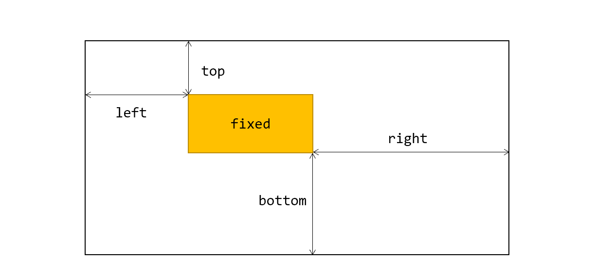
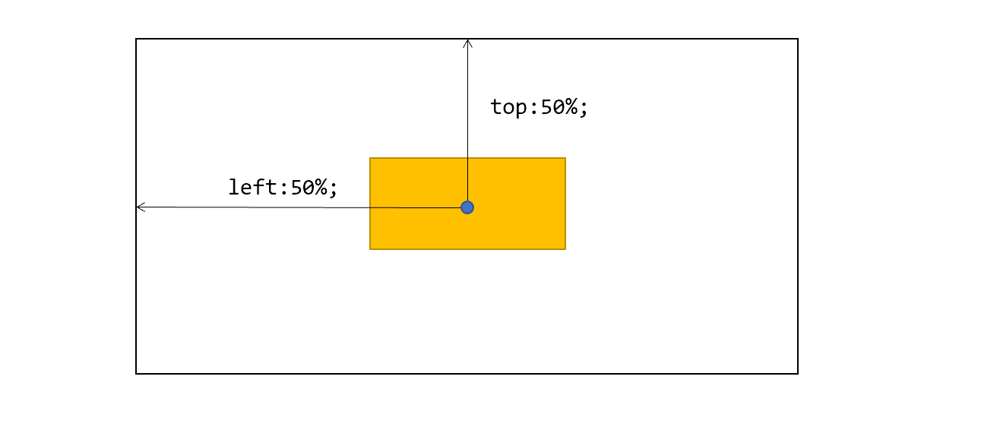

# CSS 定位详解

CSS 定位用于设置元素的位置。我们知道文档的元素的默认位置是按照从上到下，从左到右确定的，这种默认排布方式也叫正常文档流（position:static;）。有时候某些元素需要固定在窗口的某个位置，例如侧边栏，头部导航栏，小广告，或者需要相对某个元素的位置来布局，例如下拉菜单。这些元素的布局会脱离正常的文档流，浏览器会拿出来单独渲染。

## 固定定位

某些元素会固定在浏览器窗口的某个位置，固定定位就是为这种场景设计的，请看一个例子：

```html
<style>
  .fixed {
    position: fixed;
    top: 50px;
    left: 80px;
    /*辅助样式*/
    width: 100px;
    height: 100px;
    background-color: gold;
  }

  .long {
    width: 30px;
  }
</style>
<h1>我是标题</h1>
<div class="fixed">固定盒子</div>
<h1 class="long">我是长长长长长长长长长长长长长长长长长长长长长长长长长长长长长长长长长长长长长长长长长长长长长长长的内容</h1>
```

[在线例子](https://codepen.io/xiayulu/pen/Jjvxeqr)

【要点】

1）固定位置使用 `position: fixed;` 声明；

2）利用 `top, left, right, bottom` 这四个属性设置该盒子距离浏览器窗口的距离。



【思考】因为屏幕是一个平面图形，因此在 Y 轴方向只需要设置 top 或 bottom，在 X 轴方向只需要设置 left 或 right 就可以准确定位盒子，那如果同时设置了 left 和 right 会发生什么呢？

【技巧】使用固定定位的元素会脱离文档流，就好像飘出了来了一样，会盖在其他元素上面，也不占用元素的空间。如果不设置高宽，它会处在静态文档流中的位置。

【技巧】脱离文档流的元素具有某些优良性质：即使行内元素也能设置宽高，上下边距，不会造成回流。

### 固定定位居中

固定定位实现居中有三种常用方法。

第一种方法：

```html
<style>
  .fixed {
    position: fixed;
    top: 0;
    bottom: 0;
    left: 0;
    right: 0;
    margin: auto;
    
    /*辅助样式*/
    width: 100px;
    height: 100px;
    background-color: gold;
  }
</style>
<div class="fixed"></div>
```

【要点】设置 left=right,  top=bottom，并且设置  `margin: auto; ` 即可。

【思考】只需要上下居中应该如何设置呢？

第二种方法：

```html
<style>
  .fixed {
    width: 300px;
    height: 100px;
    position: fixed;
    top: 50%;
    left: 50%;
    margin-top: -50px;
    margin-left: -150px;
    /*辅助样式*/
    background-color: gold;
  }
</style>
<div class="fixed"></div>
```

【要点】先把固定的元素左上角放在屏幕正中心，然后利用 margin 调整固定盒子中心在屏幕中心。



【讨论】这种方法有个缺点：需要根据盒子的宽高手动调整位置。

第三种方法：

```html
<style>
  .fixed {
    position: fixed;
    top: 50%;
    left: 50%;
    
    transform: translate(-50%, -50%);
    /*辅助样式*/
    width: 300px;
    height: 100px;
    background-color: gold;
  }
</style>
<div class="fixed"></div>
```

【要点】这个方法使用 `transform: translate(-50%, -50%);` 代替  `margin`  的方法实现自动调整。`transform` 表示变换，例如平移，旋转，缩放。`translate(x, y)` 表示沿着 `X` 轴与 `Y` 轴平移。

### 固定定位平铺屏幕

如何让一个盒子铺满整个屏幕呢？请看示例：

```html
<style>
  .fixed {
    position: fixed;
    top: 0;
    bottom: 0;
    left: 0;
    right: 0;
    /*辅助样式*/
    background-color: gold;
  }
</style>
<div class="fixed"></div>
```

【要点】上下左右都设置为 0，并且不设置宽高就可以实现平铺效果啦。

## 绝对定位与相对定位

有时候网页需要实现一些特殊效果：例如下拉菜单，菜单的下拉内容和菜单的按钮的位置是相对固定的，并且有些时候菜单的下拉内容是隐藏的，当鼠标滑过的时候显示下拉内容。

### 绝对定位与相对定位体验

```html
<style>
  .box1 {
    width: 300px;
    height: 300px;
    margin: auto;
    background-color: lightblue;
  }

  .box2 {
    width: 200px;
    height: 200px;
    margin: auto;
    background-color: violet;
    /*参考元素*/
    position: relative;
  }

  .box3 {
    width: 100px;
    height: 100px;
    margin: auto;
    background-color: lightpink;
    /*需要定位的元素*/
    position: absolute;
    top: 20px;
    left: 30px;
  }
</style>

<div class="box1">
  <div class="box2">
    <div class="box3"></div>
  </div>
</div>
```

【要点】相对定位要注意如下几个方面的内容：

- 需要定位的盒子声明成： `display: absolute;`
- 然后把参考元素设置成：`display: relative;`

- 最后设置相对位置：`top: xxx; left:xxx;` 。

`display: absolute;` 叫做绝对定位，因为 `absolute` 有绝对的意思，但是用起来却有点相对元素的感觉，因为绝对定位的元素需要设置一个参考元素，然后相对于这个参考元素设置上下左右偏移量，所以就看自己怎么理解了。

【知识点】绝对定位元素也会完全脱离文档流，不会影响其他元素。

【知识点】相对元素可以是父元素，也可以是祖先元素，它会一层层向上找，直到找到参考元素或 body 为止，如果有多个，采取就近原则。

【易错点】兄弟元素和子元素不能作为参考元素。

【知识点】position 值为 relative, fixed, absolute 的元素都会被当做参考元素。

### 绝对定位实现下拉菜单

[在线案例](https://codepen.io/xiayulu/pen/LYmqKey)

```html
<style>
  .dropdown {
    padding: 5px;
    /*参考元素*/
    position: relative;
  }

  .dropdown .header {
    cursor: pointer;
  }

  .dropdown .content {
    width: 150px;
    background-color: grey;
    /*相对参考元素定位*/
    position: absolute;
    top: 100%;
    /*设置高度为 0 来隐藏元素*/
    height: 0;
    overflow: hidden;
    /*过渡动画*/
    transition: 0.3s;
  }

  .dropdown .header:hover~.content {
    /*鼠标放上去展开菜单*/
    height: 100px;
  }
</style>

<div class="dropdown">
  <button class="header">查看更多</button>
  <div class="content">
    二级菜单
  </div>
</div>
```

[在线演示](https://codepen.io/xiayulu/pen/vYjbMqB)

### 相对定位

相对定位指的是具有属性 `position: relative;` 的元素，相对定位元素没有脱离文档流，会在正常文档流中占据位置，如果使用 `left,right,top, bottom` 设置偏移值，该偏移值是相对自己正常文档流的位置。这看起来有点像灵魂出窍：本体一动不动，内容可以偏移。

```html
<style>
  .box1 {
    width: 200px;
    height: 200px;
    margin: 50px auto;
    background-color: lightblue;
  }

  .box2 {
    width: 100px;
    height: 100px;
    background-color: violet;
    position: relative;
    top: -10px;
  }

  .box3 {
    width: 100px;
    height: 100px;
    background-color: purple;
  }
</style>

<div class="box1">
  <div class="box2"></div>
  <div class="box3"></div>
</div>
```

相对定位的使用场景，一般使用相对定位盒子作为绝对定位的参考元素，即：父相子绝。有的同学可能会使用相对元素来微调元素的位置，但个人不建议使用，可以采用 margin（可以设置负数）或者 transform 作为替代。

## 定位的应用

### 右拉菜单

上面有个例子使用绝对定位实现了下拉菜单，除此之外我们还可以实现一个右拉菜单，右拉菜单一般用在电商网站和网课网站的分类导航中。右拉菜单示例：

```html
<style>
  .container {
    width: 1000px;
    height: 300px;
    margin: 0 auto;
    background-color: royalblue;
    position: relative;
  }

  .side {
    width: 200px;
    height: 300px;
    /*相对容器定位，列表盖在容器内*/
    position: absolute;
    background-color: rgba(160, 160, 160, 0.4);
  }

  ul {
    padding: 0;
  }

  ul li {
    list-style-type: none;
    line-height: 2;
    padding: 0 1rem;
    border-bottom: 1px solid #aaa;
  }

  ul li:hover {
    background-color: darkblue;
    color: white;
    cursor: pointer;
  }

  ul li .menu {
    height: 300px;
    background-color: steelblue;
    /*相对 .side 定位*/
    position: absolute;
    left: 100%;
    top: 0;
    /*宽度为 0 隐藏元素*/
    width: 0;
    overflow: hidden;
    /*过度动画*/
    /*transition: 0.3s;*/
  }

  ul li:hover .menu {
    /*摸到分类条目恢复宽度，展开子菜单*/
    width: 500px;
  }

  ul li span {
    float: right;
    font-weight: bold;
  }
</style>

<div class="container">
  <div class="side">
    <ul>
      <li>手机 <span>&gt;</span>
        <div class="menu">1</div>
      </li>
      <li>电视<span>&gt;</span>
        <div class="menu">2</div>
      </li>
      <li>笔记本<span>&gt;</span>
        <div class="menu">3</div>
      </li>
      <li>平板<span>&gt;</span>
        <div class="menu">4</div>
      </li>
    </ul>
  </div>
</div>
```

[在线案例](https://codepen.io/xiayulu/pen/mdLoeYG)

这个案例非常的经典，涉及到两层性对定位，第一层是左边的主菜单相对于容器的定位，第二层定位是二级菜单相对于左边主菜单的定位。

【思考】如何实现二级菜单跟随效果（[得到官网课程导航](https://www.dedao.cn/)）？

### 遮罩效果

```css
<style>
  .box {
    width: 200px;
    height: 200px;
    margin: 0 auto;
    background-color: wheat;
    /*参考元素*/
    position: relative;
  }

  .content {
    width: 200px;
    height: 200px;
    background-color: orange;
  }

  .up-door {
    width: 100%;
    background-color: rgba(66, 66, 66, 0.4);
    position: absolute;
    top: 0;
    /*高度为零隐藏元素*/
    height: 0;
    overflow: hidden;
    /*过度效果*/
    transition: .3s;
  }

  .down-door {
    width: 100%;
    background-color: rgba(66, 66, 66, 0.4);
    position: absolute;
    bottom: 0;
    /*高度为零隐藏元素*/
    height: 0;
    overflow: hidden;
    /*过渡效果*/
    transition: .3s;
  }

  .box:hover .up-door {
    height: 50%;
  }

  .box:hover .down-door {
    height: 50%;
  }
</style>

<div class="box">
  <div class="content"></div>
  <div class="up-door">上</div>
  <div class="down-door">下</div>
</div>
```

[在线案例](https://codepen.io/xiayulu/pen/YzLgwWO)

【脑洞】如果把内容的背景换成一个舌头图片，上下门帘换成上下牙齿，就是吧唧吧唧开吃了。

动画效果先展示两个，如果你还有什么好的创意，赶紧留言分享吧。

## 参考文章

[^1]:MDN. [position](https://developer.mozilla.org/en-US/docs/Web/CSS/position).

