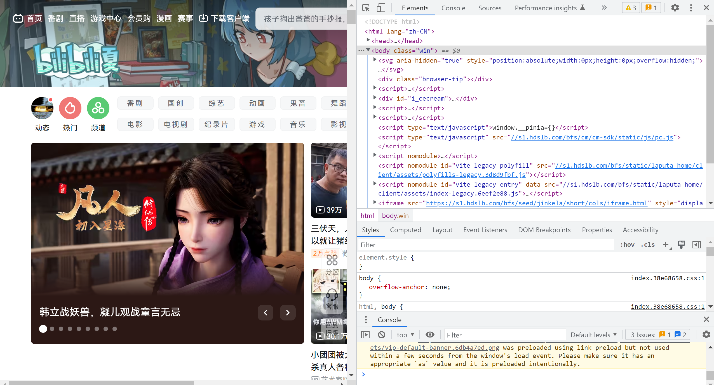

## HTML 基础

## 构成网站的元素

我们每天上网都会浏览各类网站，有搜索引擎，有问答社区，有视频网站，那么这些网站是怎么做的呢？显然这些网站是网页设计师设计出来的，网页设计师的工作就是设计形形色色的网站。在普通人眼里，网站就是图片、文字、视频、链接和按钮，但在网页设计师眼里，这些都是网页的元素。

所谓的元素就是网页的基本组成单位，如果把网站比喻成一栋房子，那么元素就好比砖头、钢筋、水泥、木板、石灰、油漆等材料。我们可以通过浏览器开发工具查看网站的“原材料”，打开开发工具的方式就是按下`F12`即可进入开发者工具。如下图所示：



我们可以看到很多由尖括号`<>`括起来的的标签(tag)，例如 `<html lang="zh-CN">`，尖括号里的第一个单词是标签名，然后是`lang="zh-CN"` 这样的键值对，这种键值对叫做标签的属性(attribute)，等号左边的是属性名，引号右边引号里的内容是属性值。`lang="zh-CN"` 表示语言属性，它的值是 `zh-CN`，表示中文。细心的你发现了这样一个标签：`<head>...</head>`，他没有属性，但是有一个结束标签`</head>`，其实大部分标签都有结束标签，这样的标签对叫做元素(element)。细心的读者发现开发工具最上面的选项卡名字是：`Elements`，没错，这个选项页面就是查看元素的。

元素之间可以是并排的，也可以是嵌套的。一个网页的结构是一棵树，这里的树不是长在街边的树，也不是山里的树，而是数据结构的树，或者说的更加专业一点：**DOM (Document Object Model) Tree**，即文档结构树。每一个元素就是这个文档树的一个**结点 (Node)**，并排的元素结点称为**兄弟结点**(Sibling)，被嵌套的元素结点称为**孩子**(Children)结点，外层的元素称为**父节点**(Parent)。

现在我们已经理解了网页的基本组成单位：**元素**。复杂的网页就是元素通过堆叠或嵌套表达的一棵文档树。

## 网页的样式

从最简单的文字来说就有很多样式，例如字体，文字的大小，粗细，颜色等。前面我们说过，标签有属性，其中每个元素都有一个 `style` 属性，通过设置这个属性就可以设置出不同样式的文字：

```html
<p style="font-size: 20px; color:red;">只因为在人群中多看了你一眼。</p>
```

通过样式属性可以调整元素的样式，但是这么做有一个坏处：当元素很多的时候，一眼看过去全都是样式，这样的网站不好修改与维护，因此需要一个独立的样式文件来给元素添加样式。

独立的样式文件要想给元素添加样式，就必须指定**给谁添加**样式，例如我要给把所有的段落标签的字体设置为 `20px`，颜色设置为灰色，我们可以这么做：

```css
p{
    font-size: 20px;
    color: grey;
}
```

这里的`p`表示元素名，大括号内用来配置样式，每个样式之间用分号隔开。通过样式表我们可以方便的给元素添加给中各样的样式了。当然，使用标签是指定元素的一种方法，我们还可以通过类(class)指定元素，通过 id 指定元素，通过属性名指定元素等。指定元素有一套科学的方法，称为**CSS选择器**，通过这套方法，你可以为任何元素设置样式。

现在，我们可以通过样式表调整元素的样式，例如字体，颜色，大小，长宽高，元素的摆位，元素之间的边距等。但这还不够，我们还需要处理用户的操作，例如点击按钮时发送验证码，用户点赞时改变点赞按钮颜色，我们甚至能在浏览器中编写代码，作图，剪辑视频。这些功能需要编程实现。

## 面向浏览器编程

前面我们讨论到浏览器可以实现复杂功能的应用，应用的逻辑通过 JavaScript 语言实现。浏览器内置了 JavaScript 引擎，能够解析执行 JavaScript 语言。其实你可以把浏览器看做一台计算机，这台计算机能够执行任何指令。有的同学可能会感到困惑，浏览器不就是一个应用程序吗，还需安装，怎么就是计算机了？其实计算机不只是我们看到的CPU内存硬盘鼠标，你可以把任何一个数学系统看成计算机，例如我们的实数系统，它其实就是一台计算机，你可以在草稿纸上实施计算，也可以用门电路实现计算。有的同学可能会问，你这计算机能够解方程吗？你这计算机能有证明三角形全等吗？你这计算机能算矩阵吗？你这计算机能算微积分吗，不定的那种哦。其实，问这些问题的同学心中已经有了答案，答案就是不仅能，在某些时候比人还厉害。

JavaScript 是怎样实现复杂的逻辑的呢？其实浏览器提供了一系列编程接口，例如 DOM API，用于操纵我们之前所说的文档树；Event API，用于相应用户事件，例如鼠标点击，拖拽，键盘敲击；Network API，用来向服务器发送和请求数据；Storage API，用来在浏览器存储数据，例如用户个性化设置；Animation API， 用来处理动画；Canvas API 和 Web GL API，专门用来绘制图形；音视频 API，用来处理音视频。

现代浏览器不仅能够解析执行 JavaScript 语言，还能执行 Web Assembly(wasm)，即网页汇编程序。 相比JavaScript，Web Assembly 更加底层，更能榨干浏览器的每一滴性能。有了 Web Assembly，其他高级语言，例如 C/C++，golang，C#，Rust 也可以编写运行在浏览器中的代码。编程语言不是重点，重点是面向浏览器编程，把浏览器当成计算机，语言只是计算机的抽象。

说了这么多，你是不是觉得浏览器真的很强大呢？你是不是迫不及待的想编写一个属于自己的炫酷网站呢？接下来，我们将更加深入的讲解每一个细节，让大家都能明白网页的设计原理。

# 参考文章

- [初识HTML](https://github.com/qianguyihao/Web/blob/master/01-HTML/03-%E5%88%9D%E8%AF%86HTML.md)
- [MDN 文档](https://developer.mozilla.org/en-US/docs/Learn/HTML/Introduction_to_HTML/Getting_started)
