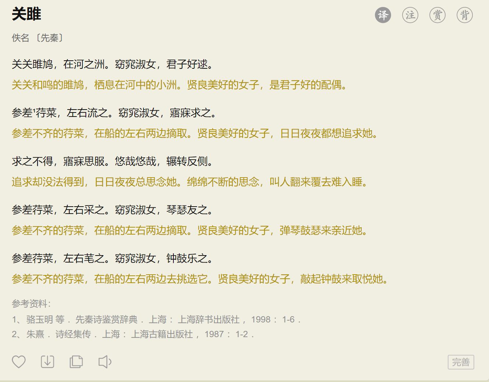

# HTML 排版

上一节课我们讲到了网页构成的三要素，即 HTML，CSS，JavaScript。今天我们将更加深入的了解排版方面的知识。先看一个简单的排版例子：



选自[古诗文网](https://so.gushiwen.cn/shiwenv_4c5705b99143.aspx)。

这篇古诗文涉及到的排版元素有标题，作者名字，朝代，然后是诗文与译文，最后是参考资料。遇到这么漂亮的网站，那我们也想做一个一样的。

## 网页制作的工具

网页的源码其实是HTML文档，可以通过任何文本编辑器编辑代码。为了方便，我们就选择免费开源的 VSCode 编辑器。新建一个文件夹，右键选择 VSCode 打开，然后新建一个文件`poetry.html`，输入 `!`，然后按下 `Tab` 可以得到一个网页模板。 

这时候我们可以安装一个插件：`live server`，方便我们查看网页内容。安装好之后，在编辑器底部有一个 `Go live` 的按钮，点击就会在浏览器打开我们的网页。当然目前的网页是空白的网页，需要自己实现网页内容。

## 添加标题 `h1`

用于标注**标题**的标签有6个，[在线示例](https://www.w3schools.com/tags/tag_hn.asp)，他们都有自己默认的大小：

```html
<h1>This is heading 1</h1>
<h2>This is heading 2</h2>
<h3>This is heading 3</h3>
<h4>This is heading 4</h4>
<h5>This is heading 5</h5>
<h6>This is heading 6</h6>
```

我们在网页中添加一个标题：

```html
<h1>关雎</h1>
```

这时候我们查看浏览器，发现显示了一个大大的“关雎”。接下来我们添加作者与朝代。

## 超链接 `a`

作者与朝代是两个超链接，`a` 标签表示超链接标签，有一个属性 `href` ，用于跳转到指定的页面：

```html
<a href="https://so.gushiwen.cn/authorv_2128926194cd.aspx">佚名</a>
<a href="https://so.gushiwen.cn/shiwens/default.aspx?cstr=%e5%85%88%e7%a7%a6">【先秦】</a>
```

## 段落 `p`

接下来，我们添加古诗文与相关译文。诗句是一个个的段落，表示段落的标签是 `p` 标签，[在线示例](https://www.w3schools.com/tags/tag_p.asp)：

```html
<p> 关关雎鸠，在河之洲。窈窕淑女，君子好逑。</p>
<p>关关和鸣的雎鸠，栖息在河中的小洲。贤良美好的女子，是君子好的配偶。</p>
<p>参差¹荇菜，左右流之。窈窕淑女，寤寐求之。</p>
<p>参差不齐的荇菜，在船的左右两边摘取。贤良美好的女子，日日夜夜都想追求她。</p>
<p>求之不得，寤寐思服。悠哉悠哉，辗转反侧。</p>
<p>追求却没法得到，日日夜夜总思念她。绵绵不断的思念，叫人翻来覆去难入睡。</p>
<p>参差荇菜，左右采之。窈窕淑女，琴瑟友之。</p>
<p>参差不齐的荇菜，在船的左右两边摘取。贤良美好的女子，弹琴鼓瑟来亲近她。</p>
<p>参差荇菜，左右芼之。窈窕淑女，钟鼓乐之。</p>
<p>参差不齐的荇菜，在船的左右两边去挑选它。贤良美好的女子，敲起钟鼓来取悦她。</p>
```

接下来是参考文献，我们可以用有序列表来表示。

## 列表 `ol, ul`

分为两类，有序列表和无序列表，列表需要使用一个容器标签： `ol`或 `ul` ，以及条目标签：`li` 组合使用。

`ol` 表示有序列表(ordered list)，每个条目会有编号，编号的样式可以通过CSS设置。 [在线示例](https://www.w3schools.com/tags/tag_ol.asp)。

```html
<ol>
  <li>Coffee</li>
  <li>Tea</li>
  <li>Milk</li>
</ol>
```

`ul`表示无序列表(unordered list)，每个条目会有一个相同的黑圆点开头，样式也是可以调整的。[在线示例](https://www.w3schools.com/tags/tag_ul.asp)：

```html
<ul>
  <li>Coffee</li>
  <li>Tea</li>
  <li>Milk</li>
</ul>
```

接上面的例子，我们添加参考文献的排版：

```html
<p>参考文献</p>
<ol>
    <li>骆玉明 等 ．先秦诗鉴赏辞典 ．上海 ：上海辞书出版社 ，1998 ：1-6 ．</li>
    <li>朱熹 ．诗经集传 ．上海 ：上海古籍出版社 ，1987 ：1-2 ．</li>
</ol>
```

这样，一首古诗的排版就大功告成了。但是我们的古诗和原版的差距很大，看起来干巴巴的，没有那种古色古香的味道，接下来有请 CSS 来给我们的古诗调味。
