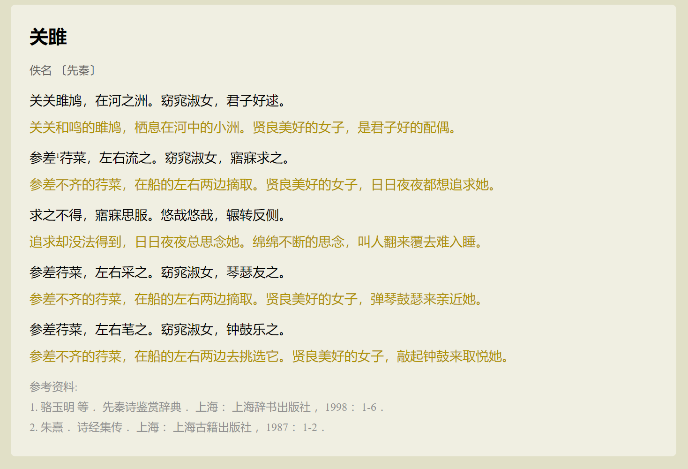

# CSS 样式

上节课我们完成了古诗的粗略排版，但还没融入古诗的韵味。这堂课的任务就是给我们的古诗添加历史的厚重。

## 背景颜色

首先添加背景，在添加背景样式之前，先在头部添加一个样式标签`style`，然后添加样式：

```css
<style>
	body {
		background-color: #E1E0C7;
	}
</style>
```

这样就把大背景设置成了深绿色，然后给古诗文的区域添加样式，先把古诗用一个 `div` 容器包裹起来，然后给容器添加一个 `class="sons"` 属性，然后给 `sons`，添加样式。这里的 `class` 指的是类，用于表示拥有某种属性的元素集合，可以通过如下方式选择：

```css
.sons{
    background-color: #F0EFE2;
}
```

设置好了背景，然后需要调整容器的宽度，内外边距，圆角：

## 容器大小

css 元素就像一个个盒子一样堆成了我们的网站，盒子的宽度、高度、内外边距、边框、圆角都是可以调整的。

```css
.sons{
    background-color: #F0EFE2;
    width: 670px;
    margin: 0 auto;
    padding: 20px;
    border-radius: 5px; 
}
```
## 字体大小

有点古诗的味道了，接下来调整标题的大小。字体大小用 `font-size` 调整：

```css
.sons .title{
    font-size: 20px;
    margin-top: 0;
}
```

## 调整链接样式

接下来是链接，`a:hover` 是伪类选择器，当鼠标停在该元素上面时有效：

```css
.sons a {
    text-decoration: none; /*去掉下划线*/
    color: #65645F;
    font-size: 12px;
}

.sons a:hover {
    text-decoration: underline; /*加上下划线*/
}
```

## 调整内容

接下来是是个原文与译文：

```css
.sons .history {
    font-size: 14px;
    margin-bottom: 10px;
}

.sons .today {
    font-size: 14px;
    color: #AF9100;
    margin-top: 10px;
}
```

## 调整文献列表

最后是参考文献：

```css
.sons .ref {
    color: #909090;
    font-size: 12px;
    line-height: 180%;
}

.sons .ref ol {
    margin: 0;
    padding: 0;
    list-style: decimal inside;
}
```

## 成果展示



铛铛铛，是不是很漂亮呢？是不是有种心动的感觉？

## 总结

我们还可以把CSS写到一个单独的 CSS 文件中，建立一个文件`sons.css`，把样式拷贝过去，然后通过 `link` 标签引入到 HTML 页面中：

```html
<link rel="stylesheet" type="text/css" href="sons.css"/>
```


