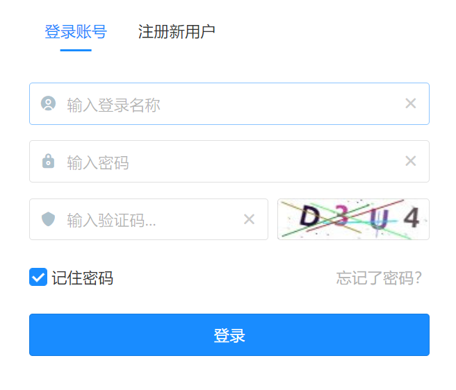
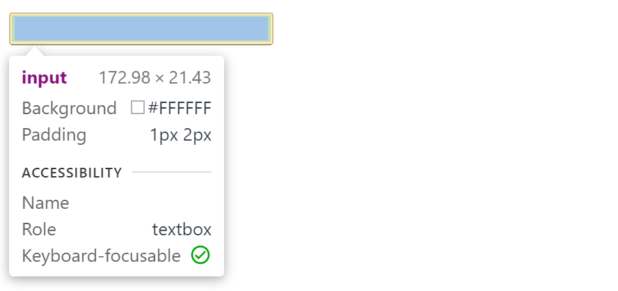
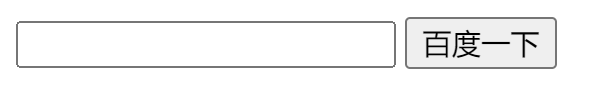
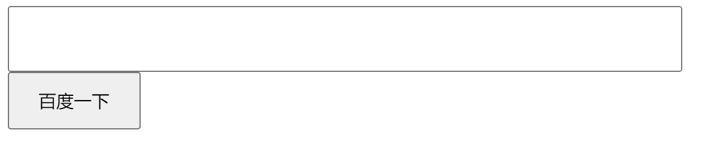
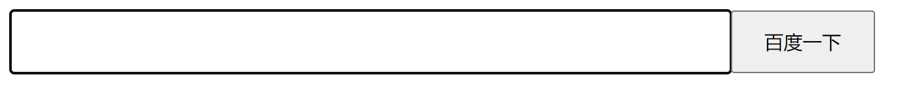
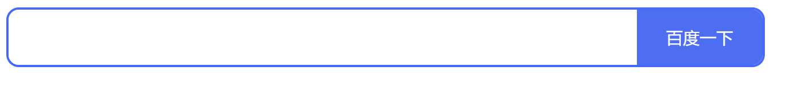
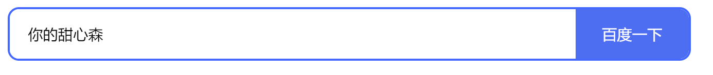
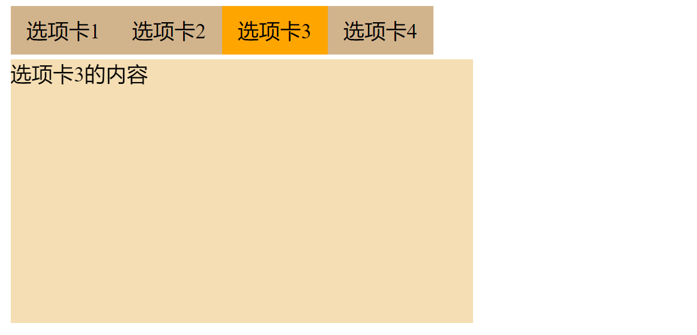

# Form 表单详解：案例、input CSS 美化

本文要点：

- 常见表单
- 表单的性质
- 表单CSS美化
- 使用 radio 实现 Tab 选项卡

## 什么是表单

用户通过表单填写信息，然后通过计算机网络传送给服务器。表单标签不是一个标签，而是一组标签，因为不同格式的数据的交互界面有区别，如果是文字就是一个输入框，传送文件就会打开文件选择窗口，如果是时间或日期就会弹出一个日历供用户选择。大家熟悉的登录页面包含了若干输入框：



一组输入框一般由 `form` 元素组织，其中还包括了用于提交数据的按钮：

```html
<form action="/api/to/handle/form" method="get/post">
  <!-- 单标签  type 决定显示效果 行内块级元素 -->
  <!-- text输入框  --- 单行输入 -->
  <input type="text">
  <!-- password 密码框 -->
  <input type="password">

  <br>
  请选择性别
  <!-- radio 单选框   必须在标签上添加属性 name  值必须是一样的 -->
  <input type="radio" name="1">男
  <input type="radio" name="1">女

  <br>

  请选择爱好
  <!-- checkbox 复选框  多选 -->
  <input type="checkbox"> 干饭
  <input type="checkbox"> 睡觉
  <input type="checkbox"> 撸代码

  <br>

  <!-- file 文件上传 默认只能传一个文件  multiple可以实现多文件上传 -->
  <input type="file" multiple>

  <br>

  <!-- 文本域   多行输入   -->
  <!-- cols列数  rows行数  不建议使用    一般使用css确定宽高 -->
  <textarea name="" id="" cols="10" rows="5"></textarea>

  <br>

  <!-- 按钮   button / submit / reset -->

  <!-- button 普通按钮 -->
  <input type="button" value="确定">

  <!-- submit 提交的 -->
  <input type="submit" value="提交">

  <!-- reset 重置 --- 清空 -->
  <input type="reset" value="清空">
</form>
```

[【在线案例】](https://codepen.io/xiayulu/pen/bGMJaGO)

【解读】`form` 元素有两个重要的属性：

- `action`: 处理数据的路由，需要后端支持
- `method`：提交数据的HTTP方法，一般是 POST。

【提示】目前大多使用 JavaScript ajax 或 fetch API 提交数据，而不直接使用 `form` 元素提交数据，此时这俩属性可以省略，甚至`form`元素都可以不要，只留下输入框。

【提示】更多案例请参考[^1]。

## input 性质

上述例子演示了不同 type 的 输入框，本小节主要讲解 `input` 标签的性质：

- `input` 元素是 `inline-block` ，它可以与其他非块级元素处在同一行，并且能设置高宽与上下内外边距。`input` 标签也叫**置换元素**(标签和属性共同决定页面的显示效果)。

```html
<style>
  .big {
    width: 500px;
    height: 40px;
    font-size: 1.5rem;
  }
</style>

<input type="text" class="big">
```

- input 元素必须设置 type 属性，如果不设置默认为 text，如果不使用 JavaScript 提交数据，还必须设置 name 属性，因为服务器会根据 name 获取相应字段的值。input 元素的 value 属性表示输入框的值，可以通过 JavaScript 获取或设置。除此之外，给 input 添加 id 属性能够方便 JavaScript 获取输入框，然后读取或设置输入框的数据。

```html
<input type="text" name="username" id="username" value="默认值" placeholder="提示信息" >
```

## input 样式

默认的表单是一个黑框框，点击会出现一个更粗的黑框框，检查元素表单自带 2 像素的边框和 2像素左右内边距和1像素上下内边距（Chrome浏览器）：



接下来，通过模仿[百度](www.baidu.com) 的输入框来说明输入框的样式调整。

1）用 HTML 搭好结构：

```html
<style>

</style>

<div class="form">
  <input class="text" type="text">
  <input class="btn" type="submit" value="百度一下">
</div>
```



2）设置好宽高：

```html
<style>
  .form {
    width: 600px;
    height: 44px;
  }

  .text {
    width: 500px;
    height: 44px;
  }

  .btn {
    width: 100px;
    height: 44px;
  }
</style>

<div class="form">
  <input class="text" type="text">
  <input class="btn" type="submit" value="百度一下">
</div>
```



此时你会发现按钮掉到下面了，这是因为 input 是行内块级元素，两个 input 之间存在空白字符就会到这一个小空隙。采用浮动消除间隙：

```css
  .text {
    width: 500px;
    float: left;
  }

  .btn {
    width: 100px;
    float: left;
  }
```

此时依然问题还没有解决，这是因为 input 为 text 的输入框才在内边距与边框，它的实际宽度是：500+2+2+2+2，取消边框与内边距：

```css
  .text {
    width: 500px;
    float: left;
    border: none;
    padding: 0;
  }
```



【重点】`input[type=submit]` 表现为按钮，它的边框与内外边距不会撑大盒子宽与高，原因在于它默认属于怪异盒子模型 （border-box），并且其中的文字自动居中。

3）设置外边框与背景颜色。为了简单，外边框设置到外面的容器上

```css
.form {
	...
    border: 2px solid #4569ff;
    border-radius: 10px;
    overflow: hidden; /*必要的，不然圆角会溢出*/
  }

.btn {
    ...
    border: none;
    background-color: #4e6ef2;
    color: #fff;
  }
```



4）设置点击时的样式，点击时表单处于 focus 状态，会触发伪类 `:focus`:

```css
  .text:focus {
    outline: none;
  }
```

5）点击时，光标是顶格的，看起来很不舒服，重新调整内边距：

```css
  .text {
    width: 468px;
    ...
    padding: 0 16px;
  }
```

6）最后给 btn 加点样式：

```css
  .btn {
   	...
    cursor: pointer;
  }
  .btn:hover {
    background-color: #4662d9;
  }
```

最终结果：



完整代码：

```html
<style>
  .form {
    width: 600px;
    height: 44px;
    border: 2px solid #4569ff;
    border-radius: 10px;
    overflow: hidden;
  }

  .text {
    width: 468px;
    height: 44px;
    float: left;
    border: none;
    padding: 0 16px;
  }

  .text:focus {
    outline: none;
  }

  .btn {
    width: 100px;
    height: 44px;
    float: left;
    border: none;
    background-color: #4e6ef2;
    color: #fff;
    cursor: pointer;
  }

  .btn:hover {
    background-color: #4662d9;
  }
</style>

<div class="form">
  <input class="text" type="text">
  <input class="btn" type="submit" value="百度一下">
</div>
```

[【在线案例】](https://codepen.io/xiayulu/pen/KKRYQYQ)

是不是很简单呢？只需要设置几个简单的样式，就实现了一个完美的输入框。

## radio表单

`input[type=radio]` 表示单选输入，说白了就是单选题，一组按钮只能选择一个。因为老式的收音机上有一种开关，多个按键排在一起，但每次只能按下一个，换句话说，按下任意一个键，其他按键全部弹起，所以 GUI 的单选按键也就被形象地称作收音机按键。

【知识点1】一组 radio 表单需要设置同样的 name 才能体现单选效果：

```html
<input type="radio" value="a" name="1">
<input type="radio" value="b" name="1">
<input type="radio" value="c" name="1">
<input type="radio" value="d" name="1">
```

【知识点2】可以通过 label 添加提示信息，并让 label 的 for 属性指向 radio 的 id 属性。

```html
<input type="radio" name="1" id="a"><label for="a">A</label>
<input type="radio" name="1" id="b"><label for="b">B</label>
<input type="radio" name="1" id="c"><label for="c">B</label>
<input type="radio" name="1" id="d"><label for="d">B</label>
```

当 label 的 for 属性 指向相应的 id 之后，它们就绑定在一起了，点击 label 也能选中。

【知识点3】当 radio 被选中时会处于 checked 状态，可以通过 `:checked` 添加样式：

```html
<style>
  input[type=radio]:checked+label {
    color: green;
    font-size: 2rem;
  }
</style>

<div><input type="radio" name="1" id="a"><label for="a">A</label></div>
<div><input type="radio" name="1" id="b"><label for="b">B</label></div>
<div><input type="radio" name="1" id="c"><label for="c">C</label></div>
<div><input type="radio" name="1" id="d"><label for="d">D</label></div>
```

【知识点4】输入框有一类开关属性，这类属性只考虑存在性，而不考虑它的属性值：

```css
<input type="text" disabled>
```

`disabled` 表示禁用元素，当该属性出现时，该输入框不起作用。

【思考】尝试给 disable 属性添加一些值，看看输入框的禁用效果是否会改变，例如 `disabled="false", disabled="disabled"` 。

开关属性还有 `hidden, required`，有些类型的输入框拥有某些特殊属性，例如 radio 与 checkbox 有 `checked`，下拉菜单有 `selected`。

[【在线演示】](https://codepen.io/xiayulu/pen/ZEoNErP)

### radio 实现选项卡

Tab 选项卡是一种UI组件，在同一个时间只能展示一个卡片，而其他卡片会隐藏起来。当点击另一个卡片的头部时，相应的卡片会展开，其他卡片会隐藏。Tab 选项卡与 radio 都存在**单选**这一性质，因此可以使用 radio 实现 Tab选项卡：

```html
<style>
  .tabs {
    position: relative;
  }

  .tab-hd {
    background-color: tan;
    display: inline-block;
    padding: 8px 12px;
    float: left;
  }

  .tab-bd {
    width: 350px;
    height: 200px;
    background-color: wheat;
    position: absolute;
    top: 110%;
    left: 0;
    visibility: hidden;
  }

  .clearfix::after {
    content: "";
    display: block;
    clear: both;
  }

  input[name=tabs]:checked+.tab-hd {
    background-color: orange;
  }

  input[name=tabs]:checked~.tab-bd {
    visibility: visible;
  }
</style>

<div class="tabs clearfix">
  <div class="tab">
    <input type="radio" name="tabs" id="tab1" hidden checked>
    <label for="tab1" class="tab-hd">选项卡1</label>
    <div class="tab-bd">选项卡1的内容</div>
  </div>
  <div class="tab">
    <input type="radio" name="tabs" id="tab2" hidden>
    <label for="tab2" class="tab-hd">选项卡2</label>
    <div class="tab-bd">选项卡2的内容</div>
  </div>
  <div class="tab">
    <input type="radio" name="tabs" id="tab3" hidden>
    <label for="tab3" class="tab-hd">选项卡3</label>
    <div class="tab-bd">选项卡3的内容</div>
  </div>
  <div class="tab">
    <input type="radio" name="tabs" id="tab4" hidden>
    <label for="tab4" class="tab-hd">选项卡4</label>
    <div class="tab-bd">选项卡4的内容</div>
  </div>
</div>
```

实现效果：



[【在线演示】](https://codepen.io/xiayulu/pen/RwyOOvq)

【要点】

- 利用 radio 实现单选效果
- 利用 `:checked` 设置选中样式
- 利用绝对定位与元素隐藏实现 Tab 内容的展示与隐藏。
- 利用浮动去除空格。

## 参考文章

[^1]:MDN. [input](https://developer.mozilla.org/en-US/docs/Web/HTML/Element/Input#input_types).

> ♥ 我是前端工程师：你的甜心森。非常感谢大家的点赞与关注，欢迎大家参与讨论或协作，QQ交流群：233589794。
>
> ★ 本文[开源](https://github.com/xiayulu/FrontEndCultivation)，采用 [CC BY-SA 4.0 协议](http://creativecommons.org/licenses/by-sa/4.0/)，转载请注明出处：[前端工程师的自我修养](https://github.com/xiayulu/FrontEndCultivation). GitHub.com@xiayulu.
>
> ★ 创作合作或招聘信息请发私信或邮件：zuiaiqiansen@163.com，注明主题：创作合作或**招聘前端工程师**。