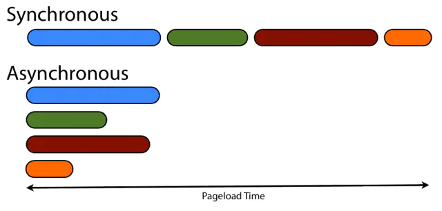
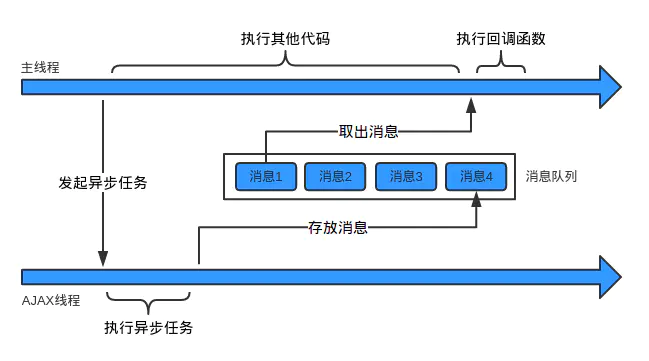

# JavaScript 异步机制

一张图看懂同步与异步



## 同步、异步、回调函数相关概念

最早 JavaScript 这门语言是运行在浏览器端的脚本语言，目的是为了实现页面的的交互效果，页面的交互核心就是 DOM 操作，这就决定了它必须使用单线程模型，否则会出现很复杂的线程同步问题。由于 JS 执行环境中负责执行代码的线程只有一个，同一时间，只有一个任务能运行，其他任务必须排队。这种单线程模式的工作模式就是我们所说的同步模式。

```js
var x = true;
while(x);
console.log("don't carry out");    // 不会执行
```

上面的例子即同步模式，其中的 while 是一个死循环，它会阻塞进程，因此第三句console不会执行。同步模式比较简单，也较容易编写。但问题也显而易见，如果请求的时间较长，而阻塞了后面代码的执行，体验是很不好的。实际上浏览器有很多耗时操作，例如网络请求，因此对于一些耗时的操作，异步模式则是更好的选择。

- 异步模式，即与同步模式相反，可以一起执行多个任务，函数调用后不会立即返回执行的结果，如果任务 A 需要等待，可先执行任务 B，等到任务 A 结果返回后再用回调函数处理结果。最常见的异步模式就数定时器了，我们来看看以下的例子。

```js
setTimeout(function () {
  console.log('taskA, asynchronous');
}, 0);
console.log('taskB, synchronize');
// while(true);
//taskB, synchronize
//taskA, asynchronous
```

我们可以看到，定时器延时的时间明明为0，但taskA还是晚于taskB执行。这是为什么呢？由于定时器是异步的，异步任务会在当前脚本的所有同步任务执行完才会执行。如果同步代码中含有死循环，即将上例的注释去掉，那么这个异步任务就不会执行，因为同步任务阻塞了进程。

> 回调函数，提起异步，就不得不谈谈回调函数了。上例中，setTimeout 里的 function 便是回调函数。可以简单理解为：（执行完）回（来）调（用）的函数。

既然 JS 是单线程的，那怎么实现异步任务呢？

## 理解浏览器工作模式

说到底，JavaScript 其实就是一门语言，说是单线程还是多线程得结合具体运行环境。JS 的运行通常是在浏览器中进行的，具体由 JS 引擎去解析和运行。一个浏览器通常由以下几个常驻的线程：

- 渲染引擎线程：顾名思义，该线程负责页面的渲染
- JS引擎线程：负责JS的解析和执行
- 定时触发器线程：处理定时事件，比如 setTimeout, setInterval
- 事件触发线程：处理 DOM 事件
- 异步 http 请求线程：处理 http 请求

需要注意的是，渲染线程和 JS 引擎线程是不能同时进行的。渲染线程在执行任务的时候，JS 引擎线程会被挂起。因为 JS 可以操作 DOM，若在渲染中JS处理了 DOM，浏览器可能就不知所措了。



**javascript中的异步实现方式有以下几种**：

- callback (回调函数)
- 发布订阅模式
- Promise 对象
- es6的生成器函数
- async/await

回调模式：

```js
 function fetchData(url){
   return `data from ${url}`;
 }
 
 function load(url, callback){
    const data = fetchData(url);
    setTimeout(callback(data),3000);//假设某个异步任务处理需要3s 3s后执行回调
}
 
load('api',function(data) {
    console.log(data)
})
```

发布订阅模式：

```js
process.stdin.on('data', data => {
  console.log(`You typed ${data.toString()}`);
  process.exit();
});
```

## Promise 的含义


- Promise 字面意思：诺言; 许诺; 承诺；预示。
- Promises 是一种 JavaScript 中处理异步代码的方法，其实 Promises 已经存在多年，但是直到 ES2015 (ES6)才被标准化和引入，现在它们已经在 ES2017(ES8) 中被 async (异步) 函数所取代和扩展，可见发展之快。

Promise 对象的两个特点:

1）对象状态不受外界影响。

Promise 对象有三种状态:pending(进行中)，fulfilled(已成功)，rejected(已失败)，当异步操作有结果时可以指定pending 状态到 fulfilled 状态或 pending 状态到 rejected 状态的转换，状态一旦变为 fulfilled，或 rejected 则这个Promise 对象状态不会再改变。

2）一旦状态改变，就不再变化，任何时候都可以得到这个结果。

## Promise 的特点和基本用法

promise 对象有两个特点：

- 对象的状态不受外界影响，pending(进行中)、fulfiled(已完成)、rejected(已失败)
- 一旦状态改变，就不会再变，任何时候都可以得到这个结果，状态改变只有两种可能，称为（resolved）

基本用法：

```javascript
const promise = new Promise(function (resove, reject) {
  let [value, error] = doSomeThing();
  if (!error) {
    resove(value);
  } else {
    reject(error);
  }
});
```
请看一个稍微复杂的案例：
```js
const p = new Promise((resolve, reject) => {
  let value = 'ok obj';
  let error = 'error obj';
  console.log('begin');
  // resolve(value);
  reject(error);
  console.log('end');
});

p.then(
  value => {
    console.log(value);
  },
  error => {
    console.log('.then的第二个参数');
    console.log(error);
  }
).catch(error => {
  console.log('.catch');
  console.log(error);
});
```

结果：

```sh
begin
end
.then的第二个参数
error obj
```
【解读】

 - `const p = new Promise(func)`，创造一个实例时，接受一个函数作为参数，该函数接受两个参数分别是resolve 和 reject。它们是两个函数，由 JavaScript 引擎提供，不用自己部署。**注意：**这两个函数的作用就是改变 Promise 对象的状态，一个是成功，一个是失败，一旦调用了其中一个，状态就不可改变和逆转；
 - Promise 实例生成以后，可以用 then 方法分别指定 resolved 状态和 rejected 状态的回调函数，即使用`p.then()` 来进一步的操作，**注意：**then() 可以接受两个参数，这两个参数也是函数，第一个表示成功的操作，就是调用了resolve(value) 后会进入，第二个表示失败的操作，就是调用了 reject(error) 后会进入，但第二个可以省略，而是用 `p.catch()` 来注册失败回调函数。
 - 例子中的 resolve 和 reject 同时存在时，只有在前面的有用，因为 Promise 一旦进入一个满足状态，其他的就不管了。

## Promise 使用场景示例

**合并多个请求**

```js
//1.模拟获取轮播数据列表
function getBannerList() {
  return new Promise((resolve, reject) => {
    setTimeout(function () {
      resolve('轮播数据');
    }, 300);
  });
}

//2.模拟获取店铺列表
function getStoreList() {
  return new Promise((resolve, reject) => {
    setTimeout(function () {
      resolve('店铺数据');
    }, 500);
  });
}

//3.模拟获取分类列表
function getCategoryList() {
  return new Promise((resolve, reject) => {
    setTimeout(function () {
      resolve('分类数据');
    }, 700);
  });
}

function initLoad() {
  Promise.all([getBannerList(), getStoreList(), getCategoryList()])
    .then(res => {
      console.log(res);
    })
    .catch(err => {
      console.log(err);
    });
}

//数据初始化
initLoad();
```

结果：

```shell
["轮播数据", "店铺数据", "分类数据"]
```

**处理请求超时**

```js
//模拟一个慢速请求
function request() {
  return new Promise(function (resolve, reject) {
    setTimeout(() => {
      resolve('请求成功');
    }, 4000);
  });
}

// 请求超时提醒
function timeout() {
  var p = new Promise(function (resolve, reject) {
    setTimeout(function () {
      reject('网络不佳');
    }, 2000);
  });
  return p;
}

Promise.race([request(), timeout()])
  .then(res => {
    console.log(res);
  })
  .catch(err => {
    console.log(err); //网络不佳
  });
```


# 参考文章

- Ruheng.  [JavaScript异步机制详解](https://www.jianshu.com/p/4ea4ee713ead). 简书.
- 姽嫿酱. [用JavaScript实现一个简单的Promise](https://juejin.cn/post/7089260773968609293). 稀土掘金.

- 前端君. [自己动手实现Promise](https://juejin.cn/post/6885295302933217294). 稀土掘金.