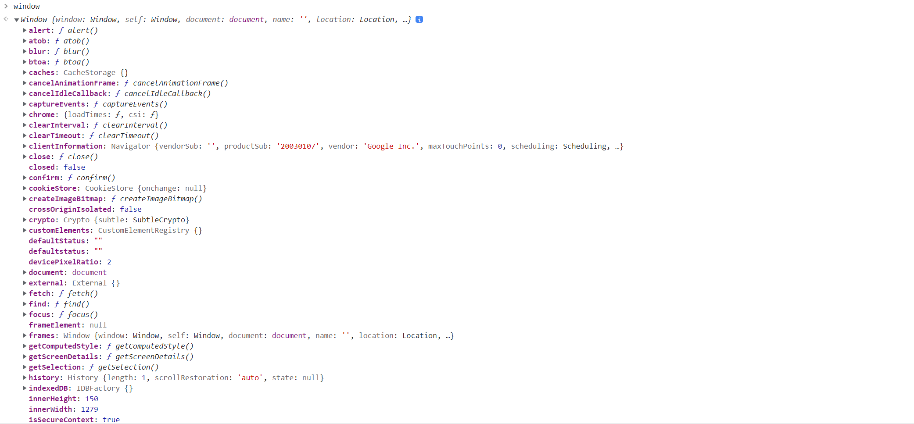
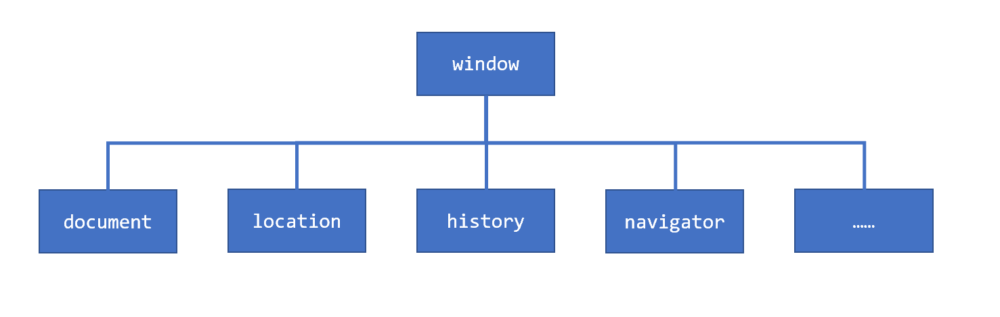
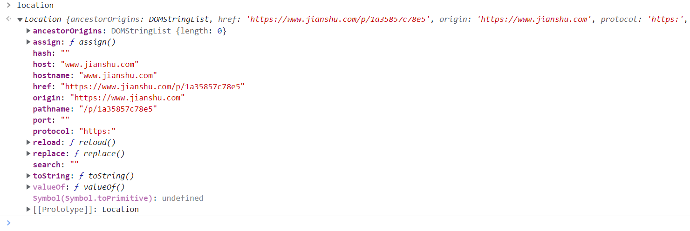
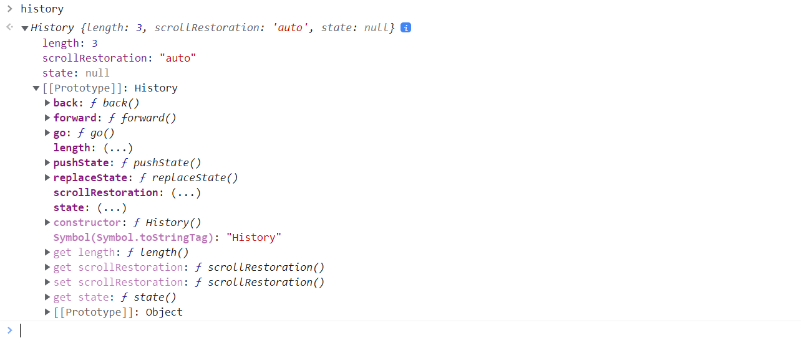
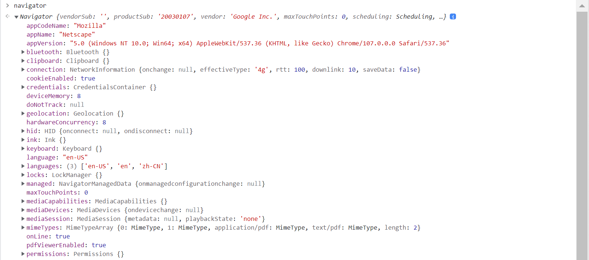

# JavaScript 熟悉又陌生的 BOM 对象

JavaScript 是一门面向浏览器编程的语言，了解浏览器对象至关重要。所谓的 BOM(Browser Object Model) 就是 window 对象，在浏览器控制台输入 `window`回车就可以得到：

`window` 对象是 JavaScript 执行的全局环境，`window` 对象定义了许多对象、属性与方法，下图总结了几个比较重要的对象：

其中 `document` 又称为DOM(Document Object Model)，DOM 对象非常重要，之后会专门讲解。

## loaction

location 对象是控制浏览器地址栏的对象，关键的属性是：

- href: 网址属性，可以读取该属性获取当前页面网址，通过设置该属性手动跳转到相应网址。

两个常用的方法：

- reload()：调用该函数会刷新网页。
- replace(url)：用 url 替换当前页面，与跳转的区别是该方法不会修改浏览历史。

关于 URL， 还有几个好用的对象或方法：

- URLSearchParams：解析和构造 URL 查询参数
- `encodeURI()` 与 `decodeURI()`：浏览器地址不支持某些字符，例如中文，取而代之的是一些用百分号标记的符号，例如 `20%`，此时可以用这俩方法编码与解码。

##  history

浏览器页面历史对象，主要方法：

- `history.go()`：正数：前进相应次数，负数：后退相应次数。

- `history.forward()`: 等价于 `history.go(1)`。
- `history.back()`：等价于：`history.go(-1)`。

## navigator

navigator 对象包含了许多系统信息，包括剪切板，蓝牙，剪切板，地理位置，电池电量等信息。

## 总结

这篇介绍 BOM 对象的文章看似没讲解什么内容，但又讲了了很多内容，在做这一篇总结之前，自己对某些对象、属性和函数有一种似曾相识的感觉，但又说不出来在哪里见过，就像《红楼梦》里说的：似曾在哪里见过妹妹。

当我打开控制台输入 `window` 查看的时候，那些见过的和那些没见过的属性都近在眼前，没事就看看，总有新的发现。
