# DOM 对象入门

DOM (Document Object Model) 文档对象模型是操作网页内容的编程接口，包括获取页面元素，修改元素属性等。DOM 对象的根对象是 document，如果在控制台输入 document 得到的是一个页面：

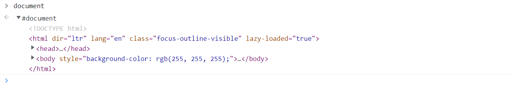

如果要查看 document 对象的属性，有两个方法：

- 从 window 对象下面进入：

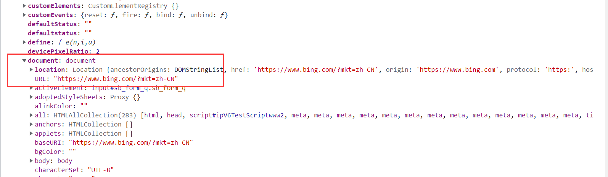

- 从调试界面进入：

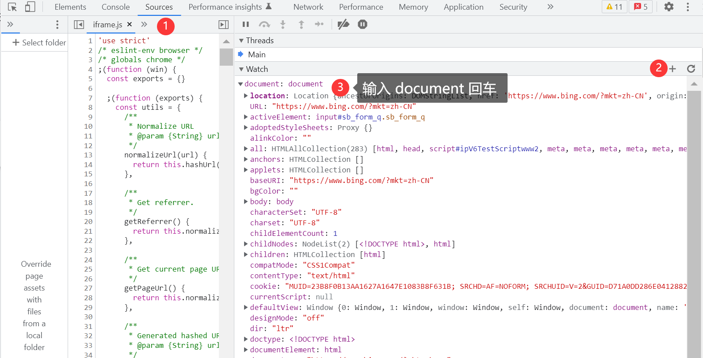

## 获取网页元素

### querySelector

`querySelector` 是最强大的元素选择器，它强大的靠山是 CSS 选择器：

```js
querySelector(selectors)
```

具体示例：

```js
querySelector('.class');
querySelector('#id');
querySelector('ul');
querySelector('input[name=password]');
```

如果有多个对象，则返回第一个符合的，如果要选择多个，可以使用 `querySelectorAll()`：

```js
const links = querySelectorAll('nav>a');
```

### getElement 系列

- getElementById

- getElementsByClassName

- getElementsByName

- getElementsByTagName

顾名思义，从函数名字就能知道怎么用了：

```html
<div id="app"></div>
<script>
  const appEle = document.getElementById('app');
  appEle.innerHTML = 'app';
</script>
```

这类函数只能应用于简单的场景，无法应付复杂的场景。

🔑【技巧】除了 Id，其他都是 getElements，返回的都是数组，这个细节需要注意。

### 三个直接对象

document 对象下面有三个直接对象：body, head, documentElement，其中 documentElement 对应于 html 元素。

```js
const headEle = document.head;
// 等价于
const headEle = document.querySelector('head');
```

### TypeScript 类型

TypeScript 的类型可以使用通用的 HTMLElement，也可以更加具体一点：

```js
const div: HTMLDivElement = document.createElement('div');
const img: HTMLImageElement = document.createElement('img');

// canvas
const canvas:HTMLCanvasElement = document.createElement('canvas');
const ctx:CanvasRenderingContext2D = canvas.getContext('2d');
```


## 元素的属性

假如网页上有如下元素：

```html
<input class="b_searchbox" id="sb_form_q" name="q" aria-autocomplete="both" aria-label="Enter your search here - Search suggestions will show as you type" type="search" value="解忧杂货店" maxlength="100" autocapitalize="off" autocorrect="off" autocomplete="off" spellcheck="false" aria-controls="sw_as">
```

### 获取属性值

JavaScript 如何获取相应的属性呢？主要有如下三种方法：

```js
const s = document.querySelector("#sb_form_q");

var value = s['value'];
var value = s.value;
var value = getAttribute('value');
```

如下图所示：

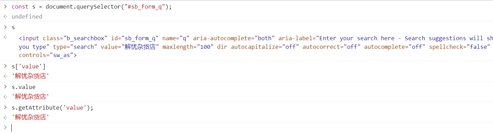

### 设置属性值

设置元素值也有三种方法：

```js
const s = document.querySelector("#sb_form_q");

s["value"] = "白夜行";
s.value = "嫌疑人的献身";
s.setAttribute("value", "局外人");
```

### 布尔属性

布尔属性设置方法，布尔属性没有显示的属性值，如果他出现在了元素上，他的值就是 `true`，如果没有该属性，他的值就是 `false`:

```js
s.disabled = true;
s.disabled = false;
```

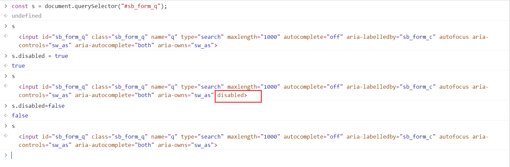

### dataset

有一类特殊属性，可以保存一些数据：`data-*`，这类属性可以通过 `dataset` 设置：

```js
s.dataset.id = 1
s.dataset.id //1

//等价于
s.setAttribute('data-id', 1);
const id = s.getAttribute('data-id');
```

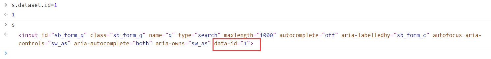

### 删除属性

`removeAttribute();`

```js
s.removeAttribute('data-id');
```

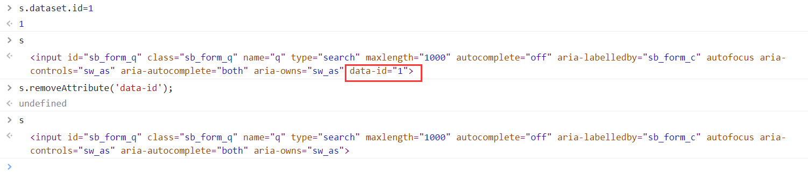

### class 属性

样式表是最常用的属性之一，样式表对象是 `classList`，主要有三个方法：

`add`：添加一个类名

`remove`: 删除一个类名

`toggle`: 如果有就删除，没有就加上。

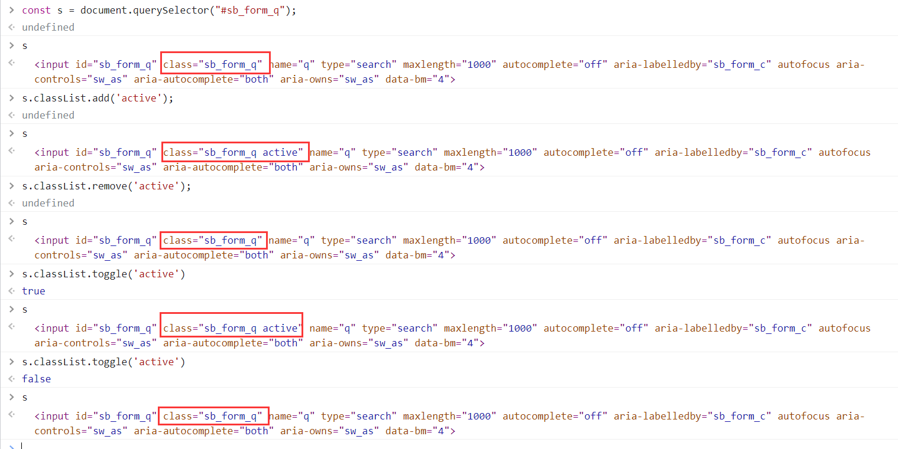

### style 属性

JavaScript 可以通过 style 属性设置行内样式：

```js
s.style.fontSize = '24px'
```

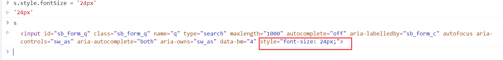

如果需要读取 style 属性值，有两种方法：

```js
const color = s.style.Color;
```

如果没有设置行内样式，这种方法会读到 undefined，这时需要使用：

```js
const style = getComputedStyle(s);
```

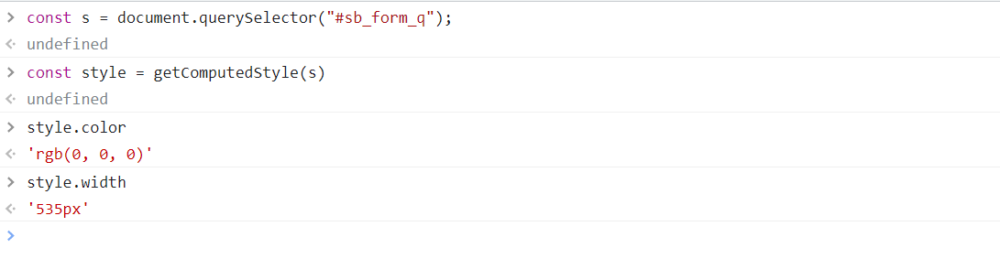

## DOM 结点操作[^1]

网页在外面的表现形式是标签的堆叠与嵌套，在计算机内部表现为一棵文档树：

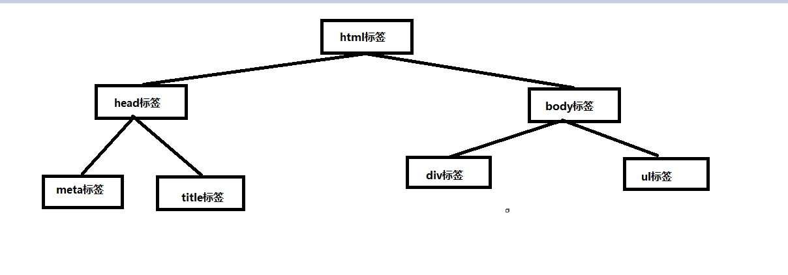

### DOM 结点类型

文档树由格式各样的结点构成：

```html
<ul class='peotry'>
  文本
  <!-- 注释 -->b
  <li><strong>将进酒</strong></li>c
  <li>君不见</li>d
  <li>黄河之水天上来</li>e
</ul>
```
打印查看所有的DOM结点：
```js
console.log(document.querySelector('ul').childNodes);
//NodeList(9) [text, comment, text, li, text, li, text, li, text]
```

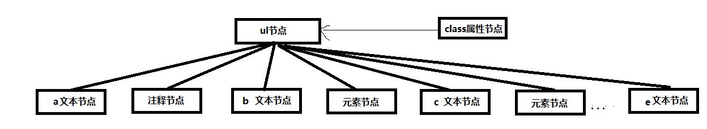

从上面的打印结果可以看出：DOM结点不止有元素结点，还有文本结点，注释结点，并且代码中的缩进与空格等字符会被当做文本结点。DOM 结点的类型的属性是：`nodeType`。

```js
document.querySelector("ul").childNodes.forEach((node) => {
  console.log(node.nodeType);
});
```

结果：

```js
3
8
3
1
3
1
3
1
3
```

这是因为结点的类型是枚举类型：

- `Node.ELEMENT_NODE` (`1`)
- `Node.ATTRIBUTE_NODE` (`2`)
- `Node.TEXT_NODE` (`3`)
- `Node.CDATA_SECTION_NODE`(`4`)
- `Node.PROCESSING_INSTRUCTION_NODE` (`7`)
- `Node.COMMENT_NODE` (`8`)
- `Node.DOCUMENT_NODE` (`9`)
- `Node.DOCUMENT_TYPE_NODE` (`10`)
- `Node.DOCUMENT_FRAGMENT_NODE` (`11`)

还有一些遗弃的结点类型：

-  `Node.ENTITY_REFERENCE_NODE` (`5`)
- `Node.ENTITY_NODE` (`6`)
- `Node.NOTATION_NODE` (`12`)

### Node 结点名称与值

Node 结点类型看起来不是很方便，可以用结点的名称与值查看结点的信息：

```js
3 '#text' '\n      文本\n      '
8 '#comment' ' 注释 '
3 '#text' '\n      '
1 'LI' null
3 '#text' '\n      '
1 'LI' null
3 '#text' '\n      '
1 'LI' null
3 '#text' '\n    '
```

### 结点的获取

```text
childNodes 获取到所有的子节点
attributes 获取到所有的属性节点
children 获取所有的子元素节点   
parentNode 获取上级节点
firstChild 获取第一个子节点
firstElementChild 获取第一个元素子节点
nextSibling 获取后面的兄弟结点
nextElementSibling 获取后面的兄弟元素结点
previousSibling 获取前一个兄弟结点
previouseElementSibling 获取前一个兄弟元素结点
```
### 创建结点

创建普通文本结点：

```js
createTextNode("text");
```

创建属性结点：

```js
const node = document.getElementById("div1");
const a = document.createAttribute("my_attrib");
a.value = "newVal";
node.setAttributeNode(a);
```

创建元素结点：

```js
const newDiv = document.createElement("div");
```

创建临时文档片[^2]：

```js
const element  = document.getElementById('ul'); // assuming ul exists
const fragment = document.createDocumentFragment();
const browsers = ['Firefox', 'Chrome', 'Opera', 'Safari', 'Internet Explorer'];

browsers.forEach((browser) => {
    const li = document.createElement('li');
    li.textContent = browser;
    fragment.appendChild(li);
});

element.appendChild(fragment);
```

临时文档碎片相当于一个缓冲区，先把结点在这里准备好，最后一次性挂载到文档中。

### 添加节点

`parentNode.appendChild(child)`：向元素尾部添加节点

`parentNode.insertBefore(newDom, refDom)`：向指定位置的前面添加节点

### 替换结点

`parentNode.replaceChild(newChild, oldChild)`

### 克隆结点

```js
cloneNode(deep)
// 如果为true，会递归克隆它的所有子节点
// 否则只克隆他自己
```

【案例】

```js
let p = document.getElementById("para1");
let p_prime = p.cloneNode(true);
```

### 删除结点

`parentNode.removeChild(someChild)`

## 计算元素尺寸

### 元素尺寸

```html
<style>
  div {
    width: 100px;
    height: 100px;
    box-sizing: border-box;
    border: 8px solid red;
    padding: 5px;
    margin: 5px;
  }
</style>
<div></div>
<script>
  const div = document.querySelector("div");
  
  //1、获取元素的实际宽度，并且携带px单位
  console.log(window.getComputedStyle(div).width);
  // 100px

  // 2、clientWidth 获取 content+padding 的宽度
  // 返回的是数字, 并且是只读属性
  console.log(div.clientWidth);
  // 84

  // 3、offsetWidth 获取 content+padding+border 的宽度
  // 返回的是数字, 也是只读属性
  console.log(div.offsetWidth);
  // 100
</script>
```

### 获取定位偏移量

```html
<style>
  .one {
    position: relative;
    width: 200px;
    height: 200px;
    background-color: skyblue;
  }

  .two {
    width: 100px;
    height: 100px;
    background-color: yellowgreen;
    position: absolute;
    top: 100px;
  }
</style>
<div class="one">
  <div class="two"></div>
</div>
<script>
  // 1、获取上级定位元素: 每一个元素绝对有一个上级定位元素，如果没有显式指定则是 body
  console.log(document.querySelector(".two").offsetParent);

  // 2、获取相对于上级定位元素的距离
  console.log(document.querySelector(".two").offsetLeft);
  console.log(document.querySelector(".two").offsetTop);
</script>
```

### 获取滚动高度

```html
<style>
  .one {
    width: 300px;
    height: 300px;
    background-color: skyblue;
    overflow: scroll;
  }

  .two {
    width: 600px;
    height: 600px;
    background-color: yellowgreen;
  }
</style>
<div class="one">
  <div class="two"></div>
</div>
<script>
  window.onscroll = function () {
    const oneDom = document.querySelector(".one");
    // 获取到完整的尺寸: 总高度
    console.log(oneDom.scrollHeight);
    // 获取到滚动距离：因滚动而隐藏的距离
    console.log(oneDom.scrollTop);
    // 获取到内容可视高度
    console.log(oneDom.clientHeight);
    // 当滚动到底时满足公式： scrollHeight = scrollTop + clientHeight
    // 注意: 等于条件可能不满足，有可能会偏差 1px, 建议使用:
    // Math.abs(scrollTop + clientHeight-scrollHeight)<1
  };
</script>
```

【案例】用户协议控制：

```html
<style>
  #box {
    width: 200px;
    height: 200px;
    overflow: auto;
    margin-bottom: 16px;
  }

  #content {
    height: 800px;
  }
</style>
<div id="box">
  <div id="content">
    欢迎注册成为森喵用户！在您注册过程中，您需要完成我们的注册流程并通过点击同意的形式在线签署以下协议，请您务必仔细阅读、充分理解协议中的条款内容后再点击同意（尤其是以粗体或下划线标识的条款，因为这些条款可能会明确您应履行的义务或对您的权利有所限制）。
  </div>
</div>
<input type="checkbox" id="agreement" disabled />
同意协议
<input type="button" id="go" value="去注册" disabled />
<script>
  const boxDom = document.querySelector("#box");
  const height = boxDom.scrollHeight; //获取到完整尺寸
  const contentHeight = boxDom.clientHeight; // 获取到内容尺寸

  boxDom.onscroll = function () {
    // 说明已经滚动到到底了
    if (Math.abs(contentHeight + boxDom.scrollTop - height) < 1) {
      document.querySelector("#agreement").disabled = false;
    }
  };
  document.querySelector("#agreement").onclick = function () {
    // 勾选了checked 按钮可以点击，否则不能点击
    document.querySelector("#go").disabled = !this.checked;
  };
</script>
```

## 参考文章

[^1]: MDN. [Node](https://developer.mozilla.org/en-US/docs/Web/API/Node).

[^2]: MDN. [Document.createDocumentFragment()](https://developer.mozilla.org/en-US/docs/Web/API/Document/createDocumentFragment). 


> ♥ 我是前端工程师：你的甜心森。非常感谢大家的点赞与关注，欢迎大家参与讨论或协作。
>
> ★ 本文[开源](https://github.com/xiayulu/FrontEndCultivation)，采用 [CC BY-SA 4.0 协议](http://creativecommons.org/licenses/by-sa/4.0/)，转载请注明出处：[前端工程师的自我修养](https://github.com/xiayulu/FrontEndCultivation). GitHub.com@xiayulu.
>
> ★ 创作合作或招聘信息请发私信或邮件：zuiaiqiansen@163.com，注明主题：创作合作或**招聘前端工程师**。
