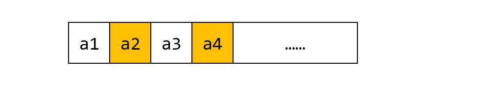

# JavaScript 数组快速入门

## 唠唠叨叨

计算机科班的同学对数组的理解非常深刻，但是对于许多学前端的小伙伴来说，可能是第一次接触数组。数组数组，顾名思义是一组数，生活中最形象的例子是火车，如果你之前没听说过数组，但是有很大可能听说过列车组，动车组，机组。因此可以从两个角度来认识数组：

- 从数的角度：数据就是乘客，上车就是把数组放到数组里面，下车就是从数组中删除数据，查找数据就是查票。
- 从列车的角度：一个动车组有多少座位，能拉多少乘客，换成数组就是数组的元素个数是多少，能装多少数据。从这个角度来看，数组是一个装数据的容器。



## 构造数组

### 数组字面量

```js
const empty = [];
const numbers = [1, 2, 3, 4];
```

 【解读】这种方式最简单直接，也是最常用的方法。

### 构造函数

构造函数是专门构造某种对象的函数，数组的构造函数：

```js
const arr1 = new Array();  //空数组 []
const arr2 = new Array(4); //长度为4的数组, [,,,,]
const arr3 = new Array('a')//['a']
const arr4 = new Arrar(2, 3); // [2, 3]
const arr5 = Arrar(2, 3);     // 可省略 new
```

【解读】使用构造函数创建数组的方式比较少见，同等情况下建议使用字面值。

【思考】如果要创建长度为 10 元素全0的数组，该如何创建呢？

```js
const zeros = Array(10).fill(0);
```

注意空数组不能使用 `map`：

```js
// 错误：
const zeros = Array(10).map(()=>0);
```

## 获取元素

JavaScript 数组可以通过下标获取对应的元素：

```js
const fruits = ['apple', 'orange', 'pear'];

console.log(fruits[0], fruits[1], fruits[2]);//apple orange pear
```

JavaScript 数组可以随便越界：

```js
const fruits = ['apple', 'orange', 'pear'];

console.log(fruits[100]);//undefined

fruits[8] = 'grap'; // 甚至可以跨元素赋值
console.log(fruits) //(9) ["apple", "orange", "pear", "grap"]
```

### 遍历数组的方法

- `for` 循环

```js
const fruits = ['apple', 'orange', 'pear'];

for (let i = 0; i < fruits.length; i++) {
  console.log(fruits[i]);
}
```

- `for ..in..`：获取属性，也就是下标

```js
const fruits = ['apple', 'orange', 'pear'];

for (let key in fruits) {
  console.log(fruits[key]);
}
```

- `for..of..`：获取值

```js
const fruits = ['apple', 'orange', 'pear'];

for (let val of fruits) {
  console.log(val);
}
```

- `forEach()`

```js
const fruits = ['apple', 'orange', 'pear'];

fruits.forEach(fruit => {
  console.log(fruit);
});
```

这么多方法，挑自己喜欢的就行。

## 常用数组方法

### 添加和删除元素

- 数组的 `push, pop` 方法使得数组能像栈一样使用，`push` 会添加一个元素到数组最后面，`pop` 会出最后一个元素。
- 数组的 `shift, unshift` 方法使得数组能在头部弹出和插入元素，结合 `push`使得数组具有队列的效果。
- 数组的 `splice()` 方法在指定位置删除和插入元素，使用方法如下[^1]：

```js
splice(start)
splice(start, deleteCount)
splice(start, deleteCount, item1)
splice(start, deleteCount, item1, item2, itemN)
```
在指定位置插入元素：
```js
const fruits = ["apple", "pear", "grape", "banana"];
const removed = fruits.splice(2, 0, "orange");
console.log(fruits, removed);
// ["apple","pear","orange","grape","banana"]
// []
```

从自定位置删除元素

```js
const fruits = ["apple", "pear", "grape", "banana"];
const removed = fruits.splice(2, 2);
console.log(fruits, removed);
// ["apple","pear"]
// ["grape","banana"]
```

删除并插入元素：

```js
const fruits = ["apple", "pear", "grape", "banana"];
const removed = fruits.splice(2, 1, "orange", "pineapple");
console.log(fruits, removed);
// ["apple","pear","orange","pineapple","banana"]
// ["grape"]
```

💡【技巧】以上方法会改变原数组。

### 函数式方法

对于数组的元素，通常需要使用循环语句 `for(...)` 遍历。数组的函数式方法是比简单的循环语句语义更加细化的方法，函数式方法在多数情况下更加优雅，易懂，但刚入门的小白可能不好理解，但只要理解了这种使用方式，就不想用 `for` 循环了。就好像习惯了骑电动车，就不会再蹬自行车一样。

函数式方法一般都具有如下格式：

```js
method((element) => { /* … */ })
method((element, index) => { /* … */ })
method((element, index, array) => { /* … */ })
```

- `forEach()`，遍历数组，人如其名。

```js
const fruits = ["apple", "pear", "grape", "banana"];

function handleEle(ele) {
  console.log(ele);
}

// 循环
for (let i = 0; i < fruits.length; i++) {
  handleEle(fruits[i]);
}
// 函数式
fruits.forEach(handleEle);
```

- `map()`，映射

```js
const fruits = ['apple', 'pear', 'grape', 'banana'];

function handleEle(ele) {
  return `<li>${ele}</li>`;
}

// 循环
const result = [];
for (let i = 0; i < fruits.length; i++) {
  result.push(handleEle(fruits[i]));
}
console.log(result);

// 函数式
const result2 = fruits.map(handleEle);
console.log(result2);
```

- `filter()`，过滤

```js
const fruits = ["apple", "pear", "grape", "banana"];

function handleEle(ele) {
  return ele.length > 4;
}
// 循环
const result = [];
for (let i = 0; i < fruits.length; i++) {
  if (handleEle(fruits[i])) {
    result.push(fruits[i]);
  }
}
console.log(result);

// 函数式
const result2 = fruits.filter(handleEle);
console.log(result2);
```

- `reduce()`，累积

```js
const fruits = ["apple", "pear", "grape", "banana"];

function handleEle(pre, cur) {
  return pre + "+" + cur;
}

// 循环
let result = "";
for (let i = 0; i < fruits.length; i++) {
  result = handleEle(result, fruits[i]);
}
console.log(result);

// 函数式
const result2 = fruits.reduce(handleEle, "");
console.log(result2);
```

💡【技巧】函数式方法不会改变原数组，需要用新变量接收结果。

💡【技巧】函数式方法会跳过占位符 `[,,,]`[^2]。

从以上例子来看，函数式方法是不是更优雅一些呢？函数式方法重在理解，理解就好办了。

### 数组切片

数组切片返回一个子数组：

```js
const animals = ['ant', 'bison', 'camel', 'duck', 'elephant'];

console.log(animals.slice(2));
// expected output: Array ["camel", "duck", "elephant"]

console.log(animals.slice(2, 4));
// expected output: Array ["camel", "duck"]

console.log(animals.slice(1, 5));
// expected output: Array ["bison", "camel", "duck", "elephant"]

console.log(animals.slice(-2));
// expected output: Array ["duck", "elephant"]

console.log(animals.slice(2, -1));
// expected output: Array ["camel", "duck"]

console.log(animals.slice());
// expected output: Array ["ant", "bison", "camel", "duck", "elephant"]
```

💡【技巧】切片区间遵循左闭右开原则：`(start, end]`。

💡【技巧】-1 代表最后一个元素。

切片与原数组是独立的：但要小心浅拷贝：

```js
const animals = ["ant", "duck", "bison", "camel", "elephant"];
const bigAni = animals.slice(2);
bigAni[0] = "bull";
console.log(bigAni);
console.log(animals)
```

拼接数组：`concat()`：

```js
const fruits = ["apple", "pear", "grape", "banana"];

const more = fruits.concat(["pineapple", "tomato", "pomelo"]);
console.log(more)
```

需要用新变量接受拼接后的数组。

## 练习

📝【练习】将多维数组：

   `var arr = [[1, 2, 2], [3, 4, 5, 5], [6, 7, 8, 9, [11, 12, [12, 13, [14]]]], 10];`

   转为一维数组 ` [1, 2, 2, 3, 4, 5, 5, 6, 7, 8, 9, 11, 12, 12, 13, 14, 10]`

提示：需要使用 `instanceof` 判断数组元素是否为数组：`arr instanceof Array;`

【解】思路：递归调用自己把高维数组转化为一维数组。

```js
function flat(arr) {
  let result = [];
  for (const ele of arr) {
    if (ele instanceof Array) {
      // 如果元素是数组，把转换后的数组元素拿出来，放到当前数组
      result = result.concat(flat(ele));
    } else {
      // 否则直接添加到当前数组
      result.push(ele);
    }
  }
  return result;
}
const arr = [
  [1, 2, 2],
  [3, 4, 5, 5],
  [6, 7, 8, 9, [11, 12, [12, 13, [14]]]],
  10,
];
console.log(flat(arr));
```

【知识点】

1）`push` 添加数组元素，`concat` 拼接数组。

2）判断数组类型：`arr instanceof Array`

3）递归思想

【解2】使用函数式方法：

```js
const arr = [
  [1, 2, 2],
  [3, 4, 5, 5],
  [6, 7, 8, 9, [11, 12, [12, 13, [14]]]],
  10,
];

const flatted = arr.flat(4);
console.log(flatted);
```

📝【练习】佩奇同学从服务器获取了一组评论，项目组长希望佩奇按照浏览量 (views) 对评论列表排序，请编程实现：

```js
var comments = [
  {
    id: 1,
    views: 234,
    content: '上次我把vuex里一个叫tab的getter改成了更有辨识度的currentTab，普遍来说没问题。',
  },
  {
    id: 2,
    views: 499,
    content: '哈哈哈，有空了理顺下。这就是亲眼看到屎山行程的过程',
  },
  {
    id: 4,
    views: 1000,
    content: '这不就是大脑的架构吗？',
  },
];
```

【解】使用 `sort()` 方法：

```
comments.sort((c1, c2) => {
  return c2.views - c1.views;
});

console.log(comments);
```

【技巧】1-2 升序，2-1 降序。

📝【练习】双十一到了，现在有一批特价商品需要打折，请把类型为 discount 的商品打 8 折：

```js
var products = [
  { id: 234, type: 'normal', price: 19.99, name: '曲奇饼' },
  { id: 245, type: 'discount', price: 20, name: '纸巾' },
  { id: 2123, type: 'discount', price: 8999, name: '游戏本电脑' },
  { id: 255, type: 'normal', price: 14999, name: 'RTX 4090' },
];
```

【解】本题考察数组遍历方式以及对象属性修改方式。

```js
for (var product of products) {
  if (product.type === 'discount') {
    product.price = Number((0.8 * product.price).toFixed(2));
  }
}
console.log(products);
```

📝【练习】通过循环按行顺序为一个5×5的二维数组 `a`  赋 1 到 25 的自然数，然后在页面上输出该数组的左下半三角。
提示：需要使用到二维数组，数组元素还是数组 `[[1,2,3,4,5],[6,7,8,9,10]]`
最终结果如下：

```js
1 
6 7 
11 12 13 
16 17 18 19 
21 22 23 24 25 
```

【解】

```js
// 构造二维数组
var a = [];
var tmp = []; // 临时数组
for (var i = 1; i <= 25; i++) {
  tmp.push(i);
  if (i % 5 === 0) {
    a.push(tmp);
    tmp = [];
  }
}

//打印左半下三角
for (var i = 0; i < 5; i++) {
  for (var j = 0; j <= i; j++) {
    document.write(a[i][j], " ");
  }
  document.write("<br>");
}
```

【知识点】

1）`push`: 在数组后面添加元素

2）循环打印二维数组。


📝【练习】点击按钮后生成双色数字并显示在 `#app` 元素中。

要求：红色数字是 1-33 中随机的 6个不重复的数字，蓝色数字是 1-13 中随机的一个数字。

```html
<div id="app"></div>
<button>生成数字</button>
<script>
// code here
</scripts>
```

【解1】随机生成红色数字，如果重复就重新生成：

```js
// 生成某个区间的随机数
function getRandom(min, max) {
  return Math.floor(Math.random() * (max - min) + min);
}

// 检查是否取过
function check(arr, ele) {
  for (var val of arr) {
    if (val === ele) {
      return true;
    }
  }
  return false;
}

// 获取红色数字数组
function getRed() {
  var result = [];
  while (result.length !== 6) {
    // 取满 6 个即可
    var num = getRandom(1, 34);
    if (!check(result, num)) {
      // 检查是否取过
      result.push(num);
    }
  }
  return result;
}

//蓝色数字很简单
function getBlue() {
  return getRandom(1, 14);
}

//点击事件
document.querySelector("button").onclick = function() {
  // 遍历数组
  var redNum = '';
  for (var num of getRed()) {
    redNum += '<span style="color:red;">' + num + ',</span>';
  }
  var blueNum = '<span style="color:blue;">' + getBlue() + '</span>'
  // 操作 dom
  document.querySelector("#app").innerHTML = redNum + blueNum;
};
```

【解2】模拟摸球过程，一个一个的摸出来：

```js
function getRed() {
  //先把球放进袋子里
  var red = [];
  for (var i = 0; i < 33; i++) {
    red.push(i + 1);
  }
  //随机摸出来
  var result = [];
  for (var i = 0; i < 6; i++) {
    var pos = getRandom(0, red.length); //随机获取一个数的下标
    result.push(red.splice(pos, 1)[0]); // 取出来放到结果数组里
  }
  return result;
}
```

【知识点】

1）随机数生成

2）函数，函数，函数，总之多些函数

3）while 循环，push 数组添加元素

4）DOM 操作。


📝【练习】以下是某班级一次考试的成绩表:

```js
学号     语文    数学     英语	  总成绩  	 备注
1       105     62      118
2       89      78	    120
3       86      64	    80
4       78      99	    91
5       107.5   97	    70
6       112     61	    92
7       101     79	    104
8       71      72	    105
9       56      68	    61
10      98      83	    77
```

请完成如下成绩整理任务：

1) 请计算每个学生总成绩，并按总成绩排名。
2) 统计各单科成绩第一名，输出其成绩与学号。

【解】

```js
var marks = [
  { no: 1, chinese: 105, math: 62, english: 118 },
  { no: 2, chinese: 89, math: 78, english: 120 },
  { no: 3, chinese: 86, math: 64, english: 80 },
  { no: 4, chinese: 78, math: 99, english: 91 },
  { no: 5, chinese: 107.5, math: 97, english: 70 },
  { no: 6, chinese: 112, math: 61, english: 92 },
  { no: 7, chinese: 101, math: 79, english: 104 },
  { no: 8, chinese: 71, math: 72, english: 105 },
  { no: 9, chinese: 56, math: 68, english: 61 },
  { no: 10, chinese: 98, math: 83, english: 77 },
];

// 计算总成绩
for (var mark of marks) {
  mark["all"] = mark["chinese"] + mark["math"] + mark["english"];
}

function printNum(num, n = 10) {
  var numStr = String(num);
  var len = numStr.length;
  for (var i = 0; i < n - len; i++) {
    numStr += "&nbsp;&nbsp;";
  }
  document.write(numStr);
}

// 按总成绩降序排列
marks.sort((a, b) => {
  return b["all"] - a["all"];
});

//打印排名
function printHead() {
  printNum("学号");
  printNum("语文");
  printNum("数学");
  printNum("英语");
  printNum("总成绩");
  document.write("<br>");
}

printHead();
for (var mark of marks) {
  printNum(mark["no"], 12);
  printNum(mark["chinese"], 12);
  printNum(mark["math"], 12);
  printNum(mark["english"], 12);
  printNum(mark["all"], 12);
  document.write("<br>");
}

// 打印单科
keName = { chinese: "语文", math: "数学", english: "英语" };
function printSingle(ke) {
  var max = marks[0];
  for (var mark of marks) {
    if (mark[ke] > max[ke]) {
      max = mark;
    }
  }

  document.write(keName[ke], "&nbsp;&nbsp;", max[ke], "&nbsp;&nbsp;", max["no"], "<br>");
}

printSingle("chinese");
printSingle("math");
printSingle("english");
```

【知识点】

1）利用对象记录分数数据。

2）对象属性操作。

3）打印函数封装。

4）数组排序。

## 参考文章

[^1]: MDN. [Array.prototype.splice()](https://developer.mozilla.org/en-US/docs/Web/JavaScript/Reference/Global_Objects/Array/splice#syntax).

[^2]: MDN. [Array methods and empty slots](https://developer.mozilla.org/en-US/docs/Web/JavaScript/Reference/Global_Objects/Array#array_methods_and_empty_slots). 


> ♥ 我是前端工程师：你的甜心森。非常感谢大家的点赞与关注，欢迎大家参与讨论或协作。
>
> ★ 本文[开源](https://github.com/xiayulu/FrontEndCultivation)，采用 [CC BY-SA 4.0 协议](http://creativecommons.org/licenses/by-sa/4.0/)，转载请注明出处：[前端工程师的自我修养](https://github.com/xiayulu/FrontEndCultivation). GitHub.com@xiayulu.
>
> ★ 创作合作或招聘信息请发私信或邮件：zuiaiqiansen@163.com，注明主题：创作合作或**招聘前端工程师**。

