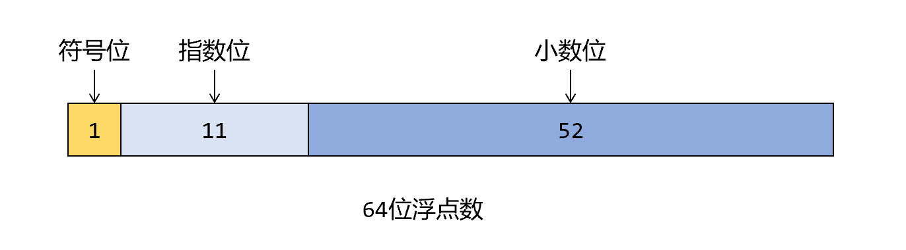

# 一文弄懂 JavaScript 基础数据类型

开始之前，先做几个小测验：

- 当前 JavaScript 一共有多少种类型？

- `console.log(1&&2&&3)` 的输出是什么?

- ` console.log(typeof 1) ` 输出什么？

- ` console.log(typeof null) ` 输出什么？
- 列举 `typeof xxx ` 的所有可能取值？

欢迎在评论区写下你的答案。


正文开始:

JavaScript 共有八种数据类型，可以分为两大类，一类是**基本数据类型**([Primitive values](https://developer.mozilla.org/en-US/docs/Web/JavaScript/Data_structures#primitive_values) )，另一类是**对象数据类型**([Objects](https://developer.mozilla.org/en-US/docs/Web/JavaScript/Data_structures#objects) )。

基础数据类型有如下七种：Boolean, Number, String, Undefined, Null, BigInt, Symbol。

基本数据类型又称原子类型，它们不能再拆分为更细粒度的数据类型。而对象数据类型类似其他语言的类或者结构体，由基础数据类型成员组成。本章重点讲解七种基本数据类型，对象数据类型会单开一个章节重点讲述。

## Boolean

首先介绍最简单的数据类型：布尔型，布尔类型是计算机语言的基础，因为计算机数据由 `0, 1` 组成，`0, 1` 正好代表了布尔类型的两个值：`true, false`。许多经典的计算机语言会把 1 当成 true，会把 0 当成 false，但一些现代的编程语言严格区分类型，不能隐式的把数值类型转换为布尔类型，Go 和 Rust 是典型的代表，这样的语言写代码的时候会让觉得安心。不幸的是，JavaScript 没有严格的类型约束，存在各式各样的类型转换规则，后面的章节讲解了 JavaScript 中的类型转换。

JavaScript 使用 `typeof` 运算符取得变量的类型：

```js
console.log(typeof true)  //boolean
console.log(typeof false) //boolean
```

### 布尔类型转换

 如下八种情况转布尔类型得到` false` : `0, +0, -0, NaN, undefined, null, '', false`，其他的都为 `true`

### 布尔表达式的运算

JavaScript 存在布尔表达式的运算，并且它的运算规则非常奇葩：

- `&&`：从左到右依次考察运算对象的值，如果是判为假，则立刻返回该值，否则返回最后一个值。
- `||`：从左到右依次考察运算对象的值，如果是判为真，则立刻返回该值，否则返回最后一个值。

咋一看，有的同学会觉得很奇怪，布尔运算应该是布尔类型之间的运算，返回的值也是布尔类型。但在 JavaScript 中任何类型都可以参与布尔运算，并且返回的值也是任何类型的，请看例子：

```js
let res = 1 && 2 && 3;
console.log(res); // 3

res = 1 || 2 || 3;
console.log(res); // 1

let user = null;
res = user &&  user.name;
console.log(res) // null

user = {name: "派大星"};
res = user &&  user.name;
console.log(res) // "派大星"

let exp = user.exp || 100;
console.log(exp) // 100
```

JavaScript **取反运算 `!`** 可能存在类型转换，对非布尔类型的变量取反会先把它转换成布尔类型，然后再取反：

```js
console.log(!1); // false
console.log(!""); // true
```

【🔑技巧】使用两次取反可以把一个变量转换成相应的布尔类型：

```js
let a = !!1;    //a===true
let b = !!{};   //b===true
```

## Number[^1]

其他编程语言例如 C++ 有 char，short，int，long 等诸多整数类型，JavaScript 没有整数类型，只有 Number 类型，并且 Number 为 IEEE 754 64 位浮点类型，使用 52 位表示小数位M，11 位表示指数位E，1 位表示符号位S。



因此，$x=-1\times S\times (1+M)\times2^{E}$

小数的计算方法：每一位的权重是 $2^{-i}, i=1,\dots,52$，**注意要加1**。

指数的计算方法：因为指数位是 11 位能表示无符号的数值范围是 0~2047，为了表示负指数，需要减去一个偏移量因，IEEE 754 标准规定该固定值为 $2^{e-1}-1=1023$ ($e$ 代表指数位数)，此表示的指数范围是：**-1022~1023**，全0与全1有特殊含义[^2]：

1. 如果指数是0并且尾数的小数部分是0，这个数 $\pm 0$（和符号位相关）
2. 如果指数 = $2^{e}-1$ 并且尾数的小数部分是0，这个数是 $\pm \infty$（同样和符号位相关）
3. 如果指数 = $2^{e}-1$ 并且尾数的小数部分非0，这个数表示为非数 NaN (Not a Number)。

|    形式    |      指数      |    小数部分    |
| :--------: | :------------: | :------------: |
|     零     |       0        |       0        |
| 非规约形式 |       0        |   大于0小于1   |
|  规约形式  | 1 到 $2^{e}-2$ | 大于等于1小于2 |
|    无穷    |   $2^{e}-1$    |       0        |
|    NaN     |   $2^{e}-1$    |      非 0      |

【**提示**】如果想了解浮点数的运算规则，请阅读参考文章3[^3]，文章写得非常棒，每一个细节都讲到了。

【例】常见的 Number 写法：

```js
let a1 = 12_345_678; //可以使用下划线分组
let a2 = 1e-5; // 那个1不能少

// 二进制, 0b或0B开头
let b1 = 0b10_0000; // 32
let b2 = 0b011_1111; // 63
let b3 = b1 & b2; // 32
console.log(b1, b2, b3);

// 八进制，0o或0O开头
let d1 = 0o755; // 493
let d2 = 0o644; // 420
let d3 = d1 + d2; //913
console.log(d1, d2, d3);

// let d4 = 0o888; 八进制不能超过7
//注: 非严格模式的八进制以0开头，建议但不要这么写

// 十六进制，0x或0X开头
let f1 = 0xffff_ffff_ffff_ffff; // 18446744073709552000
let f2 = 0x123456789abcdef; // 81985529216486900
let f3 = f1 | f2; // -1985229328
let f4 = f1 + 1; // 18446744073709552000

console.log(f1, f2, f3, f4);
```

### 构造器

Number() 返回一个数值类型。当使用 `new` 操作符时，返回一个对象。

```js
3===Number('3');//true
3===new Number('3');//false
3==new Number('3');//true
typeof new Number('3');//"object"

// 脱了裤子放屁——多余：
3 === Number(3);//true
```

【⚠️注意】new 出来的是整数对象是对象，不是 Number 基本类型，注意区分。

### 常用的特殊值

```js
const biggestNum = Number.MAX_VALUE;
const smallestNum = Number.MIN_VALUE;
const infiniteNum = Number.POSITIVE_INFINITY;
const negInfiniteNum = Number.NEGATIVE_INFINITY;
const notANum = Number.NaN;

const biggestInt = Number.MAX_SAFE_INTEGER; //  (2**53 - 1) =>  9007199254740991
const smallestInt = Number.MIN_SAFE_INTEGER; // -(2**53 - 1) => -9007199254740991

// 特别留心某些边界上的运算
console.log(
  biggestNum,
  biggestNum + 2,
  biggestInt,
  biggestInt + 1,
  biggestInt + 2
);
```

【练习】请写出如下程序的结果，为什么？

```js
console.log(1 === 1.0, 0.1 + 0.1 === 0.2, 0.1 + 0.2 === 0.3);
```

### 常用的方法

- [Number.isNaN()](https://developer.mozilla.org/en-US/docs/Web/JavaScript/Reference/Global_Objects/Number/isNaN)，用来判断是不是数值型的 NaN。

`NaN` 或 `Number.NaN` 有一个性质：只要它出现在 `==` 与`===` 中，就会返回 false，所以不能用等号来判断是不是 NaN，应该使用专门的函数 `Number.isNan()`：

```js
Number.NaN==Number.NaN;//false
Number.NaN===Number.NaN;//false
NaN!==Number.NaN //true
Number.NaN!==Number.NaN//true

Number.isNaN(NaN); //true
Number.isNaN(Number.NaN); //true
Number.isNaN(0 / 0); //true
Number.isNaN(37); //false
```

还有一个全局函数 `isNaN`，它会尝试把非数值类型换为数值类型，而 `Number.isNaN()` 只要碰到非数值类型的就直接返回 false。

```js
// 以下结果全是 false
Number.isNaN("NaN");
Number.isNaN(undefined);
Number.isNaN({});
Number.isNaN("blabla");
Number.isNaN(true);
Number.isNaN(null);
Number.isNaN("37");
Number.isNaN("37.37");
Number.isNaN("");
Number.isNaN(" ");

isNaN("NaN"); // true
isNaN(undefined); // true
isNaN({}); // true
isNaN("blabla"); // true
isNaN(true); // false, this is coerced to 1
isNaN(null); // false, this is coerced to 0
isNaN("37"); // false, this is coerced to 37
isNaN("37.37"); // false, this is coerced to 37.37
isNaN(""); // false, this is coerced to 0
isNaN(" "); // false, this is coerced to 0
```

- [Number.parseFloat()](https://developer.mozilla.org/en-US/docs/Web/JavaScript/Reference/Global_Objects/Number/parseFloat)

把字符串转化为数值，使用方法：`Number.parseFloat(string)` 或全局形式：`parseFloat(string)` （他们是一样哒）：

参数为 string ，并且开始的空格会被忽略。

返回一个 Number 或 NaN

- [Number.prototype.toFixed()](https://developer.mozilla.org/en-US/docs/Web/JavaScript/Reference/Global_Objects/Number/toFixed)

省略到几位小数。接收一个参数省略到几位小数，默认为 0，**返回数值的字符串形式**：

```js
console.log((3.1415).toFixed(2)); // 3.14
console.log((3.145).toFixed(2)); //3.15
// console.log(3.toFixed(2)); // 报错
console.log((3).toFixed(2));//3.00
console.log(Number.prototype.toFixed.call(3, 2));
```

【练习】请写出如下程序的运行结果：

```js
let a = 123 + null;
let b = 123 / 0;
let c = 0 / 0;
let d = 123 + undefined;
let e = 123 + '1' + 2;
let f = 12 + + "a";
```

## BigInt[^4]

BigInt 理论上来说可以表示任意长的整数，声明 BigInt只需要在字面值后面加上 `n` 即可：

```js
let a = BigInt(Number.MAX_SAFE_INTEGER);
let b = a + 1n;
let c = b + 1n;

console.log(a, b, c);
// 9007199254740991n 9007199254740992n 9007199254740993n
```

BigInt 支持的运算：

```js
+ * - % ** /
```

但不支持一元运算符：

```js
let a = +1n;
```

报错：

```js
TypeError: Cannot convert a BigInt value to a number
    at <anonymous>:2:9
    at dn (<anonymous>:16:5449)
```

## String

字符串是最常用的数据形式。字符串常见的操作有：获取它的长度 `length`，或使用 `+, +=` 拼接字符串，或使用  [`indexOf()`](https://developer.mozilla.org/en-US/docs/Web/JavaScript/Reference/Global_Objects/String/indexOf) 获取某个子字符串的位置，或使用 [`substring()`](https://developer.mozilla.org/en-US/docs/Web/JavaScript/Reference/Global_Objects/String/substring) 获取某个子字符串。

### 字符串声明方式

```js
const strPrim = "foo"; // A literal is a string primitive
const strPrim2 = String(1); // Coerced into the string primitive "1"
const strPrim3 = 'javascript'; // 单双引号都一样
const strPrim4 = `template literal`; // 模板字符串，可以换行，或定义表达式。

const strObj = new String(strPrim); // new 返回一个字符串对象，不是基本类型.
```

### 获取字符

有两个方法可以获取字符串的单个字符，第一种方法是使用 [`charAt()`](https://developer.mozilla.org/en-US/docs/Web/JavaScript/Reference/Global_Objects/String/charAt) 方法。

```js
'cat'.charAt(1) // gives value "a"
```

第二种方法可以像数组那样使用下标：

```js
'cat'[1] // gives value "a"
```

这种方法只能读取字符，删除或修改字符没有任何效果。

### 字符串比较

```js
let a = '123';
let b = '9';
console.log(a > b); //false

let c = 'A';
let d = 'a';
let e = 'b';
console.log(c < d, d < e, c > b);//true true true
```

【⚠️**注意**】不要直接用字符形式的数字比较大小，结果可能和你想的不一样。

## Symbol

根据规范，对象的属性键只能是字符串类型或者 Symbol 类型。Symbol 代表创建后独一无二且不可变的数据类型，它主要是为了解决可能出现的全局变量冲突的问题，用来表示唯一的标识符。创建 Symbol 示例：

```js
let id = Symbol();

// 可以给 Symbol 一个描述（也称为 Symbol 名）
// 即使我们创建了许多具有相同描述的 Symbol，它们的值也是不同。描述只是一个标签，不影响任何东西。
let id1 = Symbol("id");
let id2 = Symbol("id");

console.log(id1===id2);//false
```

Symbol 不能隐式的转换为字符串：

```js
let id1 = Symbol('id');
console.log(id1 + '');

TypeError: Cannot convert a Symbol value to a string
    at <anonymous>:3:17
    at dn (<anonymous>:16:5449)
```

但可以调用 `toString()` 显示地转换：

```js
let id1 = Symbol('id');
console.log(id1.toString()); //"Symbol(id)"
```

### 使用示例

```js
const id1 = Symbol("id");
const id2 = Symbol("id");

let user = {
  name: "John",
  id: 123,
  [id1]: 233
};

user.id = 1;
user[id1] = 42;

console.log(user.id, user["id"], user.id1, user[id1], user[id2]); 
//1 1 undefined 42 undefined
```

- Symbol 作为属性声明要加 `[]`，使用也只能用`[]`，不能用 `.` 操作符
- 即使同名的两个`id`，它们也不是同一个属性。

既然同名的 Symbol 没有任何关联，如果A 同学声明了一个 Symbol，B 同学就很难使用了。Symbol 还提供一个方法 `Symbol.for("id")`，允许在全局注册表中同名的符号，如果不存在改名字的符号，就创建一个，如果存在，就直接返回：

```js
const id1 = Symbol.for("id");
const id2 = Symbol.for("id");

console.log(id1 === id2);//true

let user = {
  name: "John",
  id: 123,
  [id1]: 233
};

console.log(user[id1], user[id2]);//233 233
```

### Symbol 在 for..in 中会被跳过

```js
const id1 = Symbol("id");
const id2 = Symbol("id");

let user = {
  name: "John",
  id: 123,
  [id1]: 233
};

for (let prop in user) {
  console.log(prop);
}
//"name"
//"id"
```

`Object.keys(user)` 也会忽略 Symbol。这是一般“隐藏符号属性”原则的一部分。如果另一个脚本或库遍历我们的对象，它不会意外地访问到符号属性。但是 [Object.assign](https://developer.mozilla.org/en-US/docs/Web/JavaScript/Reference/Global_Objects/Object/assign) 会同时复制字符串和 symbol 属性：

```js
const id = Symbol("id");

let user = {
  name: "John",
  id: 123,
  [id]: 233
};

let cloned = Object.assign({}, user);

console.log(cloned[id]); //233
```

使用 `Reflect.ownKeys()` 方法可以返回所有属性，包括 Symbol：

```js
const id = Symbol("id");

let user = {
  name: "John",
  id: 123,
  [id]: 233
};

let keys = Reflect.ownKeys(user);

console.log(keys); //["name","id",Symbol(id)]
```

## Null 和 Undefined

### Null 的今生前世

【例题】 `typeof null` 的结果是什么，为什么？

`typeof null` 的结果是 "object"。

在 JavaScript 第一个版本中，所有值都存储在 32 位的单元中，每个单元包含一个小的 **类型标签(1-3 bits)** 以及当前要存储值的真实数据。类型标签存储在每个单元的低位中，共有五种数据类型：

```javascript
000: object   - 当前存储的数据指向一个对象。
  1: int      - 当前存储的数据是一个 31 位的有符号整数。
010: double   - 当前存储的数据指向一个双精度的浮点数。
100: string   - 当前存储的数据指向一个字符串。
110: boolean  - 当前存储的数据是布尔值。
```

如果最低位是 1，则类型标签标志位的长度只有一位；如果最低位是 0，则类型标签标志位的长度占三位，为存储其他四种数据类型提供了额外两个 bit 的长度。null 的值是机器码 NULL 指针 (**NULL 指针的值是全 0**)，那也就是说 null 的类型标签也是 000，和 Object 的类型标签一样，所以会被判定为 "object"。

### Undefinded 是变量？

`undefinded` 是全局对象的一个属性，也就是一个全局变量，该变量在现代的浏览器不能写，也不能配置。不要这么干：

```js
(() => {
  const undefined = 'foo';
  console.log(undefined, typeof undefined); //foo string
})();

((undefined) => {
  console.log(undefined, typeof undefined);
})('foo');//foo string
```

undefinded 表示未定义，检测某个变量或属性是 undefinded 的方法:

- 使用 `typeof`

```js
//  x 没有定义过
if (typeof x === 'undefined') {
  //  these statements execute
}

if (x === undefined) { // 因为x未定义，所以会抛出异常：throws a ReferenceError

}
```

- 全局作用域的变量可以使用 `in` 操作符检测：

```js
if ('x' in window) {
  //  these statements execute only if x is defined globally
}
```

- 或者使用 `void 0`

```js
let x;
if (x === void 0) {
  //  these statements execute
}

//  y has not been declared before
if (y === void 0) {
  //  throws Uncaught ReferenceError: y is not defined
}
```

## 类型转换

### 转换为字符串

- Null 和 Undefined 类型：`null` 转换为 "null"，`undefined` 转换为 "undefined"，
- Boolean 类型：true 转换为 "true"，false 转换为 "false"。
- Number 和 BigInt 类型：会调用静态函数 `toString(10)`。
- Symbol 类型：不会隐式转换（报错），允许显式强制类型转换 String(x) 。
- Object 类型[^5]：

1. 如果object 所属类覆写了toString()方法，则调用该方法。如果toString()调用的返回结果为Primitive(string、number、boolean、undefined、null)，则将该Primitive值转换成string后返回。

2. 如果object所属类没有覆写toString()方法, 即 toString() 调用的返回结果为”[object Object]“；或者覆写了toString() 方法但该方法返回结果为对象。那么JS将调用object的valueOf()方法，如果valueOf()调用的返回结果为Primitive(string、number、boolean、undefined、null)，则将该Primitive值转换成string后返回。

3. 如果上述两点均无法满足，无法通过调用object的toString()方法或者valueOf()方法来获取Primitive值，那么JS将抛出TypeError错误。

### 转换为数值类型

- Undefined 类型： NaN。
- Null 类型： 0。
- Boolean 类型：true 转换为 1，false 转换为 0。
- String 类型：使用 Number() 函数进行转换，如果包含非数字值则转换为 NaN，空字符串为 0。
- Symbol 类型：不可以转换，直接报错。
- Object 类型：

1. 调用object的valueOf()方法，如果得到的是Primitive值，则将该 Primitive 值转换成number后返回。

2. 如果无法从valueOf()方法中获取 Primitive 值，那么调用object的toString()方法；如果toString()返回的是Primitive值，则将该Primitive值转换成 number 后返回。

3. 如果上述两点均无法满足，那么JS将抛出TypeError错误。

可以看到，object自动转换成 string 和 object 自动转换成number的规则其实是一致的，不同之处在于toString()方法和valueOf()方法的调用次序。

### 转换为布尔类型

如下几种情况转 Boolean 得到 false: `0, +0, -0, NaN, undefined, null, '', false`

假值的布尔强制类型转换结果为 false。从逻辑上说，假值列表以外的都应该是真值。

## 发生隐式类型转换的情景

### `+` 运算符

`+` 号比较特殊，既可以当做算数运算符做加法，又可以当做字符串连接符。

规则：undefinded, null, number, boolean 之间相加转换成 number，其他情况一律转换成字符串拼接。

【例】

```js
[]+[]
//""
[]+{}
//"[object Object]"
true+[]
//"true"
true+{}
//"true[object Object]"
undefined+[]
//"undefined"
undefined + {}
//"undefined[object Object]"
```

【例题】请问如下程序的打印结果是什么？

```js
let result = 100 + true + 21.2 + null + undefined + "Tencent" + [] + null + 9 + false

console.log(result)
```

###  其他算术运算符

转换成数值型。

### 逻辑运算符（&& || ！）和 if()

转换成布尔型。

### 比较运算符 ==、>、<等

其中有着非常复杂的规则，见条件判断。

## 类型检测的方式[^6]

### typeof

```javascript
console.log(typeof 2);               // number
console.log(typeof true);            // boolean
console.log(typeof 'str');           // string
console.log(typeof []);              // object    
console.log(typeof function(){});    // function
console.log(typeof {});              // object
console.log(typeof undefined);       // undefined
console.log(typeof null);            // object
```

其中数组、对象、null 都会被判断为 object，其他判断都正确。

【🔑技巧】`typeof` 操作符的返回值有："undefined",  "boolean", "number", "bigint", "string",  "symbol", "object", "function" 共八种，注意都是小写字符串，没有 `null, array, int, float` 之类的东西。

### instanceof

`instanceof` 可以正确判断对象的类型，**其内部运行机制是判断在其原型链中能否找到该类型的原型**。

```javascript
console.log(2 instanceof Number);                    // false
console.log(true instanceof Boolean);                // false 
console.log('str' instanceof String);                // false 
 
console.log([] instanceof Array);                    // true
console.log(function(){} instanceof Function);       // true
console.log({} instanceof Object);                   // true
```

可以看到，`instanceof`**只能正确判断引用数据类型**，而不能判断基本数据类型。`instanceof` 运算符可以用来测试一个对象在其原型链中是否存在一个构造函数的 `prototype` 属性。

### constructor

```javascript
console.log((2).constructor === Number); // true
console.log((true).constructor === Boolean); // true
console.log(('str').constructor === String); // true
console.log(([]).constructor === Array); // true
console.log((function() {}).constructor === Function); // true
console.log(({}).constructor === Object); // true
```

`constructor`有两个作用，一是判断数据的类型，二是对象实例通过 `constrcutor` 对象访问它的构造函数。需要注意，如果创建一个对象来改变它的原型，`constructor`就不能用来判断数据类型了：

```javascript
function Fn(){};
 
Fn.prototype = new Array();
 
var f = new Fn();
 
console.log(f.constructor===Fn);    // false
console.log(f.constructor===Array); // true
```

### Object.prototype.toString.call()

`Object.prototype.toString.call()` 使用 Object 对象的原型方法 toString 来判断数据类型：

```javascript
var a = Object.prototype.toString;
 
console.log(a.call(2));
console.log(a.call(true));
console.log(a.call('str'));
console.log(a.call([]));
console.log(a.call(function(){}));
console.log(a.call({}));
console.log(a.call(undefined));
console.log(a.call(null));
```

同样是检测对象obj调用toString方法，obj.toString()的结果和Object.prototype.toString.call(obj)的结果不一样，这是为什么？

这是因为 toString 是 Object 的原型方法，而 Array、function 等**类型作为Object的实例，都重写了toString方法**。不同的对象类型调用toString方法时，根据原型链的知识，调用的是对应的重写之后的toString方法（function类型返回内容为函数体的字符串，Array类型返回元素组成的字符串…），而不会去调用Object上原型toString方法（返回对象的具体类型），所以采用obj.toString()不能得到其对象类型，只能将obj转换为字符串类型；因此，在想要得到对象的具体类型时，应该调用Object原型上的toString方法。

【例题】判断数组的方式有哪些？

- 通过 `Object.prototype.toString.call()` 做判断

```javascript
Object.prototype.toString.call(obj).slice(8,-1) === 'Array';
```

- 通过原型链做判断

```javascript
obj.__proto__ === Array.prototype;
```

- 通过ES6的 `Array.isArray()` 做判断

```javascript
Array.isArrray(obj);
```

- 通过 `instanceof` 做判断

```javascript
obj instanceof Array
```

- 通过 `Array.prototype.isPrototypeOf()`

```javascript
Array.prototype.isPrototypeOf(obj)
```

### intanceof 操作符的实现原理及实现

instanceof 运算符用于判断构造函数的 prototype 属性是否出现在对象的原型链中的任何位置。

```javascript
function myInstanceof(left, right) {
  // 获取对象的原型
  let proto = Object.getPrototypeOf(left)
  // 获取构造函数的 prototype 对象
  let prototype = right.prototype; 
 
  // 判断构造函数的 prototype 对象是否在对象的原型链上
  while (true) {
    if (!proto) return false;
    if (proto === prototype) return true;
    // 如果没有找到，就继续从其原型上找，Object.getPrototypeOf方法用来获取指定对象的原型
    proto = Object.getPrototypeOf(proto);
  }
}
```

## 参考文章

[^1]:[Number](https://developer.mozilla.org/en-US/docs/Web/JavaScript/Reference/Global_Objects/Number). MDN.

[^2]:[IEEE 754](https://en.wikipedia.org/wiki/IEEE_754). 维基百科.

[^3]:晓楷. [硬核基础二进制篇（一）IEEE-754 标准和浮点数运算](https://zhuanlan.zhihu.com/p/357676697). 知乎.

[^4]:[BigInt](https://developer.mozilla.org/en-US/docs/Web/JavaScript/Reference/Global_Objects/BigInt). MDN.

[^5]:[JavaScript中的object转换成number或string规则介绍](https://m.xp.cn/b.php/67403.html). PhpStudy. 

[^6]:CUGGZ. [「2021」高频前端面试题汇总之JavaScript篇（上）](https://juejin.cn/post/6940945178899251230). 稀土掘金.


> ♥ 我是前端工程师：你的甜心森。非常感谢大家的点赞与关注，欢迎大家参与讨论或协作。
>
> ★ 本文[开源](https://github.com/xiayulu/FrontEndCultivation)，采用 [CC BY-SA 4.0 协议](http://creativecommons.org/licenses/by-sa/4.0/)，转载请注明出处：[前端工程师的自我修养](https://github.com/xiayulu/FrontEndCultivation). GitHub.com@xiayulu.
>
> ★ 创作合作或招聘信息请发私信或邮件：zuiaiqiansen@163.com，注明主题：创作合作或**招聘前端工程师**。

