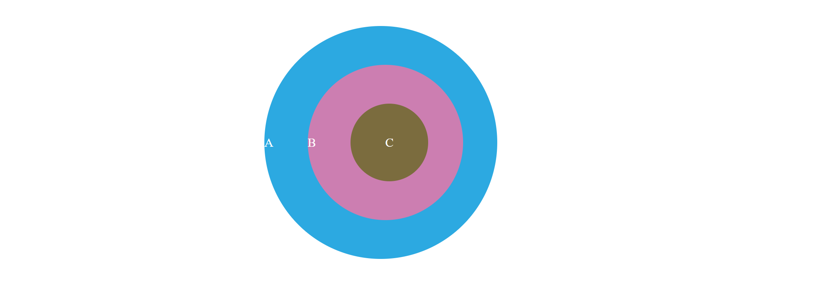
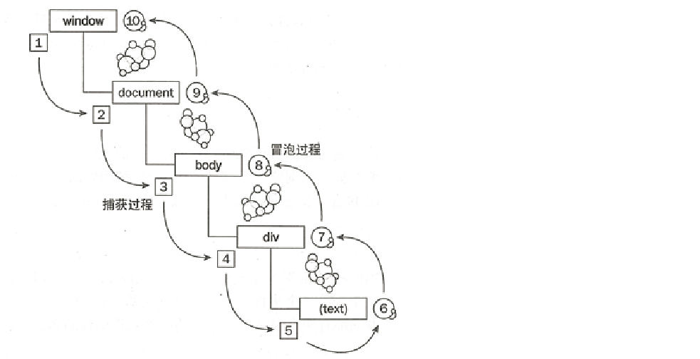
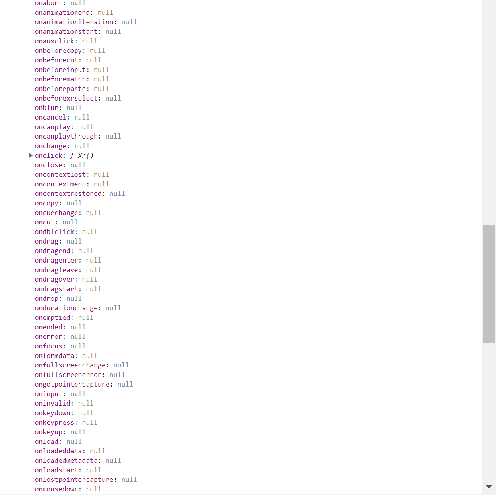
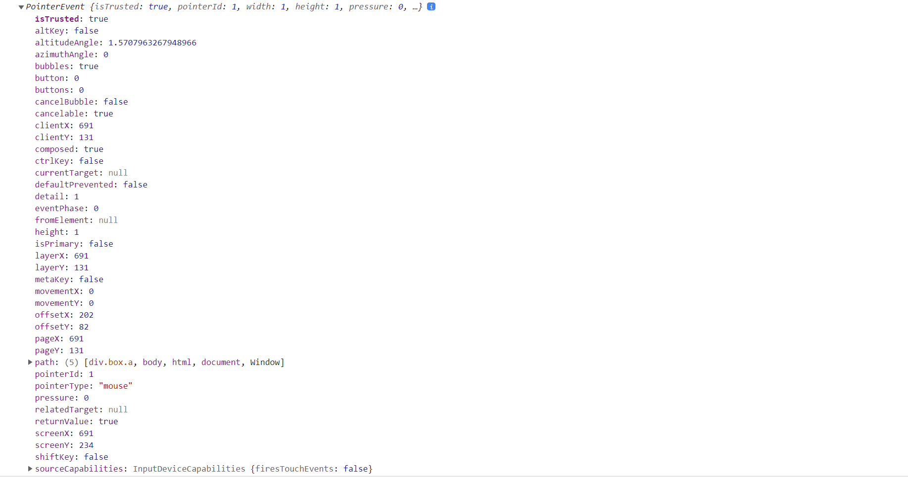
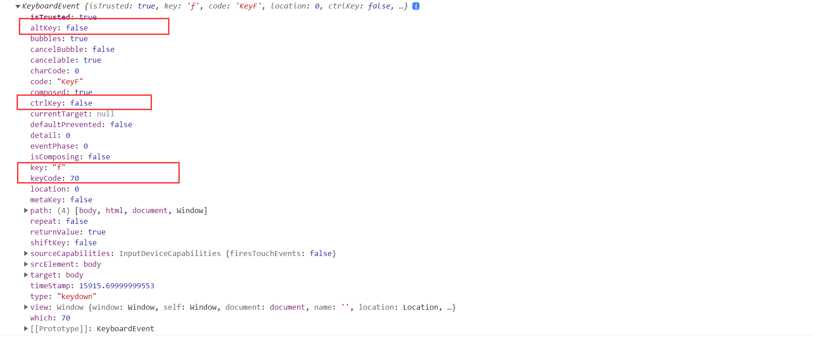
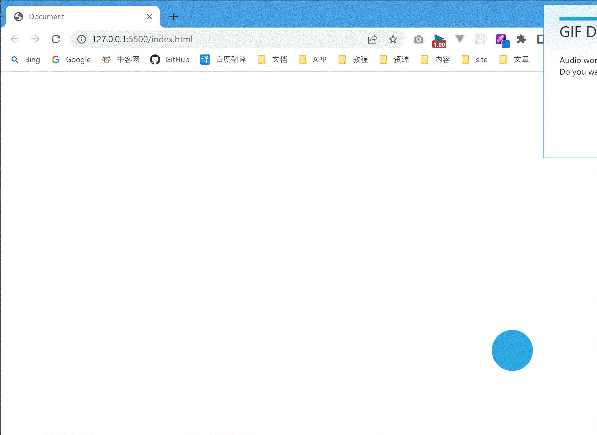

# JavaScript 事件：从入门到游戏开发

事件是 JavaScript 最常见的对象之一，因为事件与用户行为高度相关。当用户点击某个按钮时，就会产生点击事件，当用户滚动鼠标时，会产生滚动事件；当用户输入内容时，会产生输入事件。正式因为可以捕获到用户的行为，网页才能做得生动有趣。

## 事件四要素

事件的四要素是：

- 事件源：触发事件的标签元素

- 事件类型：是什么事件，例如 click, change, input
- 事件处理函数：当时间发生时的处理函数
- 事件对象：Event 对象

## 事件的冒泡与捕获

考虑下面的元素嵌套情形，如果点击了其中的 C，那么点击的对象就是 C 元素，C 元素能监听到点击事件。但是仔细想一想，好像有哪里不对劲：

- 假如向池汤里扔一块石头，由此会引起的水波会向四周传播。
- C 元素是 B 的子元素，是 B 元素的一部分，为什么不是点击了 B 元素呢，为什么不是A元素呢？



```html
<style>
  .box {
    display: flex;
    justify-content: center;
    align-items: center;
    border-radius: 50%;
    color: #fff;
    margin: 50px auto;
  }
  .a {
    width: 300px;
    height: 300px;
    background-color: #2ca9e1;
  }
  .b {
    width: 200px;
    height: 200px;
    background-color: #cc7eb1;
  }
  .c {
    width: 100px;
    height: 100px;
    background-color: #7b6c3e;
  }
</style>
<div class="box a">
  A
  <div class="box b">
    B
    <div class="box c">C</div>
  </div>
</div>
```

现在我们给每个元素绑定事件：

```html
<script>
  document.querySelector(".c").addEventListener("click", function () {
    console.log("点击了c");
  });
  document.querySelector(".b").addEventListener("click", function () {
    console.log("点击了b");
  });
  document.querySelector(".a").addEventListener("click", function () {
    console.log("点击了a");
  });
</script>
```

当点击 C 元素时，控制台输出如下：

```js
点击了c
点击了b
点击了a
```

以上输出表明事件就像投进池塘里的石头，从内部元素向外部元素传播，这种事件的传播方式叫做**事件冒泡**。事实上还存在一种事件的传播方式：**事件捕获**，这种方式正好与事件冒泡相反，即从外部向内部传播。

之所以存在两种事件捕获机制，是因为早期浏览器的实现不同，网景公司采用的是事件捕获机制，微软 IE 浏览器采用的是冒泡机制，后来 W3C 规范两种方式都采用了，即先捕获再冒泡。



其实，`addEventListener` 可以通过第三个参数设置捕获模式，默认是 `false`  即冒泡方式。
```js
addEventListener(type, listener, useCapture)
```
当采用捕获方式之后：
```html
<script>
  document.querySelector(".c").addEventListener("click", function () {
    console.log("点击了c");
  });
  document.querySelector(".b").addEventListener("click", function () {
    console.log("点击了b");
  });
  document.querySelector(".a").addEventListener("click", function () {
    console.log("点击了a");
  }, true);
</script>
```

结果：

```js
点击了a
点击了c
点击了b
```

💡【提示】一般采用冒泡方式。

🔑【技巧】阻止事件冒泡的方式：

```html
<script>
  document.querySelector(".c").addEventListener("click", function (event) {
    //阻止事件冒泡
    event.stopPropagation();
    console.log("点击了c");
  });
  document.querySelector(".b").addEventListener("click", function () {
    console.log("点击了b");
  });
  document.querySelector(".a").addEventListener("click", function () {
    console.log("点击了a");
  });
</script>
```

## 事件的绑定方式

### 行内绑定方式

```js
<div class="box a" onclick="console.log('点击了a')">a</div>
```

如果行内事件需要使用事件对象，请直接使用 `window.event` 全局对象：

```html
<div class="box a" onclick="handleClick()">a</div>

<script>
  function handleClick() {
    console.log(event);
  }
</script>
```

行内事件绑定 this：

```html
<div class="box a" onclick="handleClick(this)">a</div>

<script>
  function handleClick(dom) {
    console.log(dom);
  }
</script>
```

### 事件属性绑定

打开控制台，获取到某个dom对象之后可以发现许多 on 开头的属性：	



看到这些属性大家就明白了：

```html
<div class="box a" onclick="handleClick(this)">a</div>

<script>
  document.querySelector(".a").onclick = function () {
    console.log("别点我啦");
  };
</script>
```

这种方式可以通过事件对象回调参数或全局事件对象访问事件对象：

```js
document.querySelector(".a").onclick = function (eventParam) {
  console.log(eventParam);
  console.log(event);
  console.log(eventParam === event); // true
};
```

也可以通过 this 访问当前 dom 对象：

```js
document.querySelector(".a").onclick = function () {
  console.log(this);
};
```

取消绑定：

```js
document.querySelector(".a").onclick = null;
```

【技巧】如果你想要给某个元素绑定某个事件，但不知道它叫什么名字时，打开控制台就可以找到啦。

### addEventListener[^1]

最后介绍一种方式：

```js
dom.addEventListener(type, listener, useCapture);
dom.removeEventListener(type, listener, useCapture);
```

三个参数：

- type: 没有 on 开头的字符串，例如 "click", "mouseenter"
- listener: 事件处理回调函数，可以使用 event 形参
- useCapture: 是否采用捕获模式，默认是 false 冒泡模式。

💡【提示】移除事件函数需要使用具名函数，**匿名函数无法解绑**。即使是同一个函数，如果绑定时的 useCapture 不同，那么需要解绑两次。

🔑【技巧】addEventListener 可以绑定多个处理函数，这些处理函数都会执行，个人建议使用这种方式。

## 事件对象 Event

上一小节介绍了绑定事件的三种方式，其中包含了一个重要的对象：Event 对象，在控制台打印事件对象：



### 距离测量

事件对象包含许多有用的信息，距离属性可以计算事件触发的位置，利用位置信息可以实现例如拖动的效果。

- clientX/clientY: 以浏览器可视区左上角为原点计算的坐标值。

- offsetX/offsetY: 以元素左上角（padding 左上角）为原点计算的坐标值。

- pageX/pageY: 以文档(document)左上角为原点计算的坐标值。

- screenX/screenY：以屏幕（显示器）左上角为原点计算坐标值。

 

### 获取按键信息



键盘事件主要关心的是：按了哪个键，相关的属性是：

- key: 相关字符
- keyCode: 相应字符 ASCII 码值

如果是组合键，例如 `Ctrl-C`，则需要查看 `ctrlKey` 属性。

### TypeScript

如何给事件添加类型推导呢？万能事件类型：Event

## 案例

【例1】实现元素拖拽效果。

```html
<style>
  * {
    margin: 0;
    padding: 0;
  }
  .box {
    width: 64px;
    height: 64px;
    border-radius: 50%;
    background-color: #2ca9e1;
    position: fixed;
    bottom: 100px;
    right: 100px;
  }
</style>

<div class="box" id="fab"></div>

<script>
  const fabEle = document.querySelector("#fab");
  fabEle.addEventListener("mousedown", function (e) {
    const fx = e.offsetX;
    const fy = e.offsetY;

    function handleMousemove(e) {
      fabEle.style.cursor = "move";
      fabEle.style.left = e.clientX - fx + "px";
      fabEle.style.top = e.clientY - fy + "px";
    }

    function handleMouseup(e) {
      fabEle.removeEventListener("mousemove", handleMousemove);
      fabEle.removeEventListener("mouseup", handleMouseup);
    }

    fabEle.addEventListener("mousemove", handleMousemove);
    fabEle.addEventListener("mouseup", handleMouseup);
  });
</script>
```

如下图所示：



【例2】非常上头的打字游戏：

```html
<style>
  * {
    margin: 0;
    padding: 0;
  }
  html,
  body {
    height: 100%;
    font-family: Consolas;
  }

  .box {
    width: 64px;
    height: 64px;
    background-color: #2ca9e1;
    color: #fff;
    border-radius: 50%;
    display: flex;
    align-items: center;
    justify-content: center;
    font-size: 40px;

    position: fixed;
    left: 10vw;
  }

  .good .num {
    font-size: 32px;
    color: #00a381;
  }

  .bad .num {
    font-size: 32px;
    color: #bf242a;
  }
</style>

<div class="good">成功：<span class="num">0</span></div>
<div class="bad">失败：<span class="num">0</span></div>

<script>
  const goodEle = document.querySelector(".good .num");
  const badEle = document.querySelector(".bad .num");
  const chars = "abcdefghijklmnopqrstuvwxyz123456789";
  const colors = ["#ba2636", "#752100", "#69821b", "#165e83", "#192f60", "#4d5aaf", "#316745", "#b44c97", "#7a4171"];
  const maxHeight = document.documentElement.offsetHeight - 64;
  const maxWidth = document.documentElement.offsetWidth - 64;

  function setRandomChar(ele) {
    ele.innerHTML = chars[Math.floor(Math.random() * chars.length)];
  }

  function setRandomColor(ele) {
    ele.style.backgroundColor = colors[Math.floor(Math.random() * colors.length)];
  }

  function setRandomPos(ele) {
    ele.style.left = Math.floor(Math.random() * maxWidth) + "px";
  }

  function setGood() {
    goodEle.innerHTML = parseInt(goodEle.textContent) + 1;
  }

  function setBad() {
    badEle.innerHTML = parseInt(badEle.textContent) + 1;
  }

  function startChar() {
    const ele = document.createElement("div");
    ele.setAttribute("class", "box");
    let charTop = 0;
    const speed = Math.floor(Math.random() * 20 + 1);
    setRandomChar(ele);
    setRandomColor(ele);
    setRandomPos(ele);

    document.body.appendChild(ele);

    const timer = setInterval(() => {
      ele.style.top = charTop + "px";
      charTop++;
      if (charTop >= maxHeight) {
        document.body.removeChild(ele);
        clearInterval(timer);
        setBad();
      }
    }, speed);
  }

  function createRandom() {
    // 控制球生成数量
    let factor = parseInt(goodEle.textContent) / 50;
    if (factor < 2) {
      factor = 2;
    }
    if (factor > 10) {
      factor = 10;
    }

    for (let i = 0; i < Math.random() * factor; i++) {
      startChar();
    }
  }

  function check(char) {
    const eles = document.querySelectorAll(".box");

    //检查球对应的字符
    for (let i = 0; i < eles.length; i++) {
      if (eles[i].textContent === char) {
        setGood();
        document.body.removeChild(eles[i]);
        return;
      }
    }

    setBad();
  }

  function startGame() {
    let timer = setInterval(() => {
      createRandom();
    }, 2000);
  }

  // 绑定键盘事件
  window.addEventListener("keypress", function (e) {
    check(e.key);
  });

  startGame();
</script>
```
效果：


这个打字游戏非常上头啊，玩了根本停不下来。

【知识点】

1）DOM 元素的创建于移除

2）定时器的应用

3）键盘事件监听

## 参考文章

[^1]: MDN. [addEventListener](https://developer.mozilla.org/en-US/docs/Web/API/EventTarget/addEventListener). 

