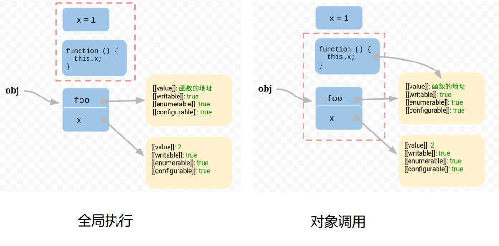

# JavaScript this 就是这么简单

## 初看 this

`this` 从英语语法来看，它是一个代词，代指**这个**。理解代词需要结合语境，需要结合上下文：

- 下课穿过熟悉的小道，两旁的银杏叶树拖去了密密的绿色妆容，穿上了橙黄色轻装。秋风是一个魔法师，把银杏树的叶子变成了蝴蝶，啊，我已经被蝴蝶包围了。**这**就是秋天。
- 代码遇到 BUG 啦？先**这**样，然后**这**样，最后**这**样就解决了。

读过以上两个句子，我们会有两个明显的感受：第一个句子的**这**意义明确，指代秋天的味道。而第二个句子没有上下文，**这** 让人摸不着头脑，不知道在说什么。

理解 JavaScript 中的 `this` 只需要理解一点：`this ` 指的是调用函数的那个对象。

1）如果直接使用 this，则代表 Window 对象:

```html
<script>
  console.log(this);
  //Window {window: Window, self: Window, document: document, name: '', location: Location, …}
</script>
```

2）全局调用的函数也指向 Window 对象：

```html
<script>
  function fn() {
    console.log(this);
  }

  fn();
  //Window {window: Window, self: Window, document: document, name: '', location: Location, …}
</script>
```

⚠️ 严格模式下，普通函数的 this 是 undefined。

```html
<script>
  "use strict";
  function fn() {
    console.log(this); //undefined
  }

  fn();
</script>
```

3）对象调用的函数指向该对象：

```html
<script>
  function fn() {
    console.log(this);
  }

  const obj = {
    name: "my obj",
    fn,
  };

  obj.fn();
  //{name: 'my obj', fn: ƒ}
</script>
```

4）如果是链式调用取就近原则：

```html
<script>
  function fn() {
    console.log(this);
  }

  const obj = {
    name: "my obj",
    inner: {
      name: "inner",
      fn,
    },
  };

  obj.inner.fn();
  //{name: 'inner', fn: ƒ}
</script>
```

5）把函数的方法拿出来调用，则指向 Window:

```html
<script>
  const obj = {
    name: "my obj",
    inner: {
      name: "inner",
      fn: function () {
        console.log(this);
      },
    },
  };

  const fn = obj.inner.fn;
  fn();
  //Window {window: Window, self: Window, document: document, name: '', location: Location, …}
</script>
```

## 从代码执行环境看 this [^1]

某些需求需要在函数体内部引用当前环境的某些变量，例如对象的某些属性：

```javascript
var f = function () {
  console.log(x);
};
```

上面代码中，函数体里面使用了变量 `x`，该变量由运行环境提供。

现在问题就来了，由于函数可以在不同的运行环境执行，因此需要有一种机制，能够在函数体内部获得当前的运行环境（context）。所以，`this` 就出现了，它的设计目的就是在函数体内部，指代函数当前的运行环境。

```javascript
var f = function () {
  console.log(this.x);
}
```

上面代码中，`x` 的意义更加明确：使用 `this.x` 指向当前运行环境的 `x`。

 ```javascript
var f = function () {
  console.log(this.x);
}

var x = 1;
var obj = {
   f: f,
   x: 2,
};

// 单独执行，this 指向 Window
f() // 1
 
// obj 环境执行, this 指向 obj
obj.f() // 2
 ```

上面代码中，函数 `f` 在全局环境执行，`this.x` 指向全局环境的`x`。



既然函数的运行依赖于上下文，那有没有方法可以改变函数执行的上下文呢？

## 改变函数运行上下文

JavaScript 允许使用 `bind(), call(), apply()` 改变函数上下文，也就是改变运行时 `this` 指向。举个例子：【例】小小森同学打算配置一台电脑，他声明了两个对象：GPU 和 CPU，他希望调用 `printMoney()` 函数时能打印出配置信息：

```js
const GPU = {
  name: 'rtx 4090',
  price: 17999,
  count: 2,
  printMoney: function () {
    console.log(`${this.name}: ${this.price} * ${this.count} = ${this.price*this.count}`);
  },
};

const CPU = {
  name: 'i9 13900kf',
  price: 5499,
  count: 1,
};

//打印 GPU 配置
GPU.printMoney(); //rtx 4090: 17999 * 2 = 35998

//打印 CPU 配置
//CPU.printMoney(); //TypeError: CPU.printMoney is not a function

GPU.printMoney.call(CPU);  //i9 13900kf: 5499 * 1 = 5499
GPU.printMoney.apply(CPU); //i9 13900kf: 5499 * 1 = 5499
GPU.printMoney.bind(CPU)();//i9 13900kf: 5499 * 1 = 5499
```

【解读】

1）GPU 对象定义了 `printMoney()` 方法，直接调用即可打印配置信息，但是 CPU 没有定义 `printMoney()` 方法。

2）小小琪同学给小小森同学想了一个办法优雅的解决了这个问题：通过把 `printMoney()` 上下文重新放到 CPU 中执行。

### 三者的区别

既然 `bind(), call(), apply()` 都能改变函数的执行上下文，那么他们有什么区别呢？

【区别 1】接受参数方式不一样：

对于 apply、call 二者而言，作用完全一样，只是接受参数的方式不太一样。

```js
const func = function(arg1, arg2) {
   // ...  
};

func.call(this, arg1, arg2);
func.apply(this, [arg1, arg2]);
```

看一个例子：

【例】小小森同学想配置一台电脑用于编程，他总结了几个店铺的优惠情况：

```js
//商品
const gpu = {
  name: "rtx 3060",
  price: 2000,
  count: 2,
};

const cpu = {
  name: "i7 12600kf",
  price: 2000,
  count: 1,
};

// 店铺
const shopSen = {
  name: "喵喵森电竞旗舰店",
  coupon: 300,
  printTotal(...products) {
    let total = 0;
    products.forEach(function (product) {
      const money = product.price * product.count;
      console.log(
        `${product.name}: ${product.price} * ${product.count} = ${money}`
      );
      total += money;
    });

    console.log(
      `${this.name}: ${total} - ${this.coupon} = ${total - this.coupon}`
    );
  },
};

const shopQi = {
  name: "美琪外设旗舰店",
  coupon: 168,
};

//打印配置
shopSen.printTotal(gpu, cpu);
shopSen.printTotal.call(shopQi, gpu, cpu);

/*
rtx 3060: 2000 * 2 = 4000
i7 12600kf: 2000 * 1 = 2000
喵喵森电竞旗舰店: 6000 - 300 = 5700
rtx 3060: 2000 * 2 = 4000
i7 12600kf: 2000 * 1 = 2000
美琪外设旗舰店: 6000 - 168 = 5832
*/
```

如果使用 apply，参数需要传入一个数组：

```js
shopSen.printTotal.apply(shopQi, [gpu, cpu]);
```

否则，将不会接收到参数：

```js
shopSen.printTotal.apply(shopQi, gpu, cpu);
//美琪外设旗舰店: 0 - 168 = -168
```

🔑【技巧】记忆方法：单词长的传数组。

【区别2】`bind` 只是重新绑定上下文，函数并不会执行：

```js
const printTotalQi = shopSen.printTotal.bind(shopQi);
printTotalQi(gpu, cpu);
/*
rtx 3060: 2000 * 2 = 4000
i7 12600kf: 2000 * 1 = 2000
美琪外设旗舰店: 6000 - 168 = 5832
*/
```

【总结】三个方法的功能相同，至于用哪个，哪个好用就用哪个，可以参考文章2[^2]。

## 构造函数

所谓的构造函数就是指创建对象的函数：

```js
function Product(name, price) {
  this.name = name;
  this.price = price;
}

const lipstick = new Product("Qita", 499);

function printProduct() {
  console.log(`${this.name}: ￥${this.price}`);
}

printProduct.call(lipstick); //Qita: ￥499
```

构造函数内部的 this 指向 new 出来的对象。

 如果构造函数返回了一个对象，那么 this 指向构造函数返回的那个对象：

```js
function Product(name, price) {
  this.name = name;
  this.price = price;

  return {
    name: "Qiza",
    price: 198,
  };
}

const lipstick = new Product("Qita", 499);

function printProduct() {
  console.log(`${this.name}: ￥${this.price}`);
}

printProduct.call(lipstick); //Qiza: ￥198
```

# 参考文章

[^1]: 阮一峰. [JavaScript 的 this 原理](https://www.ruanyifeng.com/blog/2018/06/javascript-this.html). 阮一峰的网络日志.

[^2]: 风雨后见彩虹. [JS中的call、apply、bind方法详解 ](https://www.cnblogs.com/moqiutao/p/7371988.html). 博客园.