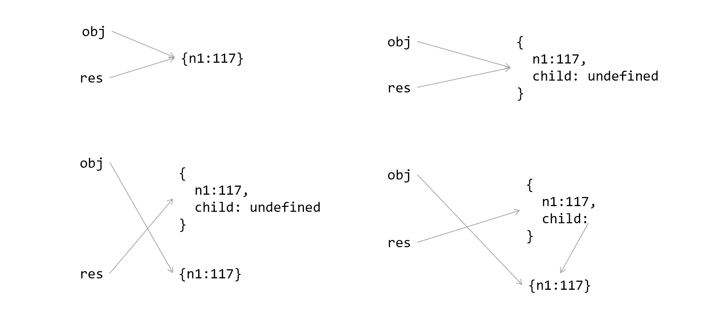

# JavaScript 变量声明详解

JavaScript 中，可以声明变量的关键字有`var`、`let`和`const`。

## var

使用 `var` 定义变量，可以保存任何类型的值。若不初始化变量，变量会保存 `undefined`。

### 1. 函数级作用域

使用 `var` 定义的变量会成为包含它的**函数**的局部变量。

```javascript
function func() {
    var a = 'hi'; // 局部变量
}
func();
console.log(a);   // ReferenceError: a is not defined
```

变量 `a` 在函数内部使用 `var` 定义，调用函数 `func`，会创建这个变量并给它赋值。函数执行结束后，变量就会被销毁，所以上述代码最后一行会报错，显示变量 `a` 未定义。

若在函数内部，不使用 `var` 操作符，直接给变量 `a` 赋值，那么 `a` 就成为了全局变量，可以在函数外部访问到。在浏览器环境下，`a` 成为`window`对象的属性。

```javascript
function func() {
    a = 'hi'; // 全局
}
func();
console.log(a); // hi
console.log(window.a); // hi
console.log(window.a === a); // true
```

### 2. 变量提升

使用`var`声明变量，会自动提升到函数作用域顶部，如下代码：

```javascript
function func() {
    console.log(a);
    var a = 1;
}
func(); // undefined
```

代码没有报错，输出了`undefined`，这是因为**变量的声明**被提升到了函数作用域顶部，等价于如下代码：

```javascript
function func() {
    var a;
    console.log(a);
    a = 1;
}
func(); // undefined
```

【练习】请问如下代码会打印什么？

```js
var a = 2;
function fn() {
  b();
  return;
  var a = 1;
  function b() {
    console.log(a);
  }
}
fn();
```

【练习】请问如下代码会输出什么？

```js
var b = 3;
(function () {
  b = 5;
  var b = 2;
})();
console.log(b);
```

【练习】请问如下代码会输出什么？

```js
if (!("a" in window)) {
  var a = 1;
  console.log("???");
}

console.log(a);
```


### 3. 重复声明

另外，使用 `var` 重复声明同一个变量也可以：

```javascript
function func() {
    var a = 1;
    var a = 2;
    var a = 3;
    console.log(a);
}
func(); // 3
```

### 4. 全局变量挂载到 window

浏览器环境中，全局作用域下，使用 `var` 声明的变量，会挂载到 `window` 对象上。

```javascript
var a = 1;
console.log(window.a === a); // true
```

🎯记忆口诀：函数作用域，全局属性，变量提升，重复声明。

## let

`let` 也可以声明变量，但和 `var` 操作符有很大的区别。

### 1. 块级作用域

以下代码会报错，因为`let`声明的作用域，具有**块级作用域**，即被`{}`包裹的部分。

```javascript
if (true) {
    let a = 10;
}
console.log(a); // a is not defined
```

### 2. 不可重复声明

以下代码，执行到`let a = 2`就会报错，因为变量`a`在当前块级作用域中已经被声明过了，不能重复声明。

```javascript
if (true) {
    let a = 1;
    let a = 2; // SyntaxError: Identifier 'a' has already been declared
    let a = 3;
}
```

另外，如果混用 `var` 和 `let` 声明变量，也是不允许的，下面的代码都会报错：

```javascript
let a;
var a; // 报错

// 反过来也不行
var a;
let a; // 报错
```

### 2. 不存在变量提升（暂时性锁区）

使用`let`声明的变量，不能在声明之前访问它。

```javascript
if (true) {
    console.log(a); // ReferenceError: Cannot access 'a' before initialization
    let a = 1;
}
```

实际上，JavaScript 也会注意出现在块后面的 `let` 声明，只不过在此之前**不能以任何方式来引用未声明的变量**。在`let`声明之前的执行瞬间被称为**暂时性死区**。

### 3. 全局变量不会挂载到 window

和 `var` 不同，即使在全局作用域下，使用`let`声明的变量也不会挂载到`window`对象。

```javascript
var a = 1;
let b = 2;
console.log(window.a === a); // true
console.log(window.b === b); // false
```

### 4. 不同的作用域互不影响

```javascript
function func() {
  let a = 'hello';
  if (true) {
    let a = 'world';
    console.log(a);
  }
  console.log(a);
}

func();
//world
//hello
```
### 5. 变量的类型

JavaScript 中的变量是松散类型的，可以保存任何类型数据，变量只不过是一个名称。

```js
let a = 1;
a = "hello";
a = [1, 2, 3];
a = {age: 32};
```
## const

`const ` 的特点与 `let` 基本一致，`const` 变量只能在声明的时候赋值，后面不能再被赋值。

### 1. 声明变量时必须同时初始化

以下声明报错，因为声明的同时没有初始化变量。

```javascript
const a; // 错误，必须赋值
const b = 1;
b=2;  // 错误，不能被赋值
```

### 2. const 修饰的变量具有内部可变性

使用 `const` 定义了一个变量后，不能再更改它的值：

```javascript
const a = 1;
a = 2; // TypeError: Assignment to constant variable
```

这里有一个误区，实际上，使用 `const` 声明的变量，不能修改的是**内存地址**！！

具体规则如下：

- 当 `const` 定义的常量为**基本数据类型**时，**不能被修改**。
- 当 `const` 定义的常量为**引用数据类型**时，可以通过其属性进行**数据修改**。

**基本数据类型**的值就保存在**内存地址**中，所以 `const` 定义的**基础数据类型**不可被改变。 而**引用数据类型**指向的**内存地址**只是一个**指针**，通过指针来指向实际数据，也就是说，**不可被改变的是指针**，**而不是数据**，所以`const`定义的**引用数据类型**的常量可以通过属性来修改其数据。

例如，使用 `const` 定义了一个数组，虽然不能更改**数据类型**，但可以通过 `push` 等方法，修改这个数组中的数据。

```javascript
const arr = [];
arr.push(1, 2, 3);
console.log(arr); // [ 1, 2, 3 ]
```

### 总结及最佳实践

| **区别**           | **var** | **let** | **const** |
| ------------------ | ------- | ------- | --------- |
| 是否有块级作用域   | ×       | ✔️       | ✔️         |
| 是否存在变量提升   | ✔️       | ×       | ×         |
| 是否添加全局属性   | ✔️       | ×       | ×         |
| 能否重复声明变量   | ✔️       | ×       | ×         |
| 是否存在暂时性死区 | ×       | ✔️       | ✔️         |
| 是否必须设置初始值 | ×       | ×       | ✔️         |
| 能否改变指针指向   | ✔️       | ✔️       | ×         |

通常，写 JavaScript 代码时，遵循以下原则：

1）先声明，后使用

2）建议优先使用：`const > let > var`

💯【面试题】以下代码运行后会打印什么？

```javascript
for (var i = 1; i <= 5; i++) {
    setTimeout(function () {
        console.log(i);
    }, 0);
}
```

**答案**：打印的都是 6

虽然每个`for`循环中定时器设置的时间都是`0`，但由于 JavaScript 是单线程 `eventLoop`机制，`setTimeout`是异步任务，遇到`setTimeout`函数时，JavaScript 会将其放入**任务队列**中，待同步任务执行完毕后，才执行**任务队列**中的**异步任务**。

又因为`setTimeout`函数也是一种**闭包**，往上找它的**父级作用域链**是`window`，而变量`i`是用`var`声明的，是`window`上的**全局变量**，所以此时变量`i`的值已经变成`i = 6`了，最后执行`setTimeout`时，当然会输出 5 个`6`了！

**使用`let`解决**：

利用 JavaScript 的**块级作用域**，就不用这么麻烦了。如果`for`循环使用**块级作用域**变量关键字，循环就会为每个循环创建**独立的变量**，从而每次打印都会有正确的索引值。

```javascript
for (let i = 1; i <= 5; i++) {
    setTimeout(function () {
        console.log(i);
    }, 0);
}
```

## 连续声明多个变量

JavaScript 允许连续声明变量：

```js
let a = b = 1;
console.log(a, b);//1 1
```

连续赋值的规则可以概括成一句话：从左到右声明，从右到左赋值。请看一个例题：

【例】如下程序的输出结果是什么？

```js
let obj = {
  n1: 117
};
let res = obj;
obj.child = obj = { n2: 935 };
let x = (y = res.child.n2);
console.log(obj.child);
console.log(res.n1);
console.log(y);
```



参考答案：

```js
"undefined"
117
935
```

## 参考文章

- 火星飞鸟. [JavaScript 变量声明var、let、const详解](https://juejin.cn/post/7026163740806479902). 稀土掘金.
- CUGGZ. [「2021」高频前端面试题汇总之JavaScript篇（上）](https://juejin.cn/post/6940945178899251230#heading-23). 稀土掘金.


> ♥ 非常感谢大家的点赞与关注。文章整理自网络，若有疏漏请在评论区指正。
>
> ★ 本文开源（[Github链接](https://github.com/xiayulu/frontend-all-in-one)）欢迎参与贡献，转载需注明出处：小星森. [JavaScript 变量声明详解](https://zhuanlan.zhihu.com/p/572278327). 知乎.
>
> ★ 商业合作请发私信或邮件：zuiaiqiansen@163.com，并注明主题：商业合作。
>
> ★ 宣传做的好，产品差不了，宣传做的棒，产品No.1。我是前端小星森，让用户看到最伟大的产品。本人会一点点前端，如果贵公司有一流的产品或服务需要前端工程师展示，或需要一个前端工程师实现您的创业梦想，请发邮件：zuiaiqiansen@163.com，并注明主题：招聘前端工程师。