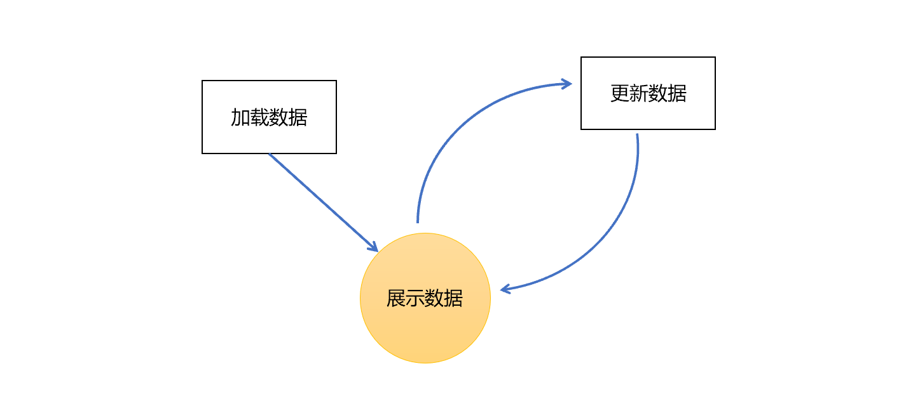

# Vue3 光速入门

本文主要用来记录一下自己入门VUE3踩得坑。


## 搭建 Vue 3 环境	

从官网快速上手开始项目[^1]：

```shell
npm init vue@latest
```

## 开始编写一个Vue 组件

Vue 项目是一个个 Vue 组件堆叠起来的，而定义 Vue 组件的最常用的方法是使用 `.vue` 文件，官方的说法是单文件组件 (SFC)[^2] 。Vue 文件里面定义了组件的三个部分：

- template: 结构
- script: 行为
- style: 表现

个人觉得 Vue 比 React 好用一点，因为 React 的 JSX 语法处理 HTML 还好，但是 CSS 写起来就特别蛋疼。Vue 3 新推出了 setup 语法，使用起来非常方便：

- 任何在 `<script setup>` 声明的顶层的绑定 (包括变量，函数声明，以及 import 导入的变量，函数，组件) 都能在模板中直接使用。
- 响应式状态需要明确使用[响应式 API](https://cn.vuejs.org/api/reactivity-core.html) 来创建。和 `setup()` 函数的返回值一样，ref 在模板中使用的时候会自动解包。

- `<setup script> ` 同样可以使用 `defineProps()` 和 `defineEmits() ` API：

```html
<script setup>
const props = defineProps({
  foo: String
})

const emit = defineEmits(['change', 'delete'])
// ...
</script>
```

这俩函数不需要显示地 import 就能用。

## 响应式

使用组件的 template 与 style 把网页的结构搭建起来之后，接下来需要处理数据。



### 展示数据

Vue 展示变量数据的方法称为模板语法，Vue 展示文本数据：

```html
<span>Message: {{ msg }}</span>
```

双大括号里面可以使用 JavaScript 表达式：

```html
{{ number + 1 }}

{{ ok ? 'YES' : 'NO' }}

{{ message.split('').reverse().join('') }}

<div :id="`list-${id}`"></div>

<span :title="toTitleDate(date)">
  {{ formatDate(date) }}
</span>
```

双大括号不能在 HTML attributes 中使用。想要响应式地绑定一个 attribute，应该使用 [`v-bind` 指令](https://cn.vuejs.org/api/built-in-directives.html#v-bind)：

```html
<div :id="dynamicId"></div>
```

### 更新数据

变量赋值，数组元素的增加或减少等数据的变动，相应的展示也会跟着变化，也就是说视图相应数据变化，这个过程叫做响应式。

vue `data()` 方法返回的变量具有响应性：

```js
export default {
  data() {
    return {
      count: 1
    }
  },
  //...
}
```

在选项式 API 中，响应式数据是用 `data()` 选项声明的。在内部，`data()` 的返回值对象会通过 [`reactive()`](https://cn.vuejs.org/api/reactivity-core.html#reactive) 这个公开的 API 函数转为响应式[^3]。


## 参考文章


[^1]: [快速上手](https://cn.vuejs.org/guide/quick-start.html).

[^2]:[SFC 语法定义](https://cn.vuejs.org/api/sfc-spec.html). Vue.js. 

[^3]: [状态管理](https://cn.vuejs.org/guide/scaling-up/state-management.html). Vue.js. 
